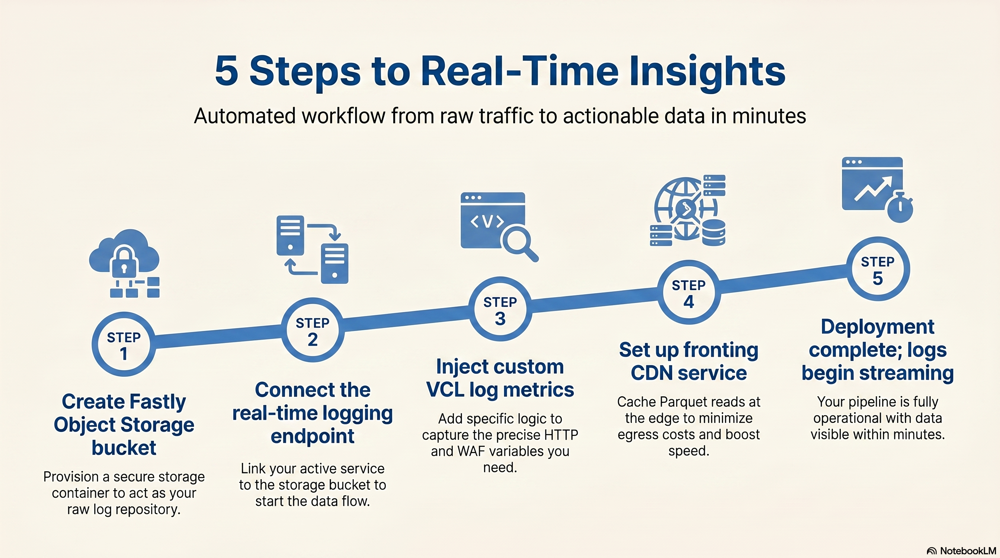
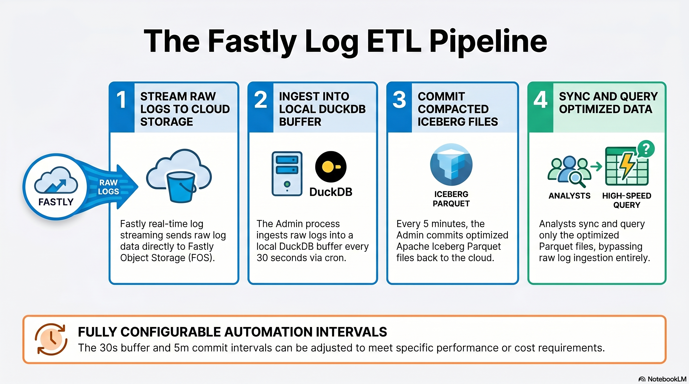
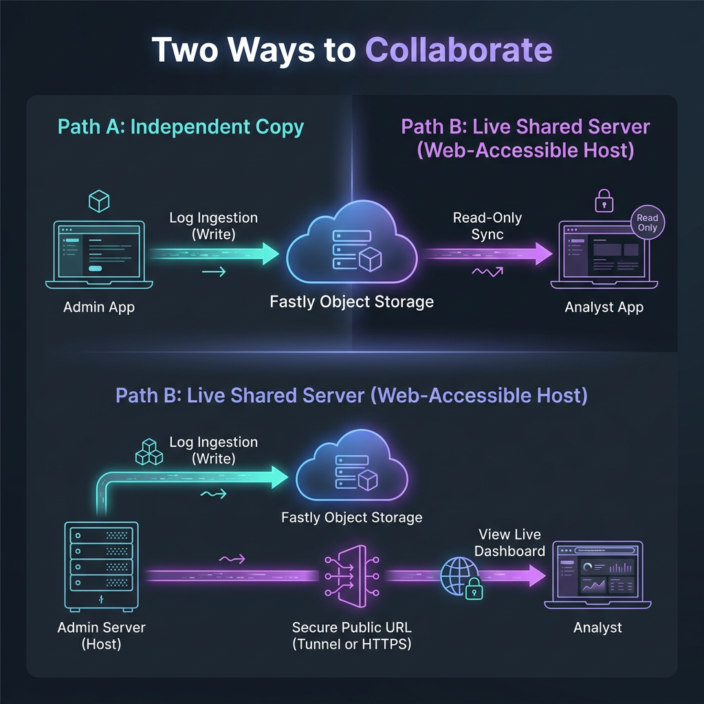

# Fastly Log Analytics

[](LICENSE)

A self-hosted dashboard for searching, filtering, and visualizing request-level Fastly logs streamed to [Fastly Object Storage](https://www.fastly.com/documentation/guides/platform/object-storage/working-with-object-storage/).

Fastly's [historical stats](https://www.fastly.com/documentation/reference/api/metrics-stats/historical-stats/) give you aggregates. When you need to drill into individual requests — by IP, URL, status, WAF signal, or any field you log — Fastly's [real-time log streaming](https://www.fastly.com/documentation/guides/integrations/streaming-logs/about-fastlys-realtime-log-streaming-features/) makes the raw data available, but you still need somewhere to put it and something to query it with. This project fills that gap using only Fastly products. Costs are limited to Fastly Object Storage [class operations](https://www.fastly.com/documentation/guides/platform/object-storage/working-with-object-storage/#using-the-s3-compatible-api) and [storage](https://docs.fastly.com/products/object-storage#billing) — no third-party logging vendor required.

### 📺 Watch the install walkthrough

A short video walks through installation and provisioning end to end:

[](https://youtu.be/7-3XWzesuAY)

---

## Before You Start

You'll need:

- A **Fastly account** with permission to create [services](https://www.fastly.com/documentation/guides/getting-started/services/about-services/) and Object Storage buckets
- **Object Storage enabled** on the account — it's a separately activated product, not on by default
- At least one **VCL service** to stream logs from
- **Docker** (recommended) — or Python 3.12+ and Node.js 24+ for a manual install
- *Optional:* a Fastly API token with the **Billing** permission to power the [Usage & Cost page](docs/features.md#usage--cost-page)
- *Optional:* [`falco`](https://github.com/ysugimoto/falco) to validate VCL during provisioning (highly recommended; the app degrades gracefully without it)
- *Optional:* **Rust 1.90+** with the `wasm32-wasip1` target (`rustup target add wasm32-wasip1`) — only needed if you plan to rebuild the [Session Scoring](docs/session_scoring_runbook.md) Compute Wasm scorer from source

---

## Server Specifications

When running as a shared server (Path B), the host machine should meet these minimums:

- **RAM:** 16 GB
- **CPU:** 2 vCPUs
- **Disk:** 40 GB minimum — the Next.js build alone needs ~1 GB and the Iceberg cache grows with log volume; 25 GB is sufficient for light use but can fill during `next build`
- **Swap:** 4 GB minimum, 8 GB preferred — the backend holds large DuckDB query buffers in memory; swap prevents OOM kills during peak analytical load
- **Open file descriptors:** set the host (and Docker) `nofile` limit to at least 65536 — DuckDB parallel Iceberg scans open one file descriptor per Parquet file; the default Docker limit (~1024) causes `Too many open files` errors on large services. The production overlay (`docker-compose.prod.yml`) sets this automatically.

---

## Quick Start

> 📺 Prefer to watch? See the [video walkthrough](https://youtu.be/7-3XWzesuAY).

```bash
docker compose up --build
```

> Requires Docker Compose v2 (the `docker compose` subcommand). The standalone `docker-compose` v1 binary reached end-of-life in 2023 and isn't shipped with current Docker installs.

Open **http://localhost** and follow the provisioning wizard. The wizard creates your Object Storage bucket, access keys, a CDN-fronting service, and the logging endpoint on the VCL service you select.

> The stack is fronted by Caddy on port **80** (a single ingress, mirroring production). A friendlier alias **http://fastly.localhost** works with no setup — browsers resolve `*.localhost` to `127.0.0.1`. For a custom name like **http://fastly.analytics**, add `127.0.0.1 fastly.analytics` to your hosts file.

For manual install (no Docker), see [Manual Installation](#manual-installation). The non-Docker [`run.sh`](run.sh) path still serves the app directly on **http://localhost:3000**.

---

## How It Works

The **admin** runs the provisioning wizard to set up a Fastly Object Storage bucket, deploy a CDN-fronting service for cheap log reads, and attach a structured JSON logging endpoint to a chosen VCL service. Once that's in place, the app continuously ingests new `.gz` log files from the bucket into an Apache Iceberg table.





Once the data lake is healthy, you can collaborate with teammates using two different approaches depending on your hosting setup and security needs:



| Model | Path A: Independent Copy | Path B: Live Shared Server |
| :--- | :--- | :--- |
| **Analyst Setup** | Runs their own local copy of the app | Standard web browser only |
| **Admin Setup** | **Offline-friendly.** Your laptop/server can go offline. | **Always-on.** Your machine hosts the active web server. |
| **Data Source** | Analyst queries FOS bucket directly | Analyst queries the Admin's database over HTTP |
| **Credential Sharing** | Shares read-only FOS bucket keys | **Zero keys shared.** Admin handles all credentials. |
| **Best For** | Long-term analysts, laptop-only admins. | Quick screen-shares & non-technical associates. |

---

### Path A: Independent Copy (Direct Bucket Access)

The analyst runs their own independent copy of the app on their laptop or server. They use a read-only credential package to sync and query the Fastly Object Storage bucket directly.

#### How it works:
1. **Admin:** Click **Invite Analyst** in your dashboard. The app packages your FOS bucket name, region, and a set of read-only access keys into a secure JSON string. Send this JSON securely to your teammate.
2. **Analyst:** Start your own copy of the app (e.g., using `docker compose`), select **Join Service** on the setup screen, and paste the JSON config.
3. Your teammate's app automatically configures itself in `read_only` mode and syncs directly from the bucket. *Note: Because only the Admin's machine runs the active raw log ingestion pipeline, if the admin is offline, no new logs will be written to the database (though the analyst can still query all historical data). Once the admin is back online, the analyst's dashboard will automatically sync the newly committed logs.*

---

### Path B: Live Shared Server (Web-Accessible Host)

You run the application as a central web-accessible server on a dedicated VM (or a laptop reachable at its own hostname / IP). Your associates connect using a standard web browser and sign in with a passcode — or, if you configure an OAuth/OIDC identity provider, with single sign-on.

#### How it works:
1. **Admin:** Click **Share Dashboard** in your dashboard. The sharing manager prompts for your server's public URL — a custom domain or IP that the analyst can reach over HTTPS. (The previous SSH-reverse-tunnel mode via `localhost.run` was removed in v2.0; production deployments use direct-mode against a real public endpoint.)
2. **Admin:** Mint an analyst invitation in the sharing manager by specifying their name, an optional IP allowlist, and either a passcode or (with an OAuth/OIDC provider configured) their email for single sign-on. Invites are single-seat by default; a per-invite toggle allows shared logins. Give them the public URL (and passcode, if used).
3. **Analyst:** Open the shared link in a standard browser, accept the Terms of Service, enter the passcode or sign in with your identity provider, and view the live read-only dashboard. All database queries are executed securely on your host server. You can revoke access or **Sever All Access** instantly.

---

## Features

- **Apache Iceberg data lake** — ACID-compliant log storage in FOS, safe for concurrent readers and writers
- **Automated provisioning** — wizard creates the bucket, access keys, CDN-fronting service, and logging endpoint
- **CDN-accelerated reads** — every FOS read goes through a Fastly service to minimize egress and maximize caching
- **Crash-safe ingestion** — buffered locally, atomically committed; interrupted imports never corrupt the table
- **Schema evolution** — new and missing JSON fields handled gracefully; corrupt lines isolated and surfaced
- **Log sampling** — optionally log a random percentage of requests to manage cost on high-traffic services
- **Multi-source support** — analyze logs from multiple services side by side
- **Interactive dashboards** — traffic over time, global request map, top-N aggregations, raw log viewer with click-to-filter
- **Insights** — automated anomaly detection, 45 detections organized into traffic, security, network, edge, and origin tabs with severity indicators (error spikes, regional surges, botnet IP-spread, content-discovery scans, session harvesting, scripted-traffic cadence, WAF signal changes, cache regressions, latency, and more)
- **Usage & Cost** — live storage breakdown, FOS operation counts, period totals, interactive cost estimator
- **Log field configuration** — built-in field groups (HTTP, network, geo, TLS, NGWAF) plus custom VCL expressions
- **Alerts** — threshold-based, webhook-delivered
- **Live dashboard sharing** — direct-mode via your own hostname or IP, with per-analyst invites (passcode or OAuth/OIDC single sign-on), IP allowlisting, optional client-IP anonymization, and instant revoke
- **Control room** — real-time operational dashboard with live metrics from rt.fastly.com at 1-second cadence across nine tabs (overview, performance, origin, security, network, sessions, cost, insights, admin health), with rolling bar charts, KPI cards, PoP traffic heatmap, contextual help, and drill-down time windows
- **Service summary** — executive view of the value Fastly delivers: cache hit ratio, offload, WAF blocks, bot mitigation, TLS adoption, latency percentiles, and Image Optimizer savings in a single tabbed page
- **Streaming analytics** — CMCD (Common Media Client Data) dashboard for services with v1 or v2 streaming-log fields enabled, showing buffer health, bitrate, throughput, concurrent sessions, and per-session detail drill-down with auto-refresh
- **Ingest error quarantine** — corrupt or unparseable log lines are isolated, classified, and surfaced in the admin UI with export/download, instead of silently dropped
- **Session scoring** — edge-computed 0-100 risk score per request combining cookie/timing signals with a PageRank transition matrix, with live threshold enforcement, audit logging, key rotation, and matrix version history. See the [runbook](docs/session_scoring_runbook.md) and [feature reference](docs/features.md)
- **Real User Monitoring (RUM)** — client-side Core Web Vitals, performance, and error analytics powered by a self-hosted, version-controlled [Grafana Faro Web SDK](https://grafana.com/oss/faro/) loaded dynamically from FOS, featuring a secure server-side beacon receiver, crash-safe local buffering, and an active SSE streaming live-event ticker
- **Assets Shield** — static asset delivery and cache performance analyzer with hit/miss/pass ratios segmented across custom Fastly cache states, distinct document class filtering, and deep-link filtering that opens pre-filtered analytics views in a new tab, integrated directly as an executive tab under Service Summary
- **Remote Frontend Deployment** — a secure, enterprise-grade edge proxy architecture fronted by a dedicated Fastly service, allowing admins to deploy and tear down a public reverse proxy for their local dashboard VM in a single click from the share control panel

See [docs/features.md](docs/features.md) for the full feature reference.

---

## Manual Installation

If you'd rather not use Docker:

```bash
# Recommended: install uv if you don't have it
curl -LsSf https://astral.sh/uv/install.sh | sh

# Backend dependencies
uv sync

# Frontend dependencies
cd frontend && npm ci && cd ..

# Start the app (production mode)
./run.sh

# ...or development mode with hot reload
./run.sh --dev
```

Then open **http://localhost:3000**.

### CLI provisioning (alternative to the wizard)

If you have a [Fastly API token](https://www.fastly.com/documentation/guides/account-info/user-and-account-management/using-api-tokens/) with **Superuser** permissions (provisioning creates new services, which an Engineer token can't do), you can provision from the command line:

```bash
# Guided
uv run python -m backend.provision.cli provision

# Non-interactive
uv run python -m backend.provision.cli provision --token <YOUR_TOKEN> --service-id <ID> --yes

# Teardown
uv run python -m backend.provision.cli teardown --service-id <ID> --yes
```

Common flags: `--region us-east-1`, `--bucket <name>`, `--prefix <path>`, `--sample-rate 100`, `--period "1 minute"`, `--cdn-prefix <subdomain>`, `--remove-data` (on teardown), `-y` / `--yes` (accept defaults). Provisioning auto-rolls back on failure to leave your Fastly account clean.

### Bring your own bucket

If you already have a bucket, drop a JSON config file in `configs/` instead (create the directory if your checkout doesn't have one yet). See [`config.example.json`](config.example.json) at the repo root for the schema (`fos_endpoint`, `fos_bucket`, `fos_access_key_id`, `fos_secret_access_key`, `fos_region`, optional `cdn_url` + `cdn_secret`, optional `fastly_api_key`).

---

## Configuration

All app-level configuration is via environment variables. Copy [.env.example](.env.example) to `.env` and uncomment any value you want to override. The app starts with sensible defaults if you skip this entirely.

Per-service configuration (credentials, log field selection, custom fields, sync intervals) lives in `configs/{service_id}.json` and is managed via the UI or the provisioning CLI.

The **Fields** button on each service card opens the log field configurator — pick which JSON fields to log and the app generates the matching VCL log format (and any required Edge Data Capture snippets). See [docs/features.md](docs/features.md#log-field-configuration) for the field-group reference.

### CDN fronting (optional but strongly recommended)

To route FOS reads through a Fastly CDN service (for free egress and edge caching) the wizard creates this for you. If you're configuring manually:

1. Create a Fastly Delivery service with your FOS bucket as the backend origin
2. Configure the VCL to handle AWS4 signing on the request to FOS and shared-secret query-param authentication (`?key=…`) from the backend. The provisioning wizard generates this VCL automatically — if you've already enabled a service through the wizard, you can copy the active VCL from the Fastly UI or API as a starting point for a hand-managed service.
3. Set `cdn_url` and `cdn_secret` in your service config

---

## Development

```bash
make install         # uv sync + frontend npm ci
make ci              # full gate: lint + format + typecheck + tests (back + front) + security scans
make dev             # backend + frontend with hot reload (./run.sh --dev)
make test            # backend pytest only
make test-frontend   # frontend vitest only
make typecheck       # mypy backend/
make lint-fix        # ruff check --fix
make format          # ruff format
```

Pre-commit hooks:

```bash
make install-hooks   # runs uv run pre-commit install once
```

After this, every `git commit` runs ruff (lint + format), mypy, and standard file checks.

The Next.js frontend uses a typed API client generated from the FastAPI OpenAPI schema. `run.sh` and production builds regenerate types on startup; after manual backend model changes, regenerate manually:

```bash
cd frontend && npm run gen:types
```

See [docs/ARCHITECTURE.md](docs/ARCHITECTURE.md) for the system design, and [AGENTS.md](AGENTS.md) for the deeper contributor/agent notes — canonical patterns and the (extensive) list of known traps.

---

## Troubleshooting

### Port already in use (3000 / 8000)
The frontend listens on **3000** and the backend on **8000** by default. If another process holds one, find it with `lsof -i :3000` or `lsof -i :8000`, then either stop it or run on different ports: set `FRONTEND_PORT` / `BACKEND_PORT` (and `API_PROXY_URL` to match the backend) in `.env`, or pass `--frontend-port` / `--backend-port` to `run.sh`.

### Browser: `ERR_ALPN_NEGOTIATION_FAILED`
Usually a protocol mismatch from a security setting forcing HTTPS on a port that only speaks HTTP. Hit `http://localhost:3000` (not `127.0.0.1`), and make sure the frontend is going through the Next.js proxy rather than calling the backend port directly.

### Next.js startup crash on hardened macOS (`uv_interface_addresses returned Unknown system error 1`)
The `dev` script in `frontend/package.json` binds with `-H 127.0.0.1` to bypass network interface enumeration. Don't drop that flag in any custom dev setup.

### Dashboard shows "No data" but the header has a row count
- Check the time range overlaps with your log data.
- Check the browser console for failed `POST`s (often the ALPN issue above).
- A newly provisioned service can take a few minutes for the first ingestion + commit. Check the **Log Management** page for sync status.

---

## Contributing

See [CONTRIBUTING.md](CONTRIBUTING.md).

## Security

See [SECURITY.md](SECURITY.md). Vulnerability reports should go through [Fastly's security issue reporting process](https://www.fastly.com/security/report-security-issue) — please don't file public GitHub issues for security problems.

## License

[Apache License 2.0](LICENSE). Copyright 2026 Fastly, Inc.
