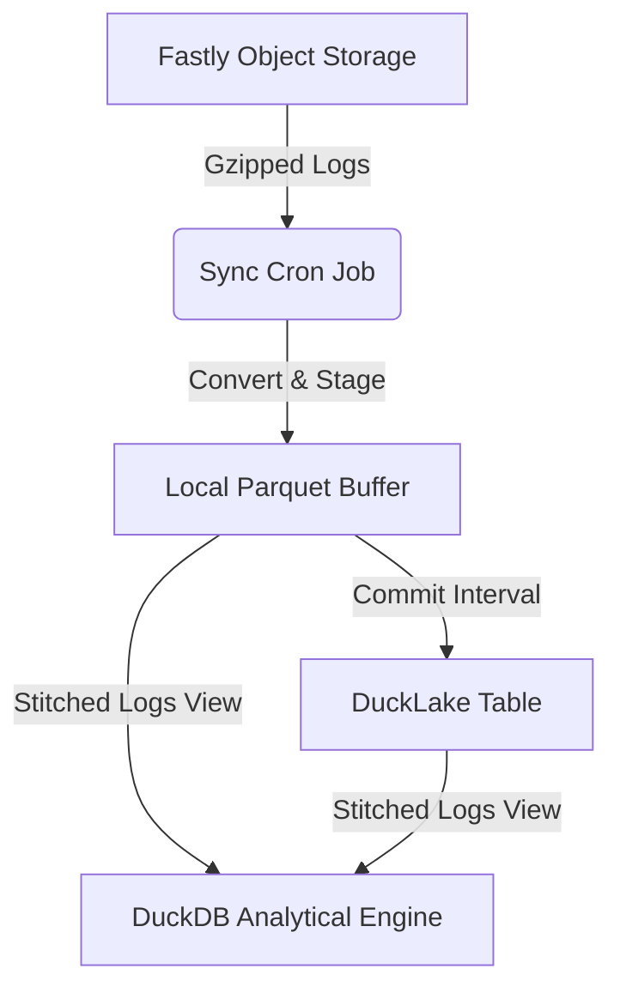
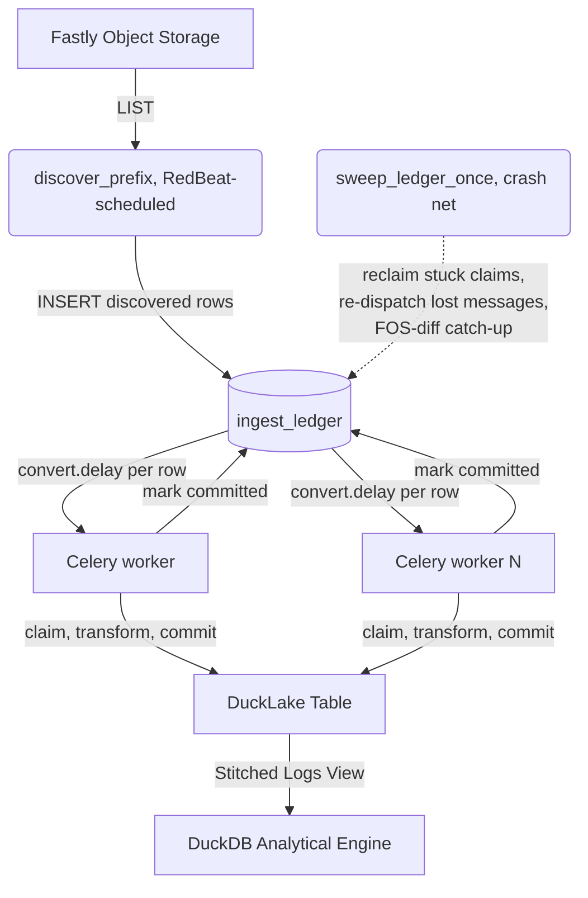

# System Architecture Reference
*Under the Hood of Fastly Object Storage Log Analysis*

This document provides a detailed technical overview of how the dashboard and ingest system are architected, how data flows through the application, and the internal design patterns used to maintain high performance, atomic crash safety, and strong security.

Two acronyms recur throughout: **FOS** = Fastly Object Storage (the S3-compatible bucket where raw logs and the Iceberg table live), and **NGWAF** = Fastly's Next-Gen WAF.

Architectural decisions are recorded under [`docs/adr/`](adr/) — see the [ADR index](adr/README.md) for the full list.

---

## 1. Directory & Storage Layout

The system uses a layered storage architecture to optimize for real-time query speed, long-term durable query planning, and transactional consistency of administrative state:

| Layer | Location / Connection | Purpose |
|---|---|---|
| **Raw Logs** | `s3://{bucket}/{prefix}/raw/**/*.gz` (RUM: `.../rum/raw/**/*.gz`) | Immutable gzipped JSON logs streamed directly from Fastly logging endpoints. |
| **Local Buffer** | `cache/{bucket}/` | Transient Parquet files stored locally during active ingestion before commit. |
| **DuckLake Table** | Catalog: local `.ducklake` file (single-pod) or a Postgres DSN (multi-pod, required in Celery mode); data: `s3://{bucket}/{prefix}/ducklake/` for cloud-backed sources | Long-term, transactional storage powered by DuckDB's DuckLake extension. Replaced Apache Iceberg/pyiceberg as the commit-path catalog in v3.0.0 — see [ADR-14](adr/14-ducklake-replacement.md). |
| **Admin State** | `s3://{bucket}/{prefix}/iceberg/meta/admin_state.json` | Replicated metadata: views, custom fields, audit logs, and log format history. (Path predates the DuckLake cutover; not moved, since it isn't part of the Iceberg/DuckLake commit-path catalog itself.) |
| **DuckDB Engine** | `data/services/{service_id}.duckdb` | Per-service analytical query engine (compiles temporary tables and unified `logs` view). |
| **Service Metadata** | `data/services/{service_id}.metadata.db` (SQLite, WAL mode) or a shared Postgres database (`METADATA_DSN`, required for multi-pod) | Stores local alerts, views, crons, ingested-file manifests, and (celery mode) the ingest ledger. See [ADR-15](adr/15-multi-writer-topology.md). |
| **NGWAF Bot Cache** | `data/ngwaf/ngwaf_bot_cache.db` | Shared SQLite database caching known verified bots from Fastly's NGWAF API. |
| **Live Share State** | `data/system/remote_share.db` | Central SQLite database managing invitations, active shared sessions, and audit records. |

### Module layout

Storage subsystems live as cohesive packages rather than monoliths:

- **Iceberg/DuckLake engine** — [`backend/core/iceberg/`](../backend/core/iceberg/): `_core.py` holds the read/write/commit/optimize/expire paths; `_ducklake.py` owns the DuckLake catalog attach contract (`_ducklake_attach`, `ducklake_table_name` — the per-tenant table-naming authority under a shared catalog); `manifest.py` holds table-info/calendar introspection (DuckLake-native as of v3.0.0 — `ducklake_table_info`/`ducklake_snapshots`); `fs.py` holds the `FosS3FileSystem` / `CachedS3FileSystem` filesystem subclasses (still used by the pyiceberg code paths that remain — `buffer.py`, `sync.py`).
- **Celery/ledger ingest** — [`backend/core/ingest.py`](../backend/core/ingest.py): `discover_prefix`/`convert_batch_objects`/`convert_object`/`sweep_ledger_once`/`finalize_committed_raw`, the state-machine functions behind the `ingest_ledger` table. See [ADR-16](adr/16-ingest-ledger.md).
- **Per-service metadata** — [`backend/core/metadata/`](../backend/core/metadata/): one submodule per concern (`base`, `alerts`, `views`, `ingest_log`, `cron_log`, `asn_cache`, `usage_log`, `slow_queries`, `reconciliation`, `state`), plus `pg_connection.py` for the Postgres backend (SQLite-shaped SQL rewritten to Postgres dialect at the query layer, so the rest of the metadata layer didn't need a parallel rewrite).

Each package's `__init__.py` re-exports the full public surface for backward compatibility; the import-shim mechanics are documented in [AGENTS.md](../AGENTS.md) and [MONKEYPATCHES.md](../MONKEYPATCHES.md).

### The Unified Logs View
To provide real-time query speed without waiting for a commit, the DuckDB `logs` view dynamically stitches the committed DuckLake table and the local transient Parquet buffers together. Callers run analytical queries against the `logs` view without needing to worry about the underlying storage state.

---

## 2. Ingest Pipeline & Atomic Guarantees

There are two ingest data planes, selected by `INGEST_MODE`. Both write through the same DuckLake commit path and the same unified `logs` view — they differ in how work is scheduled and fanned out, not in where data ends up.

### Default mode: per-service APScheduler

The original model: one in-process `BackgroundScheduler` job per service performs sync, commit, compaction, optimization, and expiration on a fixed interval. This is the whole system for single-pod deployments and remains the default.



**Atomic Manifest & Crash Recovery** (write-ahead registry pattern, unchanged from earlier releases):

1.  **In-Flight Recording:** Before writing any staged Parquet files, a per-service SQLite table `ingest_in_flight` records the source filename, unique hash, and row counts.
2.  **Deterministic Buffering:** Staged Parquet files are named deterministically based on a SHA-256 hash of their sorted content (`batch_{sha256[:16]}.parquet`). If an ingest restarts or crashes mid-way, duplicate writes naturally overwrite the same file instead of creating redundant rows.
3.  **Commit Promotion:** Once the Parquet buffer is written successfully, the database transfers the records into `ingested_files` and clears the `ingest_in_flight` table.
4.  **Idempotent Auto-Recovery:** Upon any startup or tick cycle, the ingest system inspects left-over entries in the in-flight table. If the corresponding buffer exists, it is promoted; otherwise, it is dropped and queued for clean re-download on the next LIST tick.

### `INGEST_MODE=celery`: the ledger data plane

For horizontally-scaled ingestion (many Celery workers pulling from FOS concurrently — the 100k-1M RPS target), discovery and conversion fan out across worker processes instead of running in one pod's scheduler loop:



`ingest_ledger` (one row per `service_id`+`object_key`, states `discovered → claimed → committed`, or `quarantined`/`dead_letter` on failure) is the shared source of truth every worker and the sweeper agree on without talking to each other directly. Convert is idempotent, so at-least-once redelivery (dead-worker reclaim, lost-message re-dispatch, Celery's own `acks_late` redelivery) is safe. Full design and the lost-message-queue-bloat incident it fixes: [ADR-16](adr/16-ingest-ledger.md).

Not every scheduled job routes to Celery workers in this mode — jobs that read/write the pod-local DuckDB file or cache (rollups, local compaction, alerts) stay on the backend's own APScheduler even when celery mode is on, since routing them to a worker pool would fight the backend's own readers for that file's single-writer lock. See [ADR-15](adr/15-multi-writer-topology.md) for the full scheduler split and the Postgres multi-writer requirement it depends on.

RUM beacon ingest (`client_vitals`/`client_errors`) has its own APScheduler job (`rum_sync_{id}`) mirroring the default-mode diagram above; porting it to the ledger data plane is tracked separately.

---

## 3. VCL Log Format & Modular Field Groups

The log formatting engine generates a highly optimized single-line JSON structure compiled to valid VCL. To balance diagnostic detail with Fastly's `FASTLY_LOG_FORMAT_SAFE_MAX` size restriction (~8,000 characters), variables are split into twelve configurable groups (A through L):

*   **Group A:** Request Identity (Client IP, User Agent, TLS Details)
*   **Group B:** Cache Deep-Dive (Hits, Misses, Cache State, TTL)
*   **Group C:** Infrastructure (Server ID, POP Location)
*   **Group D/E:** Geolocation (Country, Region, Lat/Long, ASN)
*   **Group F/G:** Network Quality (TCP RTT, Bandwidth, Jitter)
*   **Group H/I:** Security (JA3 TLS Fingerprinting, Proxy / Tor Detection)
*   **Group J:** WAF/NGWAF Integration (Signals, Risk Scores)
*   **Group K:** HTTP/3 QUIC Metrics
*   **Group L:** Origin Performance Metrics (TTFB, Backend response times)

Admins can also define custom log fields using arbitrary VCL expressions. Each custom expression is validated using the [`falco`](https://github.com/ysugimoto/falco) VCL linter if installed, fallback-matching regular expressions otherwise.

---

## 4. Live Dashboard Sharing Architecture

The **Share Dashboard** feature allows administrators to invite read-only analysts to collaborate on log views. Rather than copying log files, the system exposes a secure, read-only session that feeds from the administrator's running analytical engine.

Two direct-mode connectivity topologies are supported (the SSH-reverse-tunnel via localhost.run was removed in v2.0):

```text
1) Direct Hostname:      [Analyst] -> (https://logs.domain.com) --------> [Admin Instance]
2) Direct IP Address:    [Analyst] -> (https://IP:Port) ----------------> [Admin Instance]
```

Both modes share a single backend code path — `ShareStartPayload.use_tunnel=False` plus a `public_endpoint=<https URL>` that the admin supplies. The UI mode selector is presentational; the backend only enforces that `public_endpoint` starts with `https://` (the analyst session cookies need `secure=true`).

### Module layout

The tunnel manager and share-DB are split into cohesive packages:

- [`backend/utils/tunnel/`](../backend/utils/tunnel/) — `manager.py` owns the `TunnelManager` singleton (direct-mode lifecycle, sever-all panic), `session.py` holds `AnalystSession`, `rate_limiter.py` is the sliding-window `_LoginRateLimiter`, `state.py` persists `tunnel_state.json`, `fingerprint.py` computes the session fingerprint.
- [`backend/core/share_db/`](../backend/core/share_db/) — `connection.py` (pool + corruption self-heal with quarantine), `schema.py` (own MIGRATIONS dict + `apply_pending` + `PRAGMA user_version`), `invites.py`, `sessions.py`, `audit.py`, `passcode.py` (argon2id hashing with a back-compat scrypt verify branch and rehash-on-login upgrade), `tos.py`, `settings.py`, `validation.py`.

### Security Isolation Layers
*   **Middleware Enforcement:** The `RemoteAccessMiddleware` intercepts any request coming from shared endpoints, strictly blocking administrative endpoints (such as configurations, deletion paths, and credentials) while rate-limiting asset scraping. The Caddyfile + compose + middleware trust topology is asserted in pytest so a regression that re-opens the bypass class trips CI.
*   **Argon2id Passcodes:** Analyst invites are protected by cryptographically secure, random passcodes hashed at rest with argon2id (the 2026 OWASP recommendation). Hashes minted before the cutover still verify via scrypt and are transparently upgraded on the analyst's next login.
*   **Brute-Force Prevention:** Failed access attempts are tracked. 5 failures within 60 seconds triggers a temporary IP-level lockout.
*   **Immediate Severance:** Admins can instantly revoke specific invites or execute a **Sever All Access** panic, instantly evicting active sessions.
