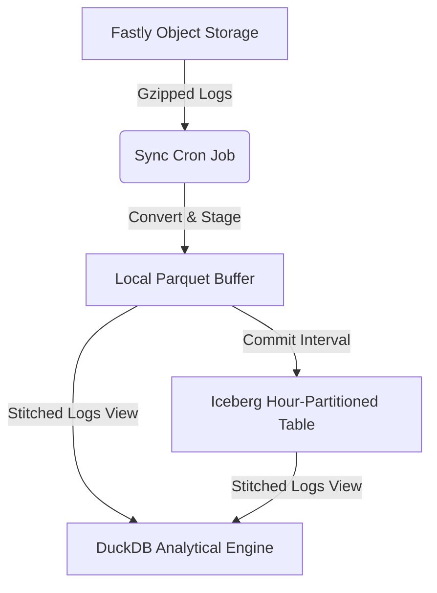

# System Architecture Reference
*Under the Hood of Fastly Object Storage Log Analysis*

This document provides a detailed technical overview of how the dashboard and ingest system are architected, how data flows through the application, and the internal design patterns used to maintain high performance, atomic crash safety, and strong security.

> ⚠️ **v2.0 rewrite in progress.** Sections marked `[v2.0-pending]` are being rewritten as part of the architecture cleanup. Target state is described in the ADRs under `pending-docs/adr/` (01: storage model; 02: request lifecycle; 03: tenancy; 04: middleware order; 05: frontend rendering boundary). The banner is removed section-by-section as each phase ships and confirms the new shape in production. Tracking issue: `pending-docs/cleanup_plan.md`.

---

## 1. Directory & Storage Layout

The system uses a layered storage architecture to optimize for real-time query speed, long-term durable query planning, and transactional consistency of administrative state:

| Layer | Location / Connection | Purpose |
|---|---|---|
| **Raw Logs** | `s3://{bucket}/{prefix}/raw/**/*.gz` | Immutable gzipped JSON logs streamed directly from Fastly logging endpoints. |
| **Local Buffer** | `cache/{bucket}/` | Transient Parquet files stored locally during active ingestion before commit. |
| **Iceberg Table** | `s3://{bucket}/{prefix}/iceberg/` | Long-term, hourly partitioned storage powered by Apache Iceberg. |
| **Admin State** | `s3://{bucket}/{prefix}/iceberg/meta/admin_state.json` | Replicated metadata: views, custom fields, audit logs, and log format history. |
| **DuckDB Engine** | `data/services/{service_id}.duckdb` | Per-service analytical query engine (compiles temporary tables and unified `logs` view). |
| **Service Metadata** | `data/services/{service_id}.metadata.db` | Per-service SQLite (WAL mode): stores local alerts, views, crons, and ingested file manifests. |
| **NGWAF Bot Cache** | `data/ngwaf/ngwaf_bot_cache.db` | Shared SQLite database caching known verified bots from Fastly's NGWAF API. |
| **Live Share State** | `data/system/remote_share.db` | Central SQLite database managing invitations, active shared sessions, and audit records. |

### Module layout

Storage subsystems live as cohesive packages rather than monoliths. The Iceberg engine is split into [`backend/core/iceberg/`](../backend/core/iceberg/) (`_core.py` holds the read/write/commit/optimize/expire paths; `fs.py` holds the `FosS3FileSystem` / `CachedS3FileSystem` subclasses that replaced the import-time s3fs monkeypatches). The per-service metadata SQLite surface is split into [`backend/core/metadata/`](../backend/core/metadata/) with one submodule per concern (`base`, `alerts`, `views`, `ingest_log`, `cron_log`, `asn_cache`, `usage_log`, `reconciliation`, `state`); a thin shim at [`backend/core/metadata_db.py`](../backend/core/metadata_db.py) re-exports the full historical surface so existing imports keep working.

### The Unified Logs View
To provide real-time query speed without waiting for Iceberg table commits, the DuckDB `logs` view dynamically stitches the committed Iceberg table and the local transient Parquet buffers together. Callers run analytical queries against the `logs` view without needing to worry about the underlying storage state.

---

## 2. Ingest Pipeline & Atomic Guarantees

Ingestion is scheduled using APScheduler. It performs active sync, commit, optimization, and expiration cycles on a per-service level:



### Scheduler module layout

The scheduler is no longer a single monolith. The APScheduler lifecycle, watchdog wrapper, and per-job bodies live as cohesive submodules under [`backend/cron/`](../backend/cron/): `scheduler.py` owns the `BackgroundScheduler` lifecycle and `_sync_jobs()` reload, `decorators.py` owns the `@cron_task` decorator (telemetry context + usage-log flush + watchdog hard-cap), and `jobs/` holds one file per job family (`sync.py`, `commit.py`, `compaction.py`, `optimize.py`, `expire.py`, `metadata.py`). [`backend/scheduler.py`](../backend/scheduler.py) is a thin compat shim that re-exports the same public symbols so `from backend.scheduler import get_scheduler` keeps working.

### Atomic Manifest & Crash Recovery
To guarantee exactly-once processing and avoid duplicating data during interrupted log transfers, the system uses a write-ahead registry pattern:

1.  **In-Flight Recording:** Before writing any staged Parquet files, a per-service SQLite table `ingest_in_flight` records the source filename, unique hash, and row counts.
2.  **Deterministic Buffering:** Staged Parquet files are named deterministically based on a SHA-256 hash of their sorted content (`batch_{sha256[:16]}.parquet`). If an ingest restarts or crashes mid-way, duplicate writes naturally overwrite the same file instead of creating redundant rows.
3.  **Commit Promotion:** Once the Parquet buffer is written successfully, the database transfers the records into `ingested_files` and clears the `ingest_in_flight` table.
4.  **Idempotent Auto-Recovery:** Upon any startup or tick cycle, the ingest system inspects left-over entries in the in-flight table. If the corresponding buffer exists, it is promoted; otherwise, it is dropped and queued for clean re-download on the next LIST tick.

---

## 3. VCL Log Format & Modular Field Groups

The log formatting engine generates a highly optimized single-line JSON structure compiled to valid VCL. To balance diagnostic detail with Fastly's `FASTLY_LOG_FORMAT_SAFE_MAX` size restriction (~8,000 characters), variables are split into twelve configurable groups (A through L):

*   **Group A:** Request Identity (Client IP, User Agent, TLS Details)
*   **Group B:** Cache Deep-Dive (Hits, Misses, Cache State, TTL)
*   **Group C:** Infrastructure (Server ID, POP Location)
*   **Group D/E:** Geolocation (Country, Region, Lat/Long, ASN)
*   **Group F/G:** Network Quality (TCP RTT, Bandwidth, Jitter)
*   **Group H/I:** Security (JA3 TLS Fingerprinting, Proxy / Tor Detection)
*   **Group J:** WAF/NGWAF Integration (Signals, Risk Scores)
*   **Group K:** HTTP/3 QUIC Metrics
*   **Group L:** Origin Performance Metrics (TTFB, Backend response times)

Admins can also define custom log fields using arbitrary VCL expressions. Each custom expression is validated using the Japanese Fastly linter (`falco`) if installed, fallback-matching regular expressions otherwise.

---

## 4. Live Dashboard Sharing Architecture

The **Share Dashboard** feature allows administrators to invite read-only analysts to collaborate on log views. Rather than copying log files, the system exposes a secure, read-only session that feeds from the administrator's running analytical engine.

Two direct-mode connectivity topologies are supported (the SSH-reverse-tunnel via localhost.run was removed in v2.0):

```text
1) Direct Hostname:      [Analyst] -> (https://logs.domain.com) --------> [Admin Instance]
2) Direct IP Address:    [Analyst] -> (https://IP:Port) ----------------> [Admin Instance]
```

Both modes share a single backend code path — `ShareStartPayload.use_tunnel=False` plus a `public_endpoint=<https URL>` that the admin supplies. The UI mode selector is presentational; the backend only enforces that `public_endpoint` starts with `https://` (the analyst session cookies need `secure=true`).

### Module layout

The tunnel manager and share-DB are split into cohesive packages:

- [`backend/utils/tunnel/`](../backend/utils/tunnel/) — `manager.py` owns the `TunnelManager` singleton (direct-mode lifecycle, sever-all panic), `session.py` holds `AnalystSession`, `rate_limiter.py` is the sliding-window `_LoginRateLimiter`, `state.py` persists `tunnel_state.json`, `fingerprint.py` computes the session fingerprint. The SSH-subprocess code path (the legacy localhost.run path, ~400 lines including `_TUNNEL_URL_RE`, the sleep listener, OS power-event handlers, and reconnect logic) was deleted in v2.0.
- [`backend/core/share_db/`](../backend/core/share_db/) — `connection.py` (pool + corruption self-heal with quarantine), `schema.py` (own MIGRATIONS dict + `apply_pending` + `PRAGMA user_version`), `invites.py`, `sessions.py`, `audit.py`, `passcode.py` (argon2id hashing with a back-compat scrypt verify branch and rehash-on-login upgrade), `tos.py`, `settings.py`, `validation.py`. The package `__init__.py` re-exports the historical public surface for compat.

### Security Isolation Layers
*   **Middleware Enforcement:** The `RemoteAccessMiddleware` intercepts any request coming from shared endpoints, strictly blocking administrative endpoints (such as configurations, deletion paths, and credentials) while rate-limiting asset scraping. The Caddyfile + compose + middleware trust topology is asserted in pytest so a regression that re-opens the bypass class trips CI.
*   **Argon2id Passcodes:** Analyst invites are protected by cryptographically secure, random passcodes hashed at rest with argon2id (the 2026 OWASP recommendation). Hashes minted before the cutover still verify via scrypt and are transparently upgraded on the analyst's next login.
*   **Brute-Force Prevention:** Failed access attempts are tracked. 5 failures within 60 seconds triggers a temporary IP-level lockout.
*   **Immediate Severance:** Admins can instantly revoke specific invites or execute a **Sever All Access** panic, instantly evicting active sessions.
