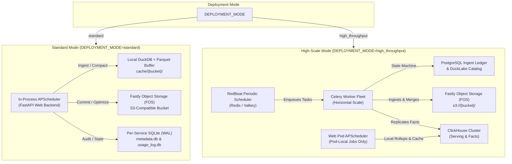

# Background Tasks & Cron Jobs — Master Architectural Directives & Specification Catalog

This directory contains the authoritative specification, telemetry contract, query audit mandate, and automated testing runbook for every scheduled background task and cron job in **Fastly Log Analytics**.

---

## 1. Master Directives & Operating Principles

Every scheduled background job in this system must adhere to these non-negotiable principles:

1. **Modular Specification Structure:**
   - Every background job has a dedicated specification file under [`docs/cron/jobs/`](file:///Users/drew.michael/Projects/fastly-log-analytics/docs/cron/jobs/) documenting its purpose, cadence, architectural execution matrix, role permissions, step-by-step lifecycle, query audit contract, failure modes, manual triggers, and AI verification checklist.
2. **100% Query, API Call & Telemetry Capture:**
   - Background jobs are subject to the same strict zero-dark-work mandate as user-facing pages.
   - Every database query (DuckDB analytical SQL, ClickHouse MergeTree DDL/DML, PostgreSQL ledger updates, SQLite operational writes), cloud storage API call (FOS S3 Class A PUT/DELETE and Class B GET/LIST), Fastly API call (Edge Stats, NGWAF signals), and DNS PTR resolution must be timed, attributed, and recorded.
3. **Multi-Engine Accounting & Observability:**
   - Jobs that interact with **ClickHouse** must register queries with `query_registry.register("ClickHouse", ...)` so they appear in the Live Query Monitor.
   - Jobs that interact with **DuckLake / DuckDB** must record execution durations in `telemetry_queries`.
   - Jobs that perform FOS S3 operations must record Class A / Class B counts in `usage_log.db`.
   - Jobs that modify operational SQLite databases must use `ThreadLocalPool` with connection wait times (`app.thread_wait_ms`) instrumented.
4. **Strict Concurrency & Pod Safety:**
   - Long-running cloud write jobs (`optimize`, `expire`, `commit`) must acquire exclusive per-service distributed or file-based locks.
   - In distributed deployments (`DEPLOYMENT_MODE=high_throughput`), jobs that touch pod-local state, caches, or DuckDB memory pools (`local_compact`, `partial_hour_merge`, `rollup_heal`, `rollup_compact`, `insights_prewarmer`, `alerts_evaluation`, `metric_snapshot`, `duckdb_recycle`) **strictly run on the web serving pod's APScheduler**. They are NEVER dispatched to Celery workers, preventing multi-process lock contention on local files.
5. **Local-Only Safety Gate (`FLA_DEV_NO_CRONS=1`):**
   - Development environments and AI test sessions must be capable of running safely without racing production FOS buckets or generating external write costs.
   - When `FLA_DEV_NO_CRONS=1` is set, all cloud-writing jobs (`log_discovery`, `commit`, `optimize`, `expire`, `full_sync`, `gap_heal`) are completely bypassed. Only local-safe jobs (`local_compact`, `rollup_compact`, `rollup_heal`, `partial_hour_merge`, `duckdb_recycle`, `metric_snapshot`) are permitted to run.
6. **Graceful Degradation & Autonomous Recovery:**
   - Background tasks must be idempotent. Re-running a job on the same data must never produce duplicate rows or corrupt catalog state.
   - Distributed pipelines must include automated crash-net sweeps (`ledger_sweep`, `ledger_rum_sweep`) to recover orphaned worker claims.
7. **Interactive Clarification & Inquiry Mandate (Never Guess):**
   - Before working on, modifying, or testing any background job or its scheduler registration, the AI agent must read the specific job specification (`docs/cron/jobs/{job}.md`) and supporting architecture docs, and proactively ask the operator clarifying questions regarding scheduling, backpressure, failure handling, or role constraints.
   - Any clarifications or design decisions must be updated in the job specification before executing tests or applying code changes.

---

## 2. Scheduling Topologies & Engines

The execution engine for background jobs depends on the configured `DEPLOYMENT_MODE`:

---

## 3. Roles & Permission Governance

Background jobs respect tenant isolation and dual-role permission models:

| Role | Permitted Jobs | Prohibited Jobs | Architectural Rationale |
|---|---|---|---|
| **Admin (`read_write`)** | **All 26 Jobs:** Full ingest, compaction, optimization, snapshot expiry, full sweeps, alerting, backups, and housekeeping. | None | Admins own the data plane and cloud storage credentials. |
| **Analyst Path A (Standalone Instance)** | `sync_metadata_{id}`, `local_compact_{id}`, `partial_hour_merge_{id}`, `alerts_evaluation_{id}`, `insights_prewarmer_{id}`, `metric_snapshot`, `duckdb_recycle`, `share_audit_purge`. | `log_discovery_{id}`, `commit_{id}`, `optimize_{id}`, `expire_{id}`, `full_sync_{id}`, `gap_heal_{id}`, `rum_sync_{id}`, `rum_commit_{id}`, `clickhouse_backup_{id}`. | Analysts have read-only FOS credentials. They must never perform cloud mutations, cloud commits, or raw log unlinking. |
| **Analyst Path B (Remote Live Share)** | **Zero Cron Execution:** Read-only analyst sessions connect over HTTPS to the admin's running process. | All cron execution APIs blocked with HTTP 403. | Analysts share the running host server; all background maintenance is handled by the host admin process. |

---

## 4. Complete Background Job Inventory & Specification Catalog

Below is the master catalog of all 26 scheduled background tasks. Click the link in the **Specification File** column to view the complete operational contract, query audit rules, and testing checklist for each job:

| Job Identifier | Default Cadence | Standard Mode Engine | High-Scale Mode Engine | Role Scope | Specification File |
|---|---|---|---|---|---|
| `log_discovery_{id}` | Derived (`log_period // 2`) | APScheduler | RedBeat + Celery | Admin | [log-discovery.md](file:///Users/drew.michael/Projects/fastly-log-analytics/docs/cron/jobs/log-discovery.md) |
| `commit_{id}` | Every 5 min (configurable) | APScheduler | RedBeat + Celery | Admin | [commit.md](file:///Users/drew.michael/Projects/fastly-log-analytics/docs/cron/jobs/commit.md) |
| `local_compact_{id}` | Every 1 min | APScheduler | Pod APScheduler | Admin & Analyst A | [local-compact.md](file:///Users/drew.michael/Projects/fastly-log-analytics/docs/cron/jobs/local-compact.md) |
| `partial_hour_merge_{id}` | Every 30 sec | APScheduler | Pod APScheduler | Admin & Analyst A | [partial-hour-merge.md](file:///Users/drew.michael/Projects/fastly-log-analytics/docs/cron/jobs/partial-hour-merge.md) |
| `rollup_heal_{id}` | Hourly at :05 | APScheduler | Pod APScheduler | Admin | [rollup-heal.md](file:///Users/drew.michael/Projects/fastly-log-analytics/docs/cron/jobs/rollup-heal.md) |
| `rollup_compact_{id}` | Daily 02:00 UTC | APScheduler | Pod APScheduler | Admin | [rollup-compact.md](file:///Users/drew.michael/Projects/fastly-log-analytics/docs/cron/jobs/rollup-compact.md) |
| `optimize_{id}` | Daily 04:00 UTC | APScheduler | RedBeat / Worker | Admin | [optimize.md](file:///Users/drew.michael/Projects/fastly-log-analytics/docs/cron/jobs/optimize.md) |
| `expire_{id}` | Hourly | APScheduler | Worker / Pod | Admin | [expire.md](file:///Users/drew.michael/Projects/fastly-log-analytics/docs/cron/jobs/expire.md) |
| `full_sync_{id}` | Daily 03:30 UTC | APScheduler | RedBeat + Celery | Admin | [full-sync.md](file:///Users/drew.michael/Projects/fastly-log-analytics/docs/cron/jobs/full-sync.md) |
| `gap_heal_{id}` | Every 30 min | APScheduler | RedBeat + Celery | Admin | [gap-heal.md](file:///Users/drew.michael/Projects/fastly-log-analytics/docs/cron/jobs/gap-heal.md) |
| `metadata_cleanup_{id}` | Daily 03:15 UTC | APScheduler | Pod APScheduler | Admin | [metadata-cleanup.md](file:///Users/drew.michael/Projects/fastly-log-analytics/docs/cron/jobs/metadata-cleanup.md) |
| `alerts_evaluation_{id}` | Every `log_period` sec | APScheduler | Pod APScheduler | Admin & Analyst A | [alerts-evaluation.md](file:///Users/drew.michael/Projects/fastly-log-analytics/docs/cron/jobs/alerts-evaluation.md) |
| `insights_prewarmer_{id}` | Every 240 sec | APScheduler | Pod APScheduler | Admin & Analyst A | [insights-prewarmer.md](file:///Users/drew.michael/Projects/fastly-log-analytics/docs/cron/jobs/insights-prewarmer.md) |
| `sync_metadata_{id}` | Every `log_period` sec | APScheduler | N/A (ADR-17) | Analyst Path A | [sync-metadata.md](file:///Users/drew.michael/Projects/fastly-log-analytics/docs/cron/jobs/sync-metadata.md) |
| `ledger_sweep_{id}` | Every 15 min | Disabled | RedBeat + Celery | Admin | [ledger-sweep.md](file:///Users/drew.michael/Projects/fastly-log-analytics/docs/cron/jobs/ledger-sweep.md) |
| `clickhouse_backup_{id}` | Daily 01:00 UTC | Disabled | Celery / Pod | Admin | [clickhouse-backup.md](file:///Users/drew.michael/Projects/fastly-log-analytics/docs/cron/jobs/clickhouse-backup.md) |
| `rum_sync_{id}` | Every 60 sec | APScheduler | Disabled | Admin | [rum-sync.md](file:///Users/drew.michael/Projects/fastly-log-analytics/docs/cron/jobs/rum-sync.md) |
| `rum_commit_{id}` | Every 5 min | APScheduler | Disabled | Admin | [rum-commit.md](file:///Users/drew.michael/Projects/fastly-log-analytics/docs/cron/jobs/rum-commit.md) |
| `rum_discovery_{id}` | Every 60 sec | Disabled | RedBeat + Celery | Admin | [rum-discovery.md](file:///Users/drew.michael/Projects/fastly-log-analytics/docs/cron/jobs/rum-discovery.md) |
| `ledger_rum_sweep_{id}` | Every 15 min | Disabled | RedBeat + Celery | Admin | [ledger-rum-sweep.md](file:///Users/drew.michael/Projects/fastly-log-analytics/docs/cron/jobs/ledger-rum-sweep.md) |
| `metric_snapshot` | Every 60 sec | APScheduler | Pod APScheduler | Global / Admin | [metric-snapshot.md](file:///Users/drew.michael/Projects/fastly-log-analytics/docs/cron/jobs/metric-snapshot.md) |
| `rdns_enrichment` | Every 5 min | APScheduler | Pod APScheduler | Global / Admin | [rdns-enrichment.md](file:///Users/drew.michael/Projects/fastly-log-analytics/docs/cron/jobs/rdns-enrichment.md) |
| `bot_data_refresh` | Daily 02:00 UTC | APScheduler | Pod APScheduler | Global / Admin | [bot-data-refresh.md](file:///Users/drew.michael/Projects/fastly-log-analytics/docs/cron/jobs/bot-data-refresh.md) |
| `ngwaf_sync_{id}` | Every 5 min | APScheduler | Pod APScheduler | Admin | [ngwaf-sync.md](file:///Users/drew.michael/Projects/fastly-log-analytics/docs/cron/jobs/ngwaf-sync.md) |
| `share_audit_purge` | Daily 03:45 UTC | APScheduler | Pod APScheduler | Global / Admin | [share-audit-purge.md](file:///Users/drew.michael/Projects/fastly-log-analytics/docs/cron/jobs/share-audit-purge.md) |
| `duckdb_recycle` | Every 60 min | APScheduler | Pod APScheduler | Process-Wide | [duckdb-recycle.md](file:///Users/drew.michael/Projects/fastly-log-analytics/docs/cron/jobs/duckdb-recycle.md) |

---

## 5. Universal Telemetry, Timing & Multi-Engine Query Audit Mandate

Every background job must participate in the comprehensive telemetry and audit harness:

### 5.1 Storage & Operational Logging
1. **`cron_runs` Table in SQLite (`metadata.db`):**
   - Every execution records: `run_id`, `service_id`, `job_id`, `status` (`success`, `warning`, `error`), `started_at`, `duration_s`, `details_json`.
   - Result tallies (files ingested, rows committed, bytes compacted, memory reclaimed) must be recorded in `details_json`.
2. **`usage_log.db` Billing & Cost Telemetry:**
   - Any job executing FOS operations must record Class A (PUT, DELETE, LIST) and Class B (GET) calls with exact operation attributes.
3. **`cron_progress` Server-Sent Events (SSE):**
   - Ingest and maintenance tasks emit live step-by-step progress events consumed by the Admin UI (`/admin/sync-status`).

### 5.2 Multi-Engine Query Auditing Rules
- **DuckDB Analytical SQL:** Every analytical query run during alerting, prewarming, or rollup generation must be wrapped with timing instrumentation and recorded in `telemetry_queries`.
- **ClickHouse Operations:** Every query issued against ClickHouse (including `BACKUP TABLE`, projection aggregations, and partition merges) must register through `query_registry.register("ClickHouse", ...)` so operators can audit them in the Live Query Monitor.
- **PostgreSQL Ledger Operations:** Distributed state transitions (`discovered` -> `claimed` -> `committed`) must use parameterized queries and record transaction durations.
- **SQLite Database Access:** All reads and writes to SQLite databases must flow through `ThreadLocalPool` wrappers to prevent thread contention and record pool acquisition wait times (`app.thread_wait_ms`).

---

## 6. Concurrency, Locking, Backpressure & Resource Governance

To maintain sub-second UI responsiveness while background jobs run:

1. **Per-Service Write Locks:**
   - Ingest, commit, and compaction operations acquire an exclusive per-service file or distributed lock. Only one write operation can mutate a service's Parquet buffers or DuckLake catalog at a time.
2. **Heavy Refresh Throttling (`_claim_heavy_refresh`):**
   - Auxiliary background updates (`update_top_values()` and `reconcile_fastly_stats()`) are strictly throttled to run at most once every 60 seconds per service, preventing continuous CPU churn on busy ingest streams.
3. **Queue-Depth Backpressure:**
   - Distributed task dispatchers inspect Redis queue depth before enqueuing conversion tasks, preventing task queue saturation during worker restarts.
4. **Adaptive Gap Healing Throttle:**
   - If sustained log loss is detected by `gap_heal_{service_id}`, subsequent sweeps are throttled to prevent cascading full sweeps when losses are caused by upstream Fastly edge drop policies.
5. **Memory Leak Mitigation:**
   - `duckdb_recycle` periodically flushes C++ object cache footers, releasing native memory heaps back to the OS without dropping active queries.

---

## 7. Automated Verification & Testing Runbook

When verifying background jobs during automated test suites or dedicated AI testing sessions:

### Verification Checklist:
- [ ] **1. Scheduler Registration Audit:**
  - Inspect `scheduler.get_jobs()` or `redbeat_schedule_entries()`.
  - Confirm all 26 jobs are registered according to their deployment mode, role, and activation gates (e.g. `alerts_evaluation` only registers when alerts exist).
- [ ] **2. Manual API Triggering:**
  - Execute manual POST triggers for each job and verify HTTP 200 response:
    - `/api/admin/sync/{service_id}` (`log_discovery`)
    - `/api/admin/commit/{service_id}` (`commit`)
    - `/api/admin/compact/{service_id}` (`local_compact`)
    - `/api/admin/optimize/{service_id}` (`optimize`)
    - `/api/admin/expire-snapshots/{service_id}` (`expire`)
    - `/api/admin/full-sweep/{service_id}` (`full_sync`)
    - `/api/admin/gap-heal/{service_id}` (`gap_heal`)
    - `/api/admin/duckdb/recycle` (`duckdb_recycle`)
- [ ] **3. `cron_runs` Verification:**
  - Inspect `data/services/{service_id}.metadata.db` table `cron_runs`.
  - Assert that execution status is `success` and `duration_s > 0`.
- [ ] **4. Telemetry & Query Audit Verification:**
  - Verify queries appear in Live Query Monitor (`/admin/queries`) under appropriate engines (`DuckDB`, `ClickHouse`, `PostgreSQL`, `SQLite`).
  - Verify FOS operations are attributed in `usage_log.db`.
- [ ] **5. Dev Safety Verification (`FLA_DEV_NO_CRONS=1`):**
  - Launch application with `FLA_DEV_NO_CRONS=1`.
  - Confirm cloud-writing jobs are not registered and do not fire.
  - Confirm local-safe jobs (`local_compact`, `partial_hour_merge`, `rollup_heal`, `rollup_compact`, `duckdb_recycle`, `metric_snapshot`) register and run normally.
