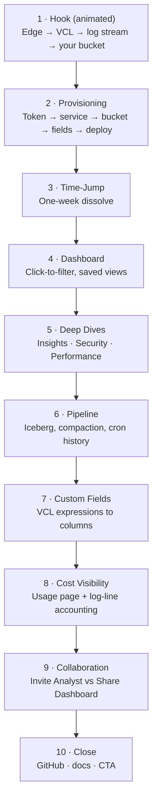
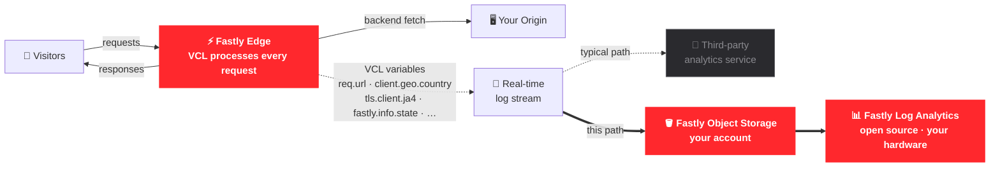

# Fastly Log Analytics — Launch Video Production Guide

The end-to-end production plan for the first public release demo of **Fastly Log Analytics**. Part 1 aligns the team on goals, positioning, and recording strategy. Part 2 is the camera-ready scene-by-scene script (paced for Google Vids teleprompter). Part 3 is the operational checklist that gets us from "ready to record" to "ready to publish."

| Field | Value |
| :--- | :--- |
| **Runtime target** | 4:45 – 5:00 |
| **Aspect / resolution** | 16:9, 1080p (1920×1080) |
| **Delivery format** | MP4 (H.264, AAC) + captioned SRT |
| **Primary distribution** | GitHub repo README, Fastly developer hub, conference loop reels |
| **Status** | Draft script ready for team review |

---

## Part 1 — Production Strategy & Setup (Team Alignment)

### 1. Goal & Success Criteria

**Goal.** In under five minutes, convince a Fastly customer-facing engineer (SA / SE / TAM) that they can stand up request-level log analytics — including security signals, bot detection, and performance analytics — using **only Fastly products** and get a teammate up to speed in one viewing.

**Audience.**
- **Primary:** Fastly SAs, SEs, TAMs preparing for customer conversations about logging cost or observability gaps.
- **Secondary:** Cost-conscious Fastly customers and prospects already streaming real-time logs but paying a third-party for ingestion and storage.

**Core message.** Real-time log streaming + Fastly Object Storage + this open-source tool = production-grade, request-level observability with no third-party logging vendor in the picture.

**A viewer should be able to answer, by the end:**
1. What problem does this solve, and why now? *(Request-level visibility into every visitor — humans, bots, crawlers, scrapers, partners, attackers, fast and slow alike. Who they are, what they're doing, what impact they're having on the origin, and where it's costing you — so you can make informed decisions about what to optimize, shield, rate-limit, or block at the edge.)*
2. How does it work end-to-end? *(Edge logs land in a Fastly Object Storage bucket as raw `.gz`; the app ingests and atomically commits them into an Apache Iceberg table in that same bucket; a local DuckDB + Parquet cache serves the dashboard so analytics queries never re-hit the cloud.)*
3. How do I get it running? *(Wizard. Five fields. One click. Logs flow.)*
4. Where's the catch? *(There isn't one — it's Apache-2.0, your only Fastly costs are Fastly Object Storage class operations and storage, and nothing leaves your account.)*

**Tone.** Developer-direct. Confident, not salesy. No music swells. No stock B-roll. Cursor movements deliberate; the product does the heavy lifting.

### 2. Brand & Visual Identity

| Element | Spec |
| :--- | :--- |
| **Color palette** | App's native dark theme — no recoloring. Use a slightly softer off-black/slate canvas (`#121214` or `#18181B`) behind the bright Fastly red (`#FF282D`) to prevent visual contrast clipping and vibration on high-contrast displays. |
| **Typography (titles)** | Inter or system-ui at 600 weight. Avoid Google Vids' default decorative fonts. |
| **Cursor** | macOS default at 1.5× size (System Settings → Accessibility → Display → Pointer size). |
| **Window chrome** | Hide all bookmarks, extensions, profile avatars, and personal tabs. Use a fresh browser profile named "Demo". |
| **Lower-thirds** | Scene-opener card with scene title + section icon for 2 seconds, then dissolve. |
| **End card** | GitHub URL, docs URL, Apache-2.0 badge, 4-second hold. |

### 3. Recording Stack — Google Vids

Google Vids stays the recording, narration, and assembly surface — it's collaborative, browser-based, and keeps assets in one place.

- **Capture.** Native recording studio. Single dedicated 1080p Chrome window. No second monitor visible in the capture.
- **Teleprompter.** Paste each scene's voiceover (Part 2) into the script panel of its slide. Toggle the teleprompter overlay in the studio so the presenter can read while the cursor drives.
- **Voiceover (dual-track for v1).** Record the full script **twice**: once as a manual VO from the assigned SE/SA, and once using Google Vids' AI voice ("Narrator"). Cut both versions on the same timeline; pick the final mix after stakeholder review. Keep both source tracks archived in case a future update wants to switch.
- **Editing.** Drop clips onto the timeline, run **Automatic Transcript Trim** to strip filler words and pauses, then apply 0.5-second cross-fades between scenes. Reserve hard cuts for *within* a scene.

### 4. The "Time-Jump" Recording Strategy

A freshly provisioned service takes minutes to receive its first edge log. Rather than fake it, lean into the cut — record two environments plus one pre-built opener, and bridge them with the narration.

| Source | Purpose | State |
| :--- | :--- | :--- |
| **Opener (pre-built)** | Animated Scene 1 explaining Fastly's edge position → VCL → log streaming → this tool. Not screen-captured. | Built in Vids / Keynote / After Effects per the **Scene 1 — Opener Slide Build Spec** in Part 2. |
| **Environment A: Fresh** | Captures Scene 2 (the provisioning wizard). | Unconfigured app at `http://localhost:3000/`. No services exist. |
| **Environment B: Populated** | Captures Scenes 3–10 (the analytics surface). | Same app, separate instance. **Seven days of realistic, PII-scrubbed production logs** ingested ahead of time. |

**Two cuts.**

1. **Opener → Env A** (end of Scene 1, ~26 s mark): 1-second cross-fade from the final state of the animated opener into the landing page. The cursor in Env A is pre-positioned near "Provision New Service" so Scene 2 begins clicking with no settle time.
2. **Env A → Env B** (end of Scene 2 / start of Scene 3): on the wizard's green success screen, hold one second of stillness, then dissolve (1-second cross-fade) to Env B's dashboard with the 7-day range preset. The voiceover in Scene 3 names the jump explicitly — no attempt to hide it.

### 5. Narrative Arc

### 6. Positioning Anchors (Every Scene Should Reinforce One)

| Anchor | Where it lands |
| :--- | :--- |
| **Start with the stream.** The pipeline begins with Fastly's free real-time log streaming pushing into a Fastly Object Storage bucket. No third party in the path. | Scenes 1, 2, 6 |
| **Who, what, where, how much.** The pitch is visibility — answering "who's hitting me, what are they doing, what's it costing, what should I do at the edge?" Covers humans, bots, crawlers, scrapers, partners, attackers; fast spikes and slow-and-low alike. Avoid framing as generic "troubleshooting" or as a narrow bot-defense tool. | Scenes 1, 4, 5 |
| **Edge-policy enablement.** Categorized request-level logs are the input to a real decision: optimize, rate-limit, shield, or block — at the edge. | Scenes 4, 5, 7 |
| **Sub-second local speeds.** Dashboards query a local DuckDB + Parquet cache. Repeated refreshes cost **zero** Fastly Object Storage Class-B operations. | Scenes 4, 6, 8 |
| **Apache-2.0, your hardware, your data.** No vendor lock-in, no SaaS subscription, no data leaving your account. | Scenes 1, 9, 10 |

### 7. Team Decisions (Locked for v1)

- [x] **Voiceover:** Record **both** tracks — human (SE/SA) and Google Vids AI ("Narrator") — and pick the final mix in post. Lets us A/B which lands better with the target audience without re-shooting.
- [x] **Pipeline depth:** Scene 6 leads with the **Cron Runs** view — the operational story is part of the pitch.
- [x] **VCL custom fields:** Demo with **all field groups toggled on** (matches the seeded Env B dataset). Voiceover explicitly says "you choose which groups you need" so viewers don't think they're forced into the full set.
- [x] **NGWAF:** Showcase the **linking step during provisioning** in Scene 2. NGWAF enrichment appears again in Scene 5 as payoff.
- [x] **CTA destination:** GitHub repo only for v1. Revisit once a developer-hub landing page exists.

---

## Part 2 — Scene-by-Scene Script

**Pacing notes for the presenter / AI voice:**
- Voiceover word counts target ~150 wpm. Where a cell looks long, trust the budget — it's been timed.
- Cursor moves should *complete* a half-beat before the corresponding sentence ends, never after.
- All durations are upper bounds. Coming in under is fine; running over is not.

**Runtime budget:** 30 + 60 + 8 + 38 + 35 + 32 + 28 + 33 + 23 + 15 = **5:02**

---

### Scene 1 — Hook (Animated Opener)

- **Duration:** 30 s
- **Format:** Pre-built animated slide (no live app footage). Cross-fades into Scene 2's landing page at the very end.

| On-screen action | Voiceover |
| :--- | :--- |
| Animated opener slide builds in four beats (see **Scene 1 — Opener Slide Build Spec** below). Final 2 s cross-fades to Environment A landing page with the cursor pre-positioned near **"Provision New Service."** | *"Fastly processes every edge request, exposing rich diagnostic data through VCL variables. Instead of routing this sensitive data to expensive third-party platforms that charge by the gigabyte, you can stream it securely to your own Fastly Object Storage bucket. Fastly Log Analytics runs directly on your hardware as a self-hosted dashboard, giving you instant SQL-powered insights into traffic anomalies, security events, and real-time costs. No third-party data egress, no SaaS bills, complete compliance control, and raw sub-second querying power."* |

#### Scene 1 — Opener Slide Build Spec

**Aspect:** 16:9, dark background (`#0E0E10` — matches the app's native theme). All text in white (`#F5F5F7`) except accents.
**Accent color:** Fastly red `#FF282D` for the Fastly Edge node, the FOS bucket, and the dashboard node.
**Dim color:** mid-grey `#5A5A5F` for the third-party path (deliberately deprioritized).

The slide builds in four timed beats, synced to the voiceover. Each beat's elements enter with **fade-in + 12px slide-up**, staggered 150 ms apart within a beat. Once an element is on screen it stays until the cross-fade out.

**Reference flow (use as the visual blueprint — screenshot rendered Mermaid as a starting frame and refine in Vids / Keynote):**

**Beat-by-beat build (timing aligned to voiceover):**

| Beat | Time | VO line landing on this beat | Elements that enter |
| :--- | :--- | :--- | :--- |
| **1** | 0 – 7 s | *"Fastly processes every edge request, exposing rich diagnostic data through VCL variables."* | Rapid entry of **Visitors** (left, user-cluster icon), **Fastly Edge** (center, Fastly logo, red accent, subtle pulse), and **Your Origin** (right, server-stack icon). Connection paths draw immediately at high speed. A greyed-out SaaS cloud node overlays a money-loss icon to signify expensive third-party bills. |
| **2** | 7 – 14 s | *"Instead of routing this sensitive data to expensive third-party platforms that charge by the gigabyte, you can stream it securely to your own Fastly Object Storage bucket."* | Title card wipes in. Below the Fastly Edge node, a vertical stack of VCL chips cascades down in Fastly Red: `req.url`, `client.geo.country`, `tls.client.ja4`, `…`. The expensive third-party path cancels out, and a thick, glowing pipeline draws securely into the **Fastly Object Storage** bucket icon labeled "your account". |
| **3** | 14 – 21 s | *"Fastly Log Analytics runs directly on your hardware as a self-hosted dashboard, giving you instant SQL-powered insights into traffic anomalies, security events, and real-time costs."* | Data streams rapidly from the storage bucket into a dynamic dashboard frame labeled **"Fastly Log Analytics — open source · your hardware"**. Four mini icons representing **SQL Engine**, **Shield/WAF**, **Anomaly Spike**, and **Cost Meter** expand dynamically above the dashboard wireframe. |
| **4** | 21 – 28 s | *"No third-party data egress, no SaaS bills, complete compliance control, and raw sub-second querying power."* | Four horizontal high-contrast value statements wipe onto the canvas: **[✓] No Third-Party Egress** -> **[✓] No SaaS Bills** -> **[✓] Complete Compliance** -> **[✓] Sub-second SQL**. The tagline **"Keep it in your court."** scales up, and the lower-third **"Apache-2.0 · Self-Hosted"** badge slides into view. |
| **Exit** | 28 – 30 s | (silent) | The entire high-density graphic settles, glowing softly, and cross-dissolves (1.0s) into the Environment A landing page with the cursor pre-positioned near the **"Provision New Service"** card so Scene 2 can begin with no settle time. |

**Asset prep checklist:**
- [ ] Fastly logo (SVG, red-on-transparent) — sourced from Fastly brand library.
- [ ] User-cluster, server-stack, bucket, and chart-window icons — Vids' built-in icon library or Lucide / Heroicons set (consistent stroke weight).
- [ ] VCL variable chips — built as rounded-rectangle text components in Vids; reuse one as a master.
- [ ] Third-party box stays deliberately generic and unbranded (no real vendor logo — legal liability, also lets viewers project their own incumbent).

#### Recommended Animation Pipelines

Google Vids excels at timeline compilation but lacks advanced keyframing and vector animation. It is highly recommended to construct the Scene 1 animation in a dedicated design tool, screen-record it in 1080p, and import it as a single master clip:

*   **Option A: Keynote (Fastest & Easiest):** Design the horizontal flow in Keynote on a dark background. Use **Magic Move** transitions and staggered entry builds (e.g., set build delays to exactly `0.15s` or `0.18s` for the cascading VCL chips). Play the presentation full-screen and screen-record.
*   **Option B: Figma Smart Animate (Maximum Polish):** Design 4 consecutive frames representing the state at each Beat. Link them in Prototype mode using `After Delay` triggers with `Smart Animate` set to `Ease In and Out` (duration `400ms – 600ms`) to create fluid vector line draws and scaling pulses. Screen-record the prototype viewport.

**Build effort estimate:** ~15–20 min in Keynote or Figma to configure the build steps, then a 30-second screen capture to import into Google Vids as a finished asset.

---

### Scene 2 — Provisioning Wizard

- **Duration:** 60 s
- **URL:** Starts at `http://localhost:3000/`, advances through the wizard.
- **State:** Provisioning wizard with NGWAF workspace available on the linked Fastly account.

| On-screen action | Voiceover |
| :--- | :--- |
| **Click "Provision New Service."** Wizard slides to the token field. | *"One click starts the wizard."* |
| **Paste a Fastly API token.** Click **Next**. | *"Paste an API token — the wizard uses it to set everything up on your behalf."* |
| **Pick a VCL service** from the dropdown. Click **Next**. | *"Pick the VCL service whose logs you want to analyze."* |
| **Storage step.** Region pre-filled; type a bucket name. Click **Next**. | *"For storage, name a Fastly Object Storage bucket. The wizard creates it, mints scoped read-write keys, and stands up a CDN-fronting Fastly service so all future log reads come back through cache — at zero egress cost."* |
| **NGWAF link step.** Click the **Link NGWAF workspace** dropdown and select the available workspace. Click **Next**. | *"If you run Next-Gen WAF, link the workspace here. The app will sync verified-bot intelligence and enrich matching log rows automatically — no extra setup later."* |
| **Fields step.** **Toggle every field group on** — core HTTP through QUIC / HTTP3. Highlight the live byte-count meter as it climbs. Click **Deploy**. | *"Now pick the log field groups. We're turning everything on for this demo — you'd choose the groups your team actually needs. The configurator shows the per-line cost in real time so you never blow Fastly's log-format size limit."* |
| **Watch the install log stream.** Hold on the green success screen for ~2 s. | *"The wizard provisions the bucket, attaches a structured JSON logging endpoint, writes the matching VCL, and registers the NGWAF workspace — all auto-rolled back if anything fails. Logs are now flowing."* |

---

### Scene 3 — The Time-Jump

- **Duration:** 8 s
- **Visual:** **[CUT]** 1-second cross-fade from Env A success screen to Env B `/dashboard/` with a 7-day range pre-selected.

| On-screen action | Voiceover |
| :--- | :--- |
| Hold one beat on the success screen. Cross-fade to the populated dashboard. Cursor lands on the date-range picker. | *"A new service takes a few minutes to start collecting logs. Let's fast-forward one week."* |

---

### Scene 4 — Interactive Dashboard

- **Duration:** 38 s
- **URL:** `/dashboard/` (Environment B)
- **State:** Fully populated dashboard, 7-day window.

| On-screen action | Voiceover |
| :--- | :--- |
| **Click-and-drag** across a visible traffic spike on the requests-over-time chart to zoom in. | *"Every visualization is a filter. Drag the timeline to isolate an anomaly…"* |
| **Click a country** on the choropleth request map. Filter chip appears in the header. | *"…click a region on the global request map…"* |
| **Click a `404`** in the status-code panel. A second filter chip appears. | *"…or click any status code, host, or user-agent to drill in. Dashboards respond in milliseconds because they query a local DuckDB cache — not the cloud."* |
| **Open the Saved Views dropdown** and hover the **"Pin current view"** action. | *"Pin any filter combination as a saved view to reopen it with one click."* |

---

### Scene 5 — Deep Dives: Insights · Security · Performance

- **Duration:** 35 s
- **Navigation:** Sidebar → **Insights**, then **Security**, then **Performance**.

| On-screen action | Voiceover |
| :--- | :--- |
| **Insights tab.** Cursor lands on a populated anomaly card (e.g., "Regional surge — IN"). | *"The Insights view runs automated anomaly detection — error spikes, regional surges, new IPs, cache regressions, latency drift — by comparing a recent window against a longer baseline."* |
| **Security tab.** Scroll past the Verified Bots panel and Top TLS Fingerprints chart. | *"The Security view surfaces TLS fingerprints, request-header anomalies, proxy and anonymizer breakdowns, and — when NGWAF is linked — verified-bot intelligence joined onto matching log rows."* |
| **Performance tab.** Pause on the Slowest URLs table and the Origin-vs-Edge processing chart. | *"And the Performance view zeroes in on where to spend optimization effort: slowest URLs and networks, origin TTFB, cache-TTL distribution, and how each request's time splits between edge and origin."* |

---

### Scene 6 — Pipeline & Log Management

- **Duration:** 32 s
- **URL:** `/admin` (Log Management), **Cron Runs tab open by default**.
- **State:** Several days of `sync` and `local_compact` runs visible, all green; ingestion log populated below.

| On-screen action | Voiceover |
| :--- | :--- |
| **Open with the Cron Runs tab already focused.** Slow scroll through ~10 alternating `sync` / `local_compact` rows with green status and duration columns visible. | *"This is what makes the whole thing trustworthy: every scheduled job — sync, local compaction, snapshot expiration — writes a row with start time, duration, and status. Operators see the pipeline's health at a glance."* |
| **Hover the most recent `sync` row** to expand its event log. | *"`sync` downloads new log files, buffers them locally as Parquet, and atomically commits them to an Apache Iceberg table in your bucket — crash-safe by design, so an interrupted run never corrupts the table."* |
| **Click `local_compact` row.** | *"And a local compaction job merges cached Parquet files in the background — no extra Fastly Object Storage round-trips — so queries stay fast as the dataset grows."* |

---

### Scene 7 — Custom Log Fields

- **Duration:** 28 s
- **URL:** `/admin/fields` or the Fields configurator modal.

| On-screen action | Voiceover |
| :--- | :--- |
| **Toggle a built-in field group** on (e.g., QUIC / HTTP3). Highlight the live byte-count meter. | *"Field groups toggle on and off. The configurator estimates the per-line cost and warns before you hit Fastly's log-format size limit."* |
| **Click "Add Custom Field."** Type name `user_tier`, expression `%{req.http.X-User-Tier}V`. Save. | *"For anything specific to your app, add a custom VCL expression — like a user-tier header. It's validated, compiled into the log format, and pushed straight to the edge service."* |

---

### Scene 8 — Cost Visibility & Log-Line Accounting

- **Duration:** 33 s
- **URLs:** `/usage`, then `/admin` → Log Accounting panel.

| On-screen action | Voiceover |
| :--- | :--- |
| **Open `/usage`.** Hover the storage breakdown bar chart, then drag the cost-estimator slider. | *"Logging shouldn't produce surprise bills. The Usage page breaks down storage by tier, counts every Class-A and Class-B operation, and pre-fills a cost estimator from your actual traffic."* |
| **Navigate to Log Accounting.** Pause on the hour-by-hour reconciliation grid. | *"And the Log Accounting panel reconciles Fastly's authoritative log counters against your locally-ingested rows, hour by hour — so any pipeline gap shows up immediately, not buried in a monthly total."* |

---

### Scene 9 — Secure Collaboration

- **Duration:** 23 s
- **UI:** **Invite Analyst** modal, then **Share Dashboard** modal.

| On-screen action | Voiceover |
| :--- | :--- |
| **Click "Invite Analyst."** Show the generated read-only config JSON. | *"To bring a teammate in, generate a read-only credential package — they paste it into their own copy of the app and start querying the same bucket."* |
| **Close, click "Share Dashboard."** Hover the three sharing modes; cursor rests on **"Sever All Access."** | *"Or share live — over an SSH tunnel, your own hostname, or your public IP — with per-analyst passcodes, IP allowlists, and one-click revoke. No Fastly Object Storage credentials leave your machine."* |

---

### Scene 10 — Close

- **Duration:** 15 s
- **State:** `/dashboard/` zoomed slightly out; end card overlay at ~7 s.

| On-screen action | Voiceover |
| :--- | :--- |
| Slow drift across the dashboard, cursor settling center. End card fades up at 7 s: GitHub URL, docs URL, Apache-2.0 badge. | *"Fastly Log Analytics — request-level observability, on your hardware, built only from Fastly products. Star the repo, read the docs, and spin up your own in minutes."* |

---

## Part 3 — Production Checklist

### A. Pre-Production (T-minus 2 days)

**Environment B data prep — the demo lives or dies here.**

- [ ] Seed Environment B with **7 days of contiguous, realistic** production logs. Minimum thresholds: ≥1 visible traffic spike, ≥1 anomaly that lights up Insights, ≥1 NGWAF signal hit, ≥3 distinct countries on the map, ≥1 cache regression.
- [ ] **Scrub PII / customer data**: rewrite real IPs to RFC-1918 / documentation ranges, swap any identifiable hostnames, and run a final grep for the product name of any real customer.
- [ ] Wait for at least one cycle of `local_compact` to run so the Cron Runs tab looks lived-in.
- [ ] Pre-pin a **Saved View** in Env B that survives the recording (so Scene 4's dropdown isn't empty).
- [ ] Pre-create one **Custom Field** in Env B so the configurator table isn't empty in Scene 7.

**Environment A prep.**

- [ ] Verify `http://localhost:3000/` opens to the landing page with no prior config (`configs/` empty, no DuckDB).
- [ ] Stage a **dedicated, throwaway Fastly account** for the wizard. The recorded API token must be revoked the moment recording ends — assume the screen capture leaks.
- [ ] Stage a clean VCL service in that account (no existing log endpoints) so the dropdown isn't confusing.
- [ ] Pre-stage on a second screen / sticky note: API token, bucket name, target service ID. The presenter never types anything novel on-camera.

**Hardware & capture.**

- [ ] Recording browser: fresh Chrome profile named "Demo." No extensions, no bookmarks bar, no signed-in Google account.
- [ ] Display: 1920×1080 scaled resolution. macOS menu bar auto-hidden. Dock auto-hidden. Notifications silenced (Focus → Do Not Disturb).
- [ ] Cursor enlarged to 1.5× (Accessibility → Display).
- [ ] Audio: presenter wears wired headphones; mic at consistent distance if recording manually.

**Assets.**

- [ ] Title card (Fastly red, project name, tagline) — 3 s.
- [ ] Scene lower-third PNGs (one per scene, transparent background).
- [ ] End card with GitHub URL, docs URL, Apache-2.0 badge.
- [ ] Captioning source: paste finalized voiceover into Google Vids so auto-captions generate against the canonical text.

### B. Day-of Recording

- [ ] Re-run the full wizard against the throwaway account once **off-camera** as a dress rehearsal — confirms tokens valid, service available, no API errors.
- [ ] Record scenes **in numeric order** even though the cut comes between 2 and 3 — easier to edit, harder to lose track.
- [ ] Record each scene in **two takes minimum**. Keep the second take as the working track; the first is insurance.
- [ ] **Dual-track VO:** capture the human voiceover during screen recording. After all visuals are captured, generate the AI ("Narrator") VO against the same script in Google Vids and place it on a parallel audio track. Final mix gets picked in post.
- [ ] Between scenes, **don't quit the browser** — keep the demo state intact in case a retake is needed.
- [ ] Immediately after wrap: **revoke the recorded API token, delete the throwaway bucket, and tear down the throwaway service.** Confirm the token is dead before anyone walks away.

### C. Post-Production

- [ ] Apply Automatic Transcript Trim to every clip to automatically strip pauses and filler words.
- [ ] **Pacing Compression (Scene 2):** Apply a `1.25× – 1.5×` speed-up on the screen recording of the wizard typing/loading segments to keep the total runtime strictly under 5 minutes.
- [ ] **The "Time-Jump" Dissolve:** Apply a perfect `1.0s` cross-fade between Scene 2's green success screen and Scene 3's pre-populated dashboard, ensuring the VO transition aligns perfectly with the middle of the dissolve.
- [ ] Audio: normalize VO to −16 LUFS, gate cursor-click noise (if present from manual recording).
- [ ] Captions: review every line against the script for accuracy — especially "Fastly," "NGWAF," "Iceberg," "DuckDB," "Parquet," which AI captioning frequently mangles.
- [ ] Color-check the title and end cards on a non-OLED monitor; Fastly red can clip.
- [ ] Export master: H.264 / AAC / MP4, 1080p, ≤200 MB. Generate accompanying `.srt`.

### D. QA & Sign-Off

- [ ] **Watch on three devices**: 4K monitor, 13" laptop, phone in portrait. Confirm UI text is legible on the smallest.
- [ ] **Watch with sound off.** If the visual story is incomprehensible without VO, the cursor work is too fast.
- [ ] **Engineer review** (factual accuracy): one engineer who didn't write the script confirms every claim about the product is true *today* (not "soon").
- [ ] **Legal / brand review:** confirm Fastly product naming, NGWAF reference, third-party logos (none expected), and that no real customer data or names are visible.
- [ ] **Security review:** scrub the final cut for any visible secrets — API tokens, bucket names tied to real accounts, hostnames, internal Slack URLs.
- [ ] **Sign-off matrix:** Product owner ✅ · Engineering ✅ · DevRel ✅ · Legal ✅ · Security ✅.

### E. Contingency — If Something Goes Wrong On-Camera

| Failure | Recovery |
| :--- | :--- |
| Wizard step 2 errors (token rejected, service list empty). | Cut. Verify token scope and account. Re-record from Scene 2 start with a fresh take — don't try to splice a recovery. |
| Provisioning hangs > 30 s on the install-log screen. | Let it run; pause the teleprompter. If still hung at 60 s, kill the recording — there's a real bug to fix before continuing. |
| Env B dashboard shows no anomaly in the recorded 7-day window. | Re-seed with a longer history and re-record Scenes 4 + 5. Don't ship a demo where the Insights tab looks empty. |
| AI voiceover mispronounces "Fastly" or "Iceberg." | Manually re-record the affected line in Google Vids and splice. Do not ship a mispronunciation of a product name. |

### F. Distribution

- [ ] Upload the master MP4 to YouTube as **unlisted** for stakeholder review; promote to public only after sign-off matrix is green.
- [ ] Embed in the GitHub repo `README.md` (replacing or augmenting the current architecture diagrams).
- [ ] Link from `docs/features.md` and the project's GitHub repo description.
- [ ] Cut a 60-second highlight reel (Scenes 1 + 4 + 8 + 10) for social posts and conference loops.
- [ ] Archive the source Google Vids project + raw recordings to shared drive; tag with the release version.

---

## Session scoring (v1.1.0)

Session scoring is now live for the demo service. Operators manage it from **/admin/session-scoring** in the dashboard.

- **Headline capability:** real-time edge scoring (L1 cookie+timing signals plus L2 PageRank transition matrix → 0–100 score) with enforce-threshold-driven 429s for high-score sessions, gated by `fastly.ddos_detected` so the scorer is bypassed under attack.
- **Operations runbook:** see [`docs/session_scoring_runbook.md`](session_scoring_runbook.md) for enable/disable, threshold tuning, matrix retrain/restore, key rotation, and audit log review.

---

*Last revised for the v1.0 launch cut. Update the runtime budget table in Part 2 whenever a scene's duration changes — that table is the source of truth, not the per-scene headers.*
