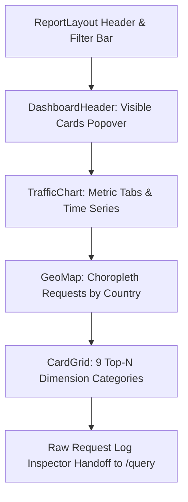

# Page Specification: Dashboard (`/dashboard`)

The **Dashboard** is the primary operational and analytical landing page of Fastly Log Analytics. It provides a real-time and historical bird's-eye view of edge traffic, caching efficiency, origin performance, security signals, and global distribution.

---

## 1. Overview & Objectives

- **Primary Goal:** Enable operators and analysts to rapidly assess traffic volume, health, anomalies, and top contributors across all dimensions with sub-second drill-down capabilities across single or multiple fields.
- **Key Tenet:** Single round-trip composite loading (`/api/dashboard/bundle`) with zero layout shift (CLS = 0) and non-blocking asynchronous data transformation for heavy multi-day datasets via Web Workers.
- **Drill-down Philosophy:** Every dimension across all Top-N tables and the world map is interactive: clicking a row or country instantly applies a global inclusive or exclusive filter, updating all visual elements across the dashboard.
- **Raw Inspector Handoff:** Dedicated deep-link handoff CTA to `/query` pre-populated with active service, time bounds, and filter payload for arbitrary SQL/log exploration.

---

## 2. Routes, URLs & Query Parameters

### Route
`GET /dashboard`

### Supported URL Query Parameters

| Parameter | Type | Default | Description |
|---|---|---|---|
| `service` | string | Active / first service | Fastly Service ID to display (e.g. `<SERVICE_ID>`). |
| `from` | ISO string | `now - 24h` | Start timestamp of the query window (UTC). |
| `to` | ISO string | `now` | End timestamp of the query window (UTC). |
| `range` | string | `24h` | Relative preset token: `1h`, `6h`, `12h`, `24h`, `7d`, `30d`. |
| `anchor` | ISO string | Quantized 60s | Time anchor for server-reproducible caching and SSR byte-matching. |
| `filters` | JSON string | `{}` | Serialized URL-encoded filter object (e.g. `{"status": ["500", "503"]}`). |
| `metric` | string | `requests` | Active chart metric: `requests`, `5xx`, `4xx`, `hit_rate`, `p50_latency`, `p95_latency`, `p99_latency`, `throughput`, `req_size`, `ttfb`. |
| `interval` | string | `1 hour` | Aggregation time bucket: `1 second`, `1 minute`, `1 hour`, `1 day`. |
| `compare` | boolean | `false` | Enable historical comparison overlay. |
| `compare_from` | ISO string | None | Comparison window start timestamp. |
| `compare_to` | ISO string | None | Comparison window end timestamp. |
| `trend` | string | `off` | Moving average / trend overlay: `off`, `auto`, `1m`, `5m`, `1h`, `1d`. |
| `view` | string | None | Saved view ID to restore filters and time range. |

---

## 3. Role & Permission Matrix

| Feature / UI Element | Admin (`read_write`) | Analyst Path B (Remote Share) | Analyst Path A (Standalone) |
|---|---|---|---|
| **View Traffic & Aggregations** | Full access | Full access | Full access |
| **Client IP Addresses** | Full raw IP displayed | Raw IP or Masked (`xxx.xxx.xxx.0` / IPv6 `/64`) based on invite setting | Full raw IP |
| **Session IDs (`cookie_session`)** | Full session value | Masked / Redacted (`[redacted]`) when IP masking is active | Full session value |
| **Filter Bar & Drill-downs** | Full access | Full access | Full access |
| **Saved Views** | Create, Update, Delete, Apply | Apply only (read-only view) | Create, Update, Delete (local SQLite) |
| **Customize Cards Dialog** | Persistent to user session | Persistent to browser session | Persistent to local state |
| **CSV Export (`/api/dashboard/raw/csv`)** | Raw unmasked export | Streamed with PII masking applied according to invite policy | Raw unmasked export |
| **Navigation & Links** | Full navigation across all pages | Scoped to allowed pages (admin links hidden) | Full navigation |
| **Service Selector** | Switch to any service in system | Scoped only to services explicitly granted in invite | Scoped to locally configured services |

---

## 4. Architecture Execution Matrix

### Standard Architecture (Local / GCE VM)
- **Serving Path:** Pooled DuckDB connection (`DUCKDB_POOL_MAX_SIZE = 8`) executing queries over the session-scoped `logs` view.
- **Data Layers:** Dynamically stitches local transient Parquet buffers (`cache/{bucket}/**/*.parquet`) with committed DuckLake/Iceberg data.
- **Rollups:** Uses hourly and daily local Parquet rollups for 7d/30d windows when available; falls back to raw Parquet scan if rollups are missing.
- **Stale View Handling:** Uses `execute_with_stale_view_retry` to recover from transient file swaps during active ingestion. Displays calm "Preparing your data" status rather than error toasts.

### High-Scale Architecture (Local High-Scale / Elevation K8s)
- **Serving Path:** Ephemeral in-memory DuckDB instance or ClickHouse serving plane (per ADR-20/21).
- **Data Layers:** Reads directly from committed DuckLake tables in Object Storage backed by PostgreSQL catalog metadata; local Parquet buffer is bypassed.
- **Rollups & Pre-aggregations:** 7d/30d queries execute against precomputed Top-N rollups or ClickHouse materialized aggregates to maintain sub-second response times under 5M RPS load.
- **Worker Separation:** Serving pod handles read-only queries; background Celery workers handle log discovery, conversion, and commits via Redis/PostgreSQL ledger.

---

## 5. Backend APIs & Query Attributions

### Primary Endpoint: `POST /api/dashboard/bundle`
- **Purpose:** Fetches core traffic timeseries, choropleth map data, ~85 Top-N dimension tables, and verified/NGWAF bot distributions in **a single HTTP round-trip**.
- **Request Model (`AggregatesRequest`):**
  ```json
  {
    "start_time": "2026-09-18T00:00:00Z",
    "end_time": "2026-09-19T00:00:00Z",
    "relative_range": "24h",
    "anchor": "2026-09-19T00:00:00Z",
    "filters": {},
    "chart_metric": "requests",
    "chart_interval": "1 hour",
    "sections": ["core", "topten", "bots"]
  }
  ```
- **Concurrency & Shielding:**
  - `aggregates` runs on `ctx.con`.
  - `top_bots` checks out a 2nd pool connection with a 200ms timeout (`asyncio.shield`), falling back to sequential execution on `ctx.con` under pool saturation.
- **Response Structure (`BundleResponse`):**
  - `aggregates`:
    - `data`: Dictionary mapping field names (`ip`, `asn`, `status`, etc.) to `{ top: [{value, count, label}], total: int }`.
    - `time_series`: Array of `{ time: ISO, value: float, category?: string, baseline?: float }`.
    - `map_data`: Array of `{ country: ISO_CODE, count: int }`.
    - `total_rows`: Filtered row count.
    - `total_rows_total`: Total unfiltered row count for period.
    - `interval`, `metric`, `where_clause`.
  - `top_bots`:
    - `bots`: Array of Fastly bot categories `{ id, name, request_count }`.
    - `ngwaf_bots`: Array of Signal Sciences/NGWAF verified bot signals `{ name, request_count }`.

### Secondary Endpoint: `POST /api/dashboard/aggregates`
- **Purpose:** Only fired when **Compare Mode** is toggled ON to fetch the baseline comparison dataset for the preceding period.
- **Request Model:** Same `AggregatesRequest` parameters as above.

### Raw Data Streaming: `POST /api/dashboard/raw/csv`
- **Purpose:** Generates chunked streaming CSV downloads (up to 50,000 rows).
- **Privacy Enforcement:** Respects analyst invite IP masking and redacts session cookie identifiers (`cookie_session`) when requested by analyst session.

### Autocomplete: `POST /api/dashboard/field-values`
- **Purpose:** Typeahead value discovery for the Filter Bar when constructing custom expressions.

### Metadata Endpoints:
- `GET /api/log-fields/catalog`: Retrieves metadata about enabled built-in and custom fields.
- `GET /api/views`: Fetches saved filter/time-range views.

---

## 6. UI Components & Layout Structure

The `/dashboard` page is built inside `ReportLayout` and composed of three main vertical sections:



### 1. Header & Filter Bar (`ReportLayout`)
- **Service Selector:** Switch active Fastly CDN service.
- **Time Range Selector:** Quick presets (`1h`, `6h`, `12h`, `24h`, `7d`, `30d`), custom date/time picker, and auto-refresh toggle (30s, 1m, 5m).
- **Global Filter Bar:** Interactive pills with negate (`!=`), remove, and clear-all actions. Supports custom field expressions.
- **Quick Filters:** Pre-defined shortcut filters (e.g. `Errors (4xx/5xx)`, `Cache Misses`, `WAF Blocks`, `Bots`).
- **Saved Views Dropdown:** Save current filters + time range, or restore existing views.
- **Compare Mode Switch:** Toggles prior-period comparison overlay.

### 2. Dashboard Header Toolbar (`DashboardHeader`)
- **Visible Cards Popover:**
  - Accessible button with `LayoutDashboard` icon, "Cards" label, and total count badge.
  - 2-column grid of checkboxes toggling visibility of any of the ~85 individual cards.
  - Cards missing from the active Fastly VCL format display an `EyeOff` warning icon with tooltip: *"Not in active log format."*
  - Bottom actions: **Show all** and **Reset** (restores default format preset).
  - Visibility state persisted in `localStorage` under key `dashboard_cards`.

### 3. Traffic Time Series Chart (`TrafficChart`)
- **Metric Selector Buttons:**
  - `Reqs` (`requests` volume)
  - `5xx` (5xx server error rate)
  - `4xx` (4xx client error rate)
  - `CHR` (`hit_rate` cache hit ratio percentage)
  - `Latency` Dropdown: `p50 Latency`, `p95 Latency`, `p99 Latency`
  - `Throughput` (`throughput` bandwidth)
  - `Req Size` (`req_size` average request size)
  - `TTFB` (`ttfb` time to first byte)
- **Stacked Category Legend:** For bar traces, clickable pill buttons allow hiding/showing individual series (e.g. toggle 200, 304, 404, 500).
- **Updating Indicator:** Pill badge with pulsing green/primary dot appears during background data refreshes (`Updating`).
- **Interactive Drag-to-Zoom:** Selecting any rectangular region on the chart parses coordinates in the service timezone and sets a custom global time range.
- **Trend Selector:** Toolbar supporting `Off`, `Auto`, `1m`, `5m`, `1h`, `1d` moving averages.
- **Web Worker Offloading:** `buildTrafficDataAsync` routes transforms to Web Workers for large windows (> 1,440 points or multi-day trend computations), falling back to synchronous execution if workers are unavailable.
- **Diagnostic Empty States:** If logs are missing due to missing VCL fields, displays specific guidance (e.g. *"Requires Infrastructure (Group C) fields to be enabled in Fastly logging"*).

### 4. Global Geographic Map (`GeoMap`)
- World map visualization showing traffic distribution by country (`ChoroplethMap`).
- Dynamic client-only import (`ssr: false`) to avoid SVG canvas server hydration mismatches.
- **Hover Tooltips:** Displays Country Name, Request Count, and Percentage of Total.
- **Click Interaction:** Clicking any country triggers `onCountryClick(countryName)` and applies an inclusive `country = <Name>` filter.
- **Missing Field Diagnostic:** Informs operator if Geolocation fields are not enabled in Fastly logging.

### 5. Categorized Dimension Cards Grid (`CardGrid`)
Displays Top-N rankings grouped into 9 collapsible categories. Each section retains its open/collapsed state in `localStorage` under `dashboard_collapsed_sections`:

| Category | Accent Tint | Default Card IDs & Dimensions |
|---|---|---|
| **Request** | Blue | IP (`ip`), ASN (`asn`), Host (`host`), URL Path (`url`), Method (`method`), Status (`status`), Cache Status (`cache`), HTTP Protocol (`proto`), User-Agent (`ua`), Referer (`referer`), Session (`cookie_session`), Content Encoding (`resp_header_content_encoding`) |
| **Cache** | Amber | TTL (`ttl`), Age (`age`), Cache Hits (`hits`), Cache Digest (`digest`) |
| **Geography** | Emerald | Country (`country`), Region (`region`), City (`city`), Metro Code (`metro`) |
| **Network & Connection** | Cyan | Client RTT (`tcp_rtt`), Transport (`transport`), Packet Loss (`ploss`), RTT Min (`rtt_min`), RTT Var (`rtt_var`), Retransmits (`retrans`), Connection Speed (`c_speed`), Connection Type (`c_type`), Delivery Rate (`delivery_rate`), Data Segs Out (`data_segs_out`) |
| **Edge Infrastructure** | Violet | Fastly POP (`pop`), Fastly Backend (`backend`), Edge Host (`edge`), Server Region (`server_region`), TLS Version (`tls`), IPv6 Flag (`is_ipv6`), Connection Requests (`conn_requests`) |
| **Security** | Rose | Verified Bots (`_bot_name`), NGWAF Bots (`_ngwaf_bot_name`), WAF Signals (`waf_sig_ind`), Scorer Reasons (`edge_score_reason_ind`), WAF Rule (`waf`), WAF Action (`waf_resp`), WAF Latency (`waf_ms`), Proxy Type (`p_type`), Proxy Desc (`p_desc`), JA3 (`ja3`), JA4 (`ja4`), TLS SHA (`tls_ciphers_sha`) |
| **Origin** | Yellow | Origin TTFB (`ottfb`), Origin TTLB (`ottlb`), Origin Status (`ost`), Origin Bytes (`obytes`), Origin IP (`oip`), Origin Retries (`oretries`) |
| **QUIC / HTTP3** | Indigo | QUIC Bandwidth (`bw`), QUIC RTT (`q_rtt`), RTT Var (`q_rtt_var`), Packet Loss (`q_lost`), Congestion Window (`q_cwnd`) |
| **Image Optimization** | Fuchsia | Input Format (`io_input_format`), Output Format (`io_output_format`) |
| **Custom Fields** | Slate | Any user-defined custom VCL logging fields |

#### Card Grid Key Features:
- **Zero Layout Shift (CLS = 0):** While the field catalog loads, renders placeholder skeletons matching `CARD_CATEGORIES` so content below never jumps.
- **Lazy Rendering (`LazyMount`):** Only mounts Top-N tables near the viewport with a `600px` root margin, cutting initial DOM node count from ~860 down to ~100.
- **Bot Integrations:** `_bot_name` and `_ngwaf_bot_name` render bot badges with dedicated retry states (`CardErrorState`).
- **Interactive Row Click:** Clicking any value in any table adds that filter to `filterStore`.

### 6. Raw Request Log Inspector CTA
- Located below the card grid.
- Hands off active `service`, `start_time`, `end_time`, and serialized `filters` via query parameters directly to `/query` for deep drill-down.

---

## 7. Interactive Workflows & Edge Cases

### 1. Row Click-to-Filter
- **Behavior:** Clicking any row in any Top-N table calls `onRowClick(column, value)`.
- **Validation:**
  - Adds the filter to `filterStore`.
  - Re-triggers `/api/dashboard/bundle` with the new filter payload.
  - Updates the URL search query parameters without a full page reload.
  - Displays the active filter chip in the top filter bar.

### 2. Time Range Selection & Drag Zoom
- Selecting a preset (`1h`, `24h`, `7d`, `30d`) re-anchors the time window.
- Dragging a bounding box across `TrafficChart` sets `from` and `to` to the exact drag timestamps and sets range to `custom`.

### 3. Customize Cards Visibility
- Click **Cards** in `DashboardHeader`.
- Toggle off specific cards (e.g. uncheck `JA3` and `QUIC`).
- Assert that unchecked cards disappear immediately from the grid without refetching data.
- Click **Reset** to restore standard catalog cards.

### 4. Zero Data & Cold Initialization States
- **Benchmarking Zero State:** When a brand new service or empty time window is selected:
  - Chart displays clean empty state ("No data available for the selected time window").
  - Top-N cards render empty placeholders without throwing JavaScript exceptions.
- **Self-Healing Stale View:** If the view is rebuilding during ingest, the page displays an unobtrusive "Preparing your data" banner with an amber pulse rather than a crash or error toast.

---

## 8. Performance & Quality Budgets

| Metric | Target (Standard) | Target (High-Scale) | Measurement Method |
|---|---|---|---|
| **SSR / First Contentful Paint (FCP)** | < 400 ms | < 400 ms | Lighthouse / Playwright performance metrics |
| **Time to Interactive (TTI)** | < 800 ms | < 800 ms | Chrome trace / PerformanceObserver |
| **Bundle API Latency (Warm 24h)** | < 300 ms (p95) | < 200 ms (p95) | HAR log / API timing |
| **Bundle API Latency (Cold 7d)** | < 1,500 ms (p95) | < 800 ms (p95) | HAR log / API timing |
| **Cumulative Layout Shift (CLS)** | 0.00 | 0.00 | Web Vitals / Skeleton layout reservation |
| **Network Round Trips on Load** | Exactly 1 (`bundle`) | Exactly 1 (`bundle`) | Network tab inspection |

---

## 9. AI Session Automated Verification Checklist

Any AI session tasked with validating the `/dashboard` page must execute and verify the following sequence:

- [ ] **1. Route Accessibility:**
  - `GET /dashboard?service=<SERVICE_ID>` returns HTTP 200.
  - Check footer string confirms expected environment mode (`standard` or `high-scale`).
- [ ] **2. Data Bundle Contract:**
  - Intercept `/api/dashboard/bundle` response.
  - Verify HTTP 200 and schema contains `aggregates` and `top_bots`.
  - Verify `aggregates.data` has active dimension dictionaries.
  - Verify total round-trips for dashboard data is exactly 1 on cold load (no duplicate calls).
- [ ] **3. Metric Switching:**
  - Click `Reqs`, `5xx`, `4xx`, `CHR`, `Throughput` buttons and `Latency` dropdown.
  - Verify `TrafficChart` updates traces and y-axis units correctly.
- [ ] **4. Time Range Presets:**
  - Cycle through `1h`, `24h`, `7d`.
  - Confirm URL parameters update and chart x-axis scales accordingly.
- [ ] **5. Click-to-Filter Drill-down:**
  - Click the top row in the **Status** card (e.g. `200`).
  - Verify filter chip appears in `ReportLayout` (`status = 200`).
  - Confirm `/api/dashboard/bundle` refetches with `{"status": ["200"]}`.
  - Remove filter chip and confirm data returns to unfiltered baseline.
- [ ] **6. Map Interaction:**
  - Verify `GeoMap` renders SVG canvas without WebGL or rendering errors.
  - Click on a country polygon and confirm country filter is applied.
- [ ] **7. Compare Mode:**
  - Toggle **Compare** switch ON.
  - Verify secondary `/api/dashboard/aggregates` query fires for prior period.
  - Verify comparison traces render on `TrafficChart`.
- [ ] **8. Section Collapse Persistence:**
  - Click header of `Geography` section to collapse it.
  - Refresh the browser page.
  - Verify `Geography` section remains collapsed from `localStorage` (`dashboard_collapsed_sections`).
- [ ] **9. Role Testing:**
  - Test as **Admin** on port 3000/3001/8081: all controls, views, and raw IPs accessible.
  - Test as **Analyst Path B** via `/share-login`: verify read-only restrictions, masked IPs (if enabled), and absence of administrative mutations.
- [ ] **10. Architecture Performance Verification:**
  - Capture HAR file during page load.
  - Assert p95 response time meets budget (< 300ms warm standard, < 200ms warm high-scale).

---

## 10. Automated Test Suite & Traffic Generation

### Executable Playwright Test
The complete automated verification checklist above is implemented in:
👉 [`frontend/e2e/pages/dashboard.spec.ts`](file:///Users/drew.michael/Projects/fastly-log-analytics/frontend/e2e/pages/dashboard.spec.ts)

Run the test suite locally:
```bash
cd frontend && npx playwright test e2e/pages/dashboard.spec.ts
```

### Synthetic Traffic Generation for Dashboard
To populate the Dashboard with diverse, realistic data across all 9 Top-N card categories (HTTP methods, status codes, countries, POPs, TLS ciphers, JA3/JA4, WAF signals, and origin metrics):

```bash
# Option A: One-line generation via service config
uv run python scripts/load_test/generate_synthetic_raw_logs.py \
    --config configs/<SERVICE_ID>.json \
    --profile normal \
    --target-rps 1000 \
    --duration-seconds 30

# Option B: Simulate specific anomaly scenarios
uv run python scripts/load_test/generate_synthetic_raw_logs.py \
    --config configs/<SERVICE_ID>.json \
    --profile security-attack \
    --target-rps 500 \
    --duration-seconds 30

# Option C: Manual flags with dry-run preview
uv run python scripts/load_test/generate_synthetic_raw_logs.py \
    --service-id <SERVICE_ID> \
    --bucket <BUCKET_NAME> \
    --endpoint <FOS_ENDPOINT> \
    --access-key-id <FOS_KEY> \
    --secret-access-key <FOS_SECRET> \
    --target-rps 1000 \
    --duration-seconds 30 \
    --dry-run
```
