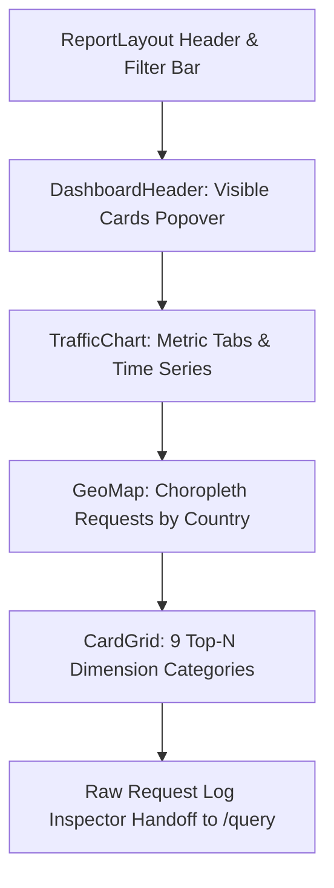

# Page Specification: Dashboard (`/dashboard`)

The **Dashboard** is the primary operational and analytical landing page of Fastly Log Analytics. It provides a real-time and historical bird's-eye view of edge traffic, caching efficiency, origin performance, security signals, and global distribution.

---

## 1. Overview & Objectives

- **Primary Goal:** Enable operators and analysts to rapidly assess traffic volume, health, anomalies, and top contributors across all dimensions with sub-second drill-down capabilities across single or multiple fields.
- **Best-in-Class UI Responsiveness & Instant Shell:** The page shell paints instantly upon navigation with all panel boundaries, grid structures, and card containers pre-rendered in place. Each panel displays a contextual loading message while data fetches in the background, achieving **zero layout shift (CLS = 0.00)** and eliminating jarring late content pop-in.
- **Key Tenet:** Single round-trip composite loading (`/api/dashboard/bundle`) and non-blocking asynchronous data transformation for heavy multi-day datasets via Web Workers.
- **Drill-down Philosophy:** Every dimension across all Top-N tables and the world map is interactive: clicking a row or country instantly applies a global inclusive or exclusive filter, updating all visual elements across the dashboard.
- **Raw Inspector Handoff:** Dedicated deep-link handoff CTA to `/query` pre-populated with active service, time bounds, and filter payload for arbitrary SQL/log exploration.

---

## 2. Routes, URLs & Query Parameters

### Route
`GET /dashboard`

### Supported URL Query Parameters

| Parameter | Type | Default | Description |
|---|---|---|---|
| `service` | string | Active / first service | Fastly Service ID to display (e.g. `<SERVICE_ID>`). |
| `from` | ISO string | `now - 24h` (or `earliest_log_at`) | Start timestamp of the query window (UTC). Defaults to `now - 24h` for mature services (>=24h history); dynamically adapts to the service's max available range (`earliest_log_at`) when <24h history exists. |
| `to` | ISO string | `now` (or `latest_log_at`) | End timestamp of the query window (UTC). |
| `range` | string | `24h` (or adaptive max) | Relative preset token: `1h`, `6h`, `12h`, `24h`, `7d`, `30d`. When total history < 24h, displays max available span. |
| `anchor` | ISO string | Quantized 60s | Time anchor for server-reproducible caching and SSR byte-matching. |
| `filters` | JSON string | `{}` | Serialized URL-encoded filter object (e.g. `{"status": ["500", "503"]}`). |
| `metric` | string | `requests` | Active chart metric: `requests`, `5xx`, `4xx`, `hit_rate`, `latency_breakdown`, `p50_latency`, `p95_latency`, `p99_latency`, `throughput`, `req_size`, `ttfb`. |
| `secondary_metric` | string | None | Optional secondary overlay metric on right y-axis (e.g. `5xx_rate`, `p95_latency`, `hit_rate`). |
| `interval` | string | `1 hour` | Aggregation time bucket: `1 second`, `1 minute`, `1 hour`, `1 day`. |
| `compare` | boolean | `false` | Enable historical comparison overlay. |
| `compare_mode` | string | `previous_period` | Comparison baseline: `previous_period` (`[now - 48h, now - 24h]`) or `same_day_last_week` (`[now - 7d - 24h, now - 7d]`). |
| `compare_from` | ISO string | None | Custom comparison window start timestamp. |
| `compare_to` | ISO string | None | Custom comparison window end timestamp. |
| `card_metric` | string | `requests` | Global Top-N ranking metric toggle: `requests`, `bytes`, `latency`. |
| `map_mode` | string | `volume` | Choropleth Map coloring mode: `volume` (request counts), `error_rate` (5xx/4xx %), `latency` (avg TTFB/elapsed ms). |
| `trend` | string | `off` | Moving average / trend overlay: `off`, `auto`, `1m`, `5m`, `1h`, `1d`. |
| `view` | string | None | Saved view ID to restore filters and time range. |

---

## 3. Role & Permission Matrix (3 Distinct Personas)

The system supports three distinct operational personas across the Dashboard:

| Feature / UI Element | Admin (`read_write`) | Analyst with PII Access (Remote Share) | Analyst with No PII Access (Remote Share - Privacy Masked) |
|---|---|---|---|
| **View Traffic & Aggregations** | Full access | Full access | Full access |
| **Client IP Addresses** | Full raw IP displayed | Full raw IP displayed | Strictly masked (`xxx.xxx.xxx.0` for IPv4 / `/64` for IPv6) |
| **Session IDs (`cookie_session`)** | Full session value | Full session value | Redacted to `[redacted]` |
| **Filter Bar & Drill-downs** | Full access (inclusive & exclusive) | Full access (inclusive & exclusive) | Full access (filters on masked values) |
| **Saved Views** | Create, Update, Delete, Apply | Apply only (read-only view) | Apply only (read-only view) |
| **Customize Cards Dialog** | Persistent to browser `localStorage` per service | Independent browser `localStorage` (does not modify Admin layout) | Independent browser `localStorage` (does not modify Admin layout) |
| **CSV Export (`/api/dashboard/raw/csv`)** | Raw unmasked export | Export with raw IPs permitted | Export permitted with client IPs masked and session cookies redacted |
| **Deep Link: Raw Logs (`/logs`)** | Full unmasked logs | Read-only logs with raw IPs | Read-only logs with client IPs masked and sessions redacted |
| **Deep Link: SQL Runner (`/query`)** | Arbitrary SQL execution | Read-only arbitrary SQL execution | Permitted, with **server-side AST & regex query rewrites** strictly enforcing column-level IP/PII masking in query outputs |
| **Service Settings & FOS Sync** | Full access to mutate configs & trigger syncs | Read-only / CTAs hidden | Read-only / CTAs hidden |

---

## 4. Architecture Execution Matrix

### Standard Architecture (Local / GCE VM)
- **Serving Path:** Pooled DuckDB connection (`DUCKDB_POOL_MAX_SIZE = 8`) executing queries over the session-scoped `logs` view.
- **Data Layers:** Dynamically stitches local transient Parquet buffers (`cache/{bucket}/**/*.parquet`) with committed DuckLake tables.
- **Rollup & Fallback Strategy:**
  - For long-horizon windows (`7d` and `30d`), the backend queries precomputed Top-N Parquet rollups (`rollups/` directory) first for maximum speed.
  - If rollups are not yet compiled, missing, or partially behind, the backend **transparently falls back to scanning raw Parquet buffers and DuckLake tables**, logging an attributed notice in `telemetry_queries` without failing or interrupting the user experience.
- **Stale View Handling:** Uses `execute_with_stale_view_retry` to recover from transient file swaps during active ingestion. Displays calm "Preparing your data" status rather than error toasts.

### High-Scale Architecture (Local High-Scale / Elevation K8s)
- **Serving Path:** Ephemeral in-memory DuckDB instance or ClickHouse serving plane (per ADR-20/21).
- **Data Layers:** Reads directly from committed DuckLake tables in Object Storage backed by PostgreSQL catalog metadata; local Parquet buffer is bypassed.
- **Rollups & Pre-aggregations:** 7d/30d queries execute against precomputed Top-N rollups or ClickHouse materialized aggregates to maintain sub-second response times under 5M RPS load, with transparent raw MergeTree fallback if aggregates are compiling.
- **Worker Separation:** Serving pod handles read-only queries; background Celery workers handle log discovery, conversion, and commits via Redis/PostgreSQL ledger.

---

## 5. Backend APIs & Query Attributions

### Primary Endpoint: `POST /api/dashboard/bundle`
- **Purpose:** Fetches core traffic timeseries, choropleth map data, ~85 Top-N dimension tables, and verified/NGWAF bot distributions in **a single HTTP round-trip**.
- **Request Model (`AggregatesRequest`):**
  ```json
  {
    "start_time": "2026-09-18T00:00:00Z",
    "end_time": "2026-09-19T00:00:00Z",
    "relative_range": "24h",
    "anchor": "2026-09-19T00:00:00Z",
    "filters": {},
    "chart_metric": "requests",
    "chart_interval": "1 hour",
    "sections": ["core", "topten", "bots"]
  }
  ```
- **Concurrency & Shielding:**
  - `aggregates` runs on `ctx.con`.
  - `top_bots` checks out a 2nd pool connection with a 200ms timeout (`asyncio.shield`), falling back to sequential execution on `ctx.con` under pool saturation.
- **Response Structure (`BundleResponse`):**
  - `aggregates`:
    - `data`: Dictionary mapping field names (`ip`, `asn`, `status`, etc.) to `{ top: [{value, count, label}], total: int }`.
    - `time_series`: Array of `{ time: ISO, value: float, category?: string, baseline?: float }`.
    - `map_data`: Array of `{ country: ISO_CODE, count: int }`.
    - `total_rows`: Filtered row count.
    - `total_rows_total`: Total unfiltered row count for period.
    - `interval`, `metric`, `where_clause`.
  - `top_bots`:
    - `bots`: Array of Fastly bot categories `{ id, name, request_count }`.
    - `ngwaf_bots`: Array of Signal Sciences/NGWAF verified bot signals `{ name, request_count }`.

### Secondary Endpoint: `POST /api/dashboard/aggregates`
- **Purpose:** Only fired when **Compare Mode** is toggled ON to fetch the baseline comparison dataset for the preceding period.
- **Request Model:** Same `AggregatesRequest` parameters as above.

### Raw Data Streaming: `POST /api/dashboard/raw/csv`
- **Purpose:** Generates chunked streaming CSV downloads (up to 50,000 rows).
- **Privacy Enforcement:** Respects analyst invite IP masking and redacts session cookie identifiers (`cookie_session`) when requested by analyst session.

### Anomaly Root Cause Analysis: `POST /api/dashboard/explain-anomaly`
- **Purpose:** Compares a selected spike interval (`[spike_from, spike_to]`) against a baseline window (`[baseline_from, baseline_to]`) and ranks the dimensions (`url`, `asn`, `pop`, `ip`, `status`, `user_agent`) that had the highest disproportionate shift.
- **Request Model (`ExplainAnomalyRequest`):**
  ```json
  {
    "spike_from": "2026-09-19T14:15:00Z",
    "spike_to": "2026-09-19T14:30:00Z",
    "baseline_from": "2026-09-19T13:00:00Z",
    "baseline_to": "2026-09-19T14:15:00Z",
    "filters": {},
    "dimensions": ["url", "status", "asn", "pop", "ip", "client_ua"]
  }
  ```
- **Response Structure (`ExplainAnomalyResponse`):**
  - Array of `{ dimension: string, value: string, baseline_pct: float, spike_pct: float, diff_ratio: float, extra_requests: int }` sorted by absolute contribution.

### VCL Deployments & Config Markers: `GET /api/services/{service_id}/vcl-deployments`
- **Purpose:** Fetches timestamped Fastly VCL activation and config change events within the requested time window (`from`, `to`) to render as vertical annotation lines on `TrafficChart`.

### Metadata Endpoints:
- `GET /api/log-fields/catalog`: Retrieves metadata about enabled built-in and custom fields.
- `GET /api/views`: Fetches saved filter/time-range views.

---

## 6. UI Components & Layout Structure

The `/dashboard` page is built inside `ReportLayout` and composed of three main vertical sections:



### 1. Header & Filter Bar (`ReportLayout`)
- **Service Selector:** Switch active Fastly CDN service.
- **Time Range Selector:** Quick presets (`1h`, `6h`, `12h`, `24h`, `7d`, `30d`), custom date/time picker, and auto-refresh toggle (30s, 1m, 5m).
- **Global Filter Bar:** Interactive pills with negate (`!=`), remove, and clear-all actions. Supports custom field expressions.
- **Quick Filters:** Pre-defined shortcut filters (e.g. `Errors (4xx/5xx)`, `Cache Misses`, `WAF Blocks`, `Bots`).
- **Saved Views Dropdown:** Save current filters + time range, or restore existing views.
- **Compare Mode Switch:** Toggles prior-period comparison overlay.

### 2. Dashboard Header Toolbar (`DashboardHeader`)
- **Visible Cards Popover:**
  - Accessible button with `LayoutDashboard` icon, "Cards" label, and total count badge.
  - 2-column grid of checkboxes toggling visibility of any of the ~85 individual cards.
  - Cards missing from the active Fastly VCL format display an `EyeOff` warning icon with tooltip: *"Not in active log format."*
  - Bottom actions: **Show all** and **Reset** (restores default format preset).
  - Visibility state persisted in `localStorage` under key `dashboard_cards`.

### 3. Traffic Time Series Chart (`TrafficChart`)
- **Metric Selector Buttons:**
  - `Reqs` (`requests` volume)
  - `5xx` (5xx server error rate)
  - `4xx` (4xx client error rate)
  - `CHR` (`hit_rate` cache hit ratio percentage)
  - `Latency` Dropdown: `p50 Latency`, `p95 Latency`, `p99 Latency`
  - `Throughput` (`throughput` bandwidth)
  - `Req Size` (`req_size` average request size)
  - `TTFB` (`ttfb` time to first byte)
- **Stacked Category Legend:** For bar traces, clickable pill buttons allow hiding/showing individual series (e.g. toggle 200, 304, 404, 500).
- **Updating Indicator:** Pill badge with pulsing green/primary dot appears during background data refreshes (`Updating`).
- **Interactive Drag-to-Zoom:** Selecting any rectangular region on the chart parses coordinates in the service timezone and sets a custom global time range.
- **Trend Selector:** Toolbar supporting `Off`, `Auto`, `1m`, `5m`, `1h`, `1d` moving averages.
- **Web Worker Offloading:** `buildTrafficDataAsync` routes transforms to Web Workers for large windows (> 1,440 points or multi-day trend computations), falling back to synchronous execution if workers are unavailable.
- **Diagnostic Empty States:** If logs are missing due to missing VCL fields, displays specific guidance (e.g. *"Requires Infrastructure (Group C) fields to be enabled in Fastly logging"*).

### 4. Global Geographic Map (`GeoMap`)
- World map visualization showing traffic distribution by country (`ChoroplethMap`).
- Dynamic client-only import (`ssr: false`) to avoid SVG canvas server hydration mismatches.
- **Hover Tooltips:** Displays Country Name, Request Count, and Percentage of Total.
- **Click Interaction:** Clicking any country triggers `onCountryClick(countryName)` and applies an inclusive `country = <Name>` filter.
- **Missing Field Diagnostic:** Informs operator if Geolocation fields are not enabled in Fastly logging.

### 5. Categorized Dimension Cards Grid (`CardGrid`)
Displays Top-N rankings grouped into 9 collapsible categories. Each section retains its open/collapsed state in `localStorage` under `dashboard_collapsed_sections`:

| Category | Accent Tint | Default Card IDs & Dimensions |
|---|---|---|
| **Request** | Blue | IP (`ip`), ASN (`asn`), Host (`host`), URL Path (`url`), Method (`method`), Status (`status`), Cache Status (`cache`), HTTP Protocol (`proto`), User-Agent (`ua`), Referer (`referer`), Session (`cookie_session`), Content Encoding (`resp_header_content_encoding`) |
| **Cache** | Amber | TTL (`ttl`), Age (`age`), Cache Hits (`hits`), Cache Digest (`digest`) |
| **Geography** | Emerald | Country (`country`), Region (`region`), City (`city`), Metro Code (`metro`) |
| **Network & Connection** | Cyan | Client RTT (`tcp_rtt`), Transport (`transport`), Packet Loss (`ploss`), RTT Min (`rtt_min`), RTT Var (`rtt_var`), Retransmits (`retrans`), Connection Speed (`c_speed`), Connection Type (`c_type`), Delivery Rate (`delivery_rate`), Data Segs Out (`data_segs_out`) |
| **Edge Infrastructure** | Violet | Fastly POP (`pop`), Fastly Backend (`backend`), Edge Host (`edge`), Server Region (`server_region`), TLS Version (`tls`), IPv6 Flag (`is_ipv6`), Connection Requests (`conn_requests`) |
| **Security** | Rose | Verified Bots (`_bot_name`), NGWAF Bots (`_ngwaf_bot_name`), WAF Signals (`waf_sig_ind`), Scorer Reasons (`edge_score_reason_ind`), WAF Rule (`waf`), WAF Action (`waf_resp`), WAF Latency (`waf_ms`), Proxy Type (`p_type`), Proxy Desc (`p_desc`), JA3 (`ja3`), JA4 (`ja4`), TLS SHA (`tls_ciphers_sha`) |
| **Origin** | Yellow | Origin TTFB (`ottfb`), Origin TTLB (`ottlb`), Origin Status (`ost`), Origin Bytes (`obytes`), Origin IP (`oip`), Origin Retries (`oretries`) |
| **QUIC / HTTP3** | Indigo | QUIC Bandwidth (`bw`), QUIC RTT (`q_rtt`), RTT Var (`q_rtt_var`), Packet Loss (`q_lost`), Congestion Window (`q_cwnd`) |
| **Image Optimization** | Fuchsia | Input Format (`io_input_format`), Output Format (`io_output_format`) |
| **Custom Fields** | Slate | Any user-defined custom VCL logging fields |

#### Card Grid Key Features:
- **Zero Layout Shift (CLS = 0):** While the field catalog loads, renders placeholder skeletons matching `CARD_CATEGORIES` so content below never jumps.
- **Lazy Rendering (`LazyMount`):** Only mounts Top-N tables near the viewport with a `600px` root margin, cutting initial DOM node count from ~860 down to ~100.
- **Bot Integrations:** `_bot_name` and `_ngwaf_bot_name` render bot badges with dedicated retry states (`CardErrorState`).
- **Interactive Row Click:** Clicking any value in any table adds that filter to `filterStore`.
- **Shared Active Fields Integration (`useActiveLogFields`):** Uses the shared active fields hook to evaluate Fastly VCL group dependencies (e.g. Group A Request Identity, Group C Infrastructure, Geolocation) and render clear activation guidance if fields are absent from the service logging configuration.

### 6. Raw Request Log Inspector CTA
- Located below the card grid.
- Hands off active `service`, `start_time`, `end_time`, and serialized `filters` via query parameters directly to `/query` for deep drill-down.

### 7. Instant Shell, Pre-Allocated Layout & Per-Panel Skeletons
To achieve best-in-class responsiveness and eliminate visual jarring, the dashboard implements a pre-allocated layout strategy:
- **Instant Paint:** The global header, filter bar, metric buttons, chart boundary, map container, and all 9 category sections are painted immediately on initial render.
- **Per-Panel Contextual Loading Skeletons:** While data is in-flight from `/api/dashboard/bundle`, every panel renders a reserved placeholder with an animated pulse indicator:
  - **Traffic Time-Series Chart:** Pre-allocated `h-[300px]` container displaying `"Crunching logs..."` (or `"Initializing..."` during warm-up).
  - **Choropleth Map:** Pre-allocated `min-h-[300px]` container displaying `"Mapping traffic..."` (or `"Loading map..."`).
  - **Top-N Cards Grid:** Pre-allocated `h-[300px]` card boxes across all static categories displaying `"Loading..."` (or `"Initializing..."`).
- **Zero Layout Shift (CLS = 0.00):** Containers use explicit CSS containment (`contain-intrinsic-size: 300px`, `content-visibility: auto`). When analytical data hydrates, charts and tables replace skeletons inside identical boundaries—eliminating vertical jumping or late pop-in.
- **Preserved Context on Background Updates:** When applying filters or modifying time presets, existing rendered charts and tables stay visible under a subtle dim (`opacity-40 pointer-events-none`) rather than collapsing back to blank skeletons, keeping the user oriented.

---

## 7. Interactive Workflows & Edge Cases

### 1. Row Click-to-Filter (Inclusive & Exclusive)
- **Inclusive Filtering (`field = value`):** Clicking any row in any Top-N table calls `onRowClick(column, value)` and adds an inclusive filter chip.
- **Exclusive Filtering (`field != value`):** Hovering over any Top-N row reveals a dedicated strike-through/exclude icon button. Clicking it adds an exclusive filter chip.
- **Multi-Filter Composition:** Adding multiple filters across different cards (e.g. `status = 503` AND `country = US`) combines them seamlessly in `filterStore`, re-triggering `/api/dashboard/bundle` in a single round-trip without shifting scroll position.
- **URL Synchronization:** All active filters synchronize cleanly to URL search parameters (`filters={"status":["503"],"country":["US"]}`) for shareable, bookmarkable state.

### 2. Time Range Selection, Drag Zoom & History Extents
- **Default Rolling Window (>= 24h Data):** For mature services with at least 24 hours of data, the dashboard loads the **last 24 hours** (`[now - 24h, now]`) by default.
- **Adaptive Max-Range Fallback (< 24h Data):** If the service has less than 24 hours of data (e.g. brand-new service, fresh staging environment, or test dataset where `latest_log_at - earliest_log_at < 24h`), the dashboard automatically adapts to show the **current maximum available range of data** (`[earliest_log_at, latest_log_at]` or `[earliest_log_at, now]`). This prevents rendering an empty 24-hour chart where 90%+ is blank and guarantees no zero-width clamped range errors.
- **Presets & Drag-to-Zoom:**
  - Selecting a preset (`1h`, `6h`, `12h`, `24h`, `7d`, `30d`) re-anchors the time window.
  - Dragging a bounding box across `TrafficChart` sets `from` and `to` to the exact drag timestamps and sets range to `custom`.
  - **Zoom Reset:** The user can easily reset zoom back to their baseline range by clicking the standard **Reset** button in the active filter bar. No duplicate floating buttons or conflicting reset modals are rendered on the chart.

### 3. Explain Spike & Anomaly Root Cause Analysis (BubbleUp)
- **Trigger:** Dragging across a spike on the chart or clicking the "Explain Spike" action triggers `POST /api/dashboard/explain-anomaly`.
- **Behavior:** The backend automatically compares the selected spike window against the surrounding baseline traffic and ranks the dimensions (`url`, `asn`, `pop`, `ip`, `status`, `client_ua`) with the highest disproportionate shift.
- **Display:** Displays a ranked breakdown drawer/modal showing exact percentage contribution (e.g. *"84% of this 503 spike was driven by `/api/v2/checkout` from AS13335"*), allowing 1-click filtering to that root cause.

### 4. Edge-to-Origin Latency Breakdown
- **Metric Selection:** Selecting `latency_breakdown` from the chart metric dropdown switches the visualization to a stacked area/bar chart.
- **Decomposition:** Stacks the exact log latency components:
  - **Client TLS Handshake:** `tls_time`
  - **Edge Processing & WAF:** `waf_ms`
  - **Origin TTFB:** `ottfb` (time edge waited for backend first byte)
  - **Origin Transfer:** `ottlb - ottfb` (backend streaming duration)
- **Diagnostic Power:** Instantly clarifies whether latency spikes originate from backend databases/origins vs edge inspection or eyeball network issues.

### 5. Quick Filter Facets (1-Click Problem Presets)
- **Toolbar Pills:** The toolbar provides prominent 1-click Quick Filter Facet pills:
  - **5xx Errors:** `status >= 500 AND status < 600`
  - **Origin Outages:** `(status = 502 OR status = 503 OR status = 504) AND cache IN ('MISS', 'PASS', 'ERROR')`
  - **Cache Misses:** `cache IN ('MISS', 'PASS')`
  - **Bot Traffic:** `bot_category IS NOT NULL OR ngwaf_signal IS NOT NULL`
  - **Slow Requests:** `elapsed > 1000`
- **Behavior:** Clicking a quick facet applies the compound filter in a single round-trip without requiring manual multi-card clicks.

### 6. Dual-Axis Metric Overlay on TrafficChart
- **Overlay Selector:** Users can select an optional **Secondary Metric** (`secondary_metric`) to plot on the right y-axis.
- **Supported Pairings:**
  - Requests (left, req/s) + 5xx Error Rate % (right, 0-100%)
  - Requests (left, req/s) + Cache Hit Ratio % (right, 0-100%)
  - Requests (left, req/s) + P95 TTFB (right, ms)
- **Visuals:** Primary metric is rendered as a filled area/solid line; secondary metric is rendered as a distinct accent line with its own independent y-axis scale.

### 7. Fastly VCL Deployment Event Annotations
- **Marker Lines:** `TrafficChart` fetches Fastly VCL activation and service config update timestamps from `GET /api/services/{service_id}/vcl-deployments` and renders them as subtle vertical dashed annotation lines across the time series.
- **Inspection:** Hovering over a deployment line displays a tooltip with the deployed VCL version number, deployment timestamp, and author comment. Alerts are intentionally omitted from chart lines to keep the visualization uncluttered.

### 8. GeoMap Modes (Traffic Volume, Error Rate %, Avg Latency)
- **Choropleth Mode Selector:** The `GeoMap` includes a 3-way mode toggle:
  - **Traffic Volume (`volume`):** Colors countries by total request volume (default).
  - **Error Rate % (`error_rate`):** Highlights countries/regions experiencing elevated 4xx/5xx error rates, turning anomaly hotspots red.
  - **Avg Latency (`latency`):** Colors countries by average TTFB/elapsed latency to reveal regional routing or peering degradations.
- **Country Filter:** Clicking any country polygon applies an inclusive filter (`country = ISO_CODE`).

### 9. Global Top-N Card Metric Re-Ranking (Requests vs Bandwidth vs Latency)
- **Global Metric Toggle:** A toolbar toggle switches the primary ranking dimension for applicable Top-N cards:
  - **Requests (`requests`):** Ranks items by total request count (default).
  - **Bandwidth (`bytes`):** Ranks items by total egress bytes delivered (`resp_bytes`).
  - **Avg Latency (`latency`):** Ranks items by average request duration (`elapsed`).
- **Caching:** The backend re-computes Top-N arrays in a single round-trip, utilizing pre-aggregated rollup columns when available.

### 10. Compare Mode & Delta Badges
- **Toggle & Baseline:** When Compare Mode is enabled via the top toolbar toggle, it defaults to comparing against the **preceding 24 hours** (`[now - 48h, now - 24h]`), with an optional selector allowing the user to switch to **"Same day last week"** (`[now - 7d - 24h, now - 7d]`).
- **Visual Presentation:**
  - `TrafficChart` renders the current period as a solid line and the comparison baseline as a dashed/muted line.
  - Summary KPI cards (Requests, 5xx Error Rate, Cache Hit Ratio, Bandwidth) display color-coded delta percentage badges (green for positive improvements like higher cache hit ratio, red for regressions like elevated 5xx error rates).

### 11. Dedicated Log Inspection Handoff (`/logs`)
- **Workflow:** Clicking "View in Logs" seamlessly routes to `/logs?service=...&from=...&to=...&filters=...`.
- **Handoff Contract:** Transfers the exact active service, time window, and filter dictionary. No slide-out drawers or duplicated partial log tables clutter the Dashboard.

### 12. 1-Click Permalink Sharing ("Copy Link")
- **Action Button:** A prominent "Share View" / "Copy Link" button in the toolbar copies the complete permalink to the clipboard.
- **State Serialization:** URL encodes `service`, `from`, `to`, `range`, `filters`, `metric`, `secondary_metric`, `card_metric`, and `map_mode`.
- **Feedback:** Displays a clean confirmation toast (`"Link to this view copied to clipboard"`).

### 13. Unconfigured / Missing VCL Log Fields
- When an optional VCL log field is not enabled in the service's Fastly VCL logging format (e.g. TCP RTT, `waf_ms`, or custom headers):
  - The card renders an informative, elegant notice: `"Field not enabled in Fastly VCL logging"`.
  - Includes a direct link/CTA to **Service Settings** so administrators can activate the field with one click.
  - Prevents confusing blank tables or broken chart exceptions.

### 14. Card Visibility & Customization Persistence
- **Customization Modal:** Clicking **Cards** in `DashboardHeader` allows users to toggle visibility and reorder cards across all 9 categories.
- **Persistence Scope:**
  - Saved to browser `localStorage` (`dashboard_card_visibility_{service_id}`).
  - **Analyst Isolation:** Analysts connecting via Remote Live Share receive their own independent browser-local customization that does not alter the Admin host's saved layout.
- **Reset:** A "Reset to Default" button instantly restores the canonical card catalog order.

### 15. Auto-Refresh Visual Behavior
- **Default State:** Auto-refresh is **Off by default** to avoid unexpected layout or network activity.
- **Opt-In Intervals:** Users can select 30s, 1m, or 5m refresh intervals.
- **Non-Destructive Update:** When auto-refresh fires, it executes a silent background re-fetch:
  - Existing panels dim subtly (`opacity-40 pointer-events-none`) while the request is in flight.
  - Data updates smoothly in place with **zero skeleton flicker** and **zero scroll-position jump**.

### 16. Zero Data & Cold Initialization States
- **Benchmarking Zero State:** When a brand new service or empty time window is selected:
  - Chart displays clean empty state ("No data available for the selected time window").
  - Top-N cards render empty placeholders without throwing JavaScript exceptions.
- **Self-Healing Stale View:** If the view is rebuilding during ingest, the page displays an unobtrusive "Preparing your data" banner with an amber pulse rather than a crash or error toast.

---

## 8. Performance & Quality Budgets

| Metric | Target (Standard) | Target (High-Scale) | Measurement Method |
|---|---|---|---|
| **SSR / First Contentful Paint (FCP)** | < 400 ms | < 400 ms | Lighthouse / Playwright performance metrics |
| **Time to Interactive (TTI)** | < 800 ms | < 800 ms | Chrome trace / PerformanceObserver |
| **Bundle API Latency (Warm 24h)** | < 300 ms (p95) | < 200 ms (p95) | HAR log / API timing |
| **Bundle API Latency (Cold 7d)** | < 1,500 ms (p95) | < 800 ms (p95) | HAR log / API timing |
| **Cumulative Layout Shift (CLS)** | 0.00 | 0.00 | Web Vitals / Skeleton layout reservation |
| **Network Round Trips on Load** | Exactly 1 (`bundle`) | Exactly 1 (`bundle`) | Network tab inspection |
| **Telemetry Query Capture** | 100% of queries/API calls captured | 100% of queries/API calls captured | `_debug_*` payload / `/api/debug/page-telemetry` |
| **Telemetry Query Efficiency** | Exactly 1 composite DuckDB query; 0 redundant queries | Exactly 1 composite DuckDB query; 0 redundant queries | Query audit & execution time analysis |

---

## 9. AI Session Automated Verification Checklist

Any AI session tasked with validating the `/dashboard` page must execute and verify the following sequence:

- [ ] **1. Route Accessibility:**
  - `GET /dashboard?service=<SERVICE_ID>` returns HTTP 200.
  - Check footer string confirms expected environment mode (`standard` or `high-scale`).
- [ ] **2. Instant Shell, Pre-Allocated Skeletons & Zero Layout Shift (CLS = 0.00):**
  - Verify page shell, filter bar, chart box, map box, and all 9 category sections are in the DOM on initial paint.
  - Verify each panel displays an in-place loading skeleton with contextual loading copy (`Crunching logs...`, `Mapping traffic...`, `Loading...`) while `/api/dashboard/bundle` is in-flight.
  - Verify that when data returns, panels hydrate inside identical boundaries with zero vertical jumping (CLS = 0.00).
- [ ] **3. Data Bundle Contract:**
  - Intercept `/api/dashboard/bundle` response.
  - Verify HTTP 200 and schema contains `aggregates` and `top_bots`.
  - Verify `aggregates.data` has active dimension dictionaries.
  - Verify total round-trips for dashboard data is exactly 1 on cold load (no duplicate calls).
- [ ] **4. Metric Switching:**
  - Click `Reqs`, `5xx`, `4xx`, `CHR`, `Throughput` buttons and `Latency` dropdown.
  - Verify `TrafficChart` updates traces and y-axis units correctly.
- [ ] **5. Time Range Presets & History Extents:**
  - Verify default load window:
    - If service history >= 24h: loads rolling last 24 hours (`[now - 24h, now]`).
    - If service history < 24h: verifies dashboard dynamically adapts to show the max available range of data (`[earliest_log_at, latest_log_at]` / `[earliest_log_at, now]`) without rendering blank charts or triggering empty clamped window errors.
  - Cycle through `1h`, `6h`, `24h`, `7d` presets.
  - Confirm URL parameters update and chart x-axis scales accordingly.
- [ ] **6. Click-to-Filter Drill-down:**
  - Click the top row in the **Status** card (e.g. `200`).
  - Verify filter chip appears in `ReportLayout` (`status = 200`).
  - Confirm `/api/dashboard/bundle` refetches with `{"status": ["200"]}`.
  - Remove filter chip and confirm data returns to unfiltered baseline.
- [ ] **7. Map Interaction:**
  - Verify `GeoMap` renders SVG canvas without WebGL or rendering errors.
  - Click on a country polygon and confirm country filter is applied.
- [ ] **8. Compare Mode:**
  - Toggle **Compare** switch ON.
  - Verify secondary `/api/dashboard/aggregates` query fires for prior period.
  - Verify comparison traces render on `TrafficChart`.
- [ ] **9. Section Collapse Persistence:**
  - Click header of `Geography` section to collapse it.
  - Refresh the browser page.
  - Verify `Geography` section remains collapsed from `localStorage` (`dashboard_collapsed_sections`).
- [ ] **10. 3-Role Persona Verification:**
  - **Admin (`read_write`)**: Verify full controls, raw unmasked IPs, session IDs, CSV export with raw PII, and raw SQL execution in `/query`.
  - **Analyst with PII Access (Remote Share)**: Verify read-only analytics with raw IPs and session IDs visible, while administrative mutations (Save View, Service Settings) are blocked/hidden.
  - **Analyst with No PII Access (Remote Share - Privacy Masked)**:
    - Verify client IPs are strictly masked (`xxx.xxx.xxx.0` for IPv4 / `/64` for IPv6).
    - Verify session cookies are redacted to `[redacted]`.
    - Verify CSV export outputs masked IPs and redacted session cookies.
    - Verify deep-linking to `/query` applies server-side AST and regex query rewrites so raw IPs cannot be exposed via arbitrary SQL.
- [ ] **11. Outlier Root Cause Analysis (BubbleUp):**
  - Select/drag a time slice on `TrafficChart` containing an error spike.
  - Verify `POST /api/dashboard/explain-anomaly` executes with spike and baseline time bounds.
  - Verify response returns ranked dimension shifts (`url`, `asn`, `pop`, `status`, `ip`).
  - Verify clicking a ranked contributor adds it as an active filter chip.
- [ ] **12. Latency Breakdown & Secondary Metric Overlay:**
  - Select `latency_breakdown` metric: verify stacked area/bar components (`tls_time`, `waf_ms`, `ottfb`, `ottlb`).
  - Select `secondary_metric`: verify secondary axis renders on right y-axis with correct independent scaling.
- [ ] **13. Quick Filter Facets & Map Modes:**
  - Click `5xx Errors` and `Origin Outages` quick filter pills in toolbar; confirm compound filters apply in single round-trip.
  - Switch `GeoMap` mode to `error_rate` and `latency`; verify country polygon fill colors reflect the chosen metric.
- [ ] **14. Top-N Metric Re-Ranking & Permalink Share:**
  - Toggle global card metric between `requests`, `bytes`, and `latency`; verify Top-N tables re-order appropriately.
  - Click "Share / Copy Link" button; verify clipboard contents match full serialized state and confirmation toast appears.
- [ ] **15. Architecture Performance Verification:**
  - Capture HAR file during page load.
  - Assert p95 response time meets budget (< 300ms warm standard, < 200ms warm high-scale).
- [ ] **16. Telemetry Instrumentation & Query Efficiency Audit:**
  - Verify that all DuckDB queries, ClickHouse queries, SQLite metadata lookups, FOS API calls, and section timings executing on load are captured under the page load's telemetry (`_debug_queries`, `_debug_sqlite`, `_debug_calls`, and `/api/debug/page-telemetry`).
  - Audit the captured queries:
    - **Efficiency:** Verify exactly 1 composite query is executed for dashboard metrics, with 0 redundant duplicate queries, 0 N+1 loops, and total database execution time is < 300ms.
    - **Propriety:** Verify strict tenancy (`service_id` isolation), parameterized SQL, and valid caller attribution.
    - Verify section timings and confirm no unmeasured "dark" operations occurred.

---

## 10. Automated Test Suite & Multi-Tier Traffic Generation

### Executable Playwright Test
The complete automated verification checklist above is implemented in:
👉 [`frontend/e2e/pages/dashboard.spec.ts`](../../frontend/e2e/pages/dashboard.spec.ts)

Run the test suite locally:
```bash
cd frontend && npx playwright test e2e/pages/dashboard.spec.ts
```

### Multi-Tier Synthetic Traffic Generation

To test the dashboard across all ~85 Top-N dimension tables, choropleth map, bot classifications, and latency distributions with realistic 24-hour data:

```bash
# Tier 1: Direct-to-Engine Local Fixture (Fast Ingest-Bypass, Zero S3 Cost)
# Generates realistic Parquet files directly into local DuckLake/buffer for rapid local test iterations
uv run python scripts/load_test/generate_synthetic_traffic.py \
    --service-id test-dashboard-service \
    --target local \
    --span-hours 24 \
    --rows 100000 \
    --profile normal

# Tier 2: Full Fastly -> FOS Ingest Pipeline
# Generates and uploads gzipped NDJSON logs to FOS object storage to exercise discovery, ledger, and commit crons
uv run python scripts/load_test/generate_synthetic_traffic.py \
    --config configs/<SERVICE_ID>.json \
    --target fos \
    --span-hours 24 \
    --target-rps 1000 \
    --duration-seconds 60

# Tier 3: High-Scale & Long-Horizon Historic Load Generator
# Populates 7 to 30 days of data with diurnal traffic curves, DDoS spikes, and origin latency anomalies
uv run python scripts/load_test/generate_synthetic_traffic.py \
    --service-id test-dashboard-service \
    --target local \
    --span-days 30 \
    --rows 1000000 \
    --profile realistic-trends
```
