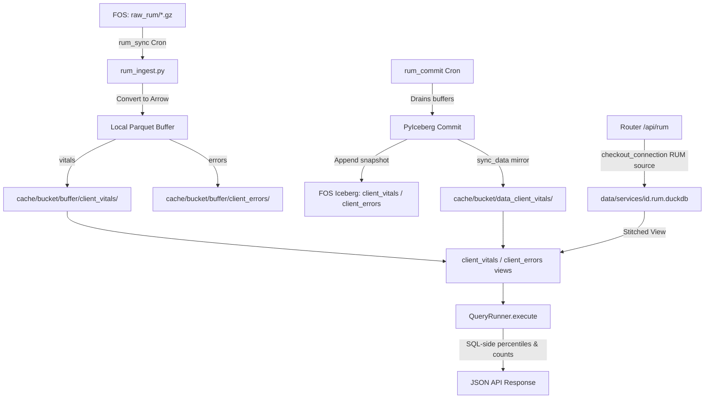

# Architectural Transition Plan: RUM-to-DuckDB & Apache Iceberg Migration

This document is the authoritative technical specification for migrating **Real User Monitoring (RUM)** off its SQLite prototype and onto the same **DuckDB + Local Parquet Buffer + Apache Iceberg on Fastly Object Storage (FOS)** engine that serves CDN request logs — with full process, catalog, and database isolation between the two.

> **Revision 2026-08-09 (rev 2).** Every file path, function signature, table
> name, and column name below was re-verified against `feature/rum` @ `d44f8444`.
> All design questions are **resolved** — see §7. Claims from the original draft
> that did not survive verification are marked **⚠️ CORRECTION** and replaced;
> those markers are kept deliberately so the implementer does not
> "helpfully" restore the original wording from a cached copy.

---

## 0. Current State (verified @ `d44f8444`)

This plan is a **delta against the code as it exists**, not a greenfield design. Read this table before writing anything.

| Component | State | Location |
|---|---|---|
| RUM cron registration | **Done.** `rum_sync_{id}` + `rum_commit_{id}` registered, gated on `rum_enabled`/`rum.enabled`, with reschedule-on-config-change | `backend/cron/scheduler.py:780-838` |
| `rum_sync` job wrapper | **Done**, and does more than ingest — it drives the Faro bundle reconcile (FOS HEAD integrity + throttled upstream drift check) | `backend/cron/jobs/rum_sync.py` |
| `rum_commit` job | **Placeholder.** Logs, writes a `cron_runs` row, does no work | `backend/cron/jobs/rum_commit.py` |
| RUM ingest | **SQLite prototype.** Parses `.gz` from FOS, `INSERT`s reconstructed JSON into `rum_beacons` | `backend/core/rum_ingest.py` |
| RUM repositories | **Written but dead.** SQL already targets `client_vitals` / `client_errors` views that do not exist; no caller; contains a `cid`/`rum_cid` bug | `backend/repositories/rum.py` |
| RUM router | **Live on SQLite.** Analytics, beacon-health, live-events all read `rum_beacons` | `backend/routers/rum.py` |
| Bootstrap RUM counters | **Live on SQLite.** Feeds the nav badge | `backend/routers/bootstrap.py:420-428` |
| Edge beacon capture | **Done and working.** Synthetic 204 at the edge, fields captured to `x-fos-edge-data:*`, logged to FOS by a dedicated endpoint | `backend/provision/declarative/generators.py:190-212` |
| FOS raw prefix | `raw/rum/` today → **moves to `raw_rum/` in Phase 0** | `backend/provision/declarative/generators.py:525` |

### 0.1 How a beacon actually reaches FOS — read this before touching anything

Misreading this flow is the single most destructive mistake available in this migration.

1. The Faro tracker JS (`backend/provision/rum_assets.py:33`) POSTs to **`/rum-beacon`**.
2. At the edge, `vcl_recv` intercepts `req.url.path == "/rum-beacon"`, copies `cid` / `req` / the raw query into `x-fos-edge-data:*` headers, sets `x-skip-rum-logging`, and returns **`error 611 "No Content"`** — a synthetic 204 (`generators.py:190-212`).
3. **The origin is never contacted for a beacon.** There is no round-trip.
4. Two response conditions split the log streams (`backend/provision/declarative/reconciler.py:728-775`):
   - `log_analytics_condition` — standard CDN logs, with `req.url.path != "/rum-beacon"`
   - `rum_log_condition` — the RUM log endpoint, with `req.url.path == "/rum-beacon"` → writes `.gz` to the RUM prefix.

**Consequence:** `POST /rum-beacon` in `backend/routers/rum.py:254` is **already dead code in production** — it can only fire from a request that bypasses the Fastly edge. Deleting that route handler (§7, decision 4) therefore requires **no VCL change and no tracker-JS change**. Do not remove the `vcl_recv` beacon interception, the `error 611` synthetic, `rum_log_condition`, or the `/rum-beacon` path from the tracker. Removing any of those breaks RUM collection completely.

---

## 1. Architectural Layout & Isolation Strategy



### A. Storage Layout Matrix

| Layer / Concern | Key / Path Pattern | Format | Isolation & Guardrails |
|---|---|---|---|
| **Raw Request Logs** | `s3://{bucket}/{prefix}raw/` | `.gz` JSON | CDN request logs |
| **Raw RUM Logs** | `s3://{bucket}/{prefix}raw_rum/` | `.gz` JSON | Faro Web Vitals & error beacons. **Sibling of `raw/`, moved in Phase 0** |
| **Request Iceberg Table** | `s3://{bucket}/{prefix}iceberg/default/logs/` | Parquet + JSON manifests | CDN request log catalog |
| **RUM Vitals Table** | `s3://{bucket}/{prefix}iceberg/default/client_vitals/` | Parquet + JSON manifests | Core Web Vitals catalog |
| **RUM Errors Table** | `s3://{bucket}/{prefix}iceberg/default/client_errors/` | Parquet + JSON manifests | JS exceptions catalog |
| **Local Iceberg mirror (logs)** | `cache/{bucket}/data/` | Hour-partitioned Parquet | **Do not change this path** |
| **Local Iceberg mirror (RUM)** | `cache/{bucket}/data_{table_name}/` | Hour-partitioned Parquet | Downloaded by `sync_data`; the *left* half of the stitched view |
| **Local write buffer (logs)** | `cache/{bucket}/buffer/` | Parquet (ZSTD-1) | **Do not change this path** — existing on-disk buffers would be orphaned |
| **Local write buffer (RUM)** | `cache/{bucket}/buffer/{table_name}/` | Parquet (ZSTD-1) | Pre-commit hot data; the *right* half of the stitched view |
| **DuckDB Database (logs)** | `data/services/{service_id}.duckdb` | DuckDB file | |
| **DuckDB Database (RUM)** | `data/services/{service_id}.rum.duckdb` | DuckDB file | Isolated pool lock, isolated view cache |
| **Operational Metadata** | `data/services/{service_id}.metadata.db` | SQLite (WAL) | Ingest tracking, cron runs, alerts. Gains a `table_name` discriminator |
| **Usage Billing** | `data/services/{service_id}.usage_log.db` | SQLite (WAL) | Unchanged |

**Buffer vs mirror — do not conflate them.** The *buffer* is pre-commit hot data written by ingest and drained by `commit_buffer`; it is never tier-compacted. The *mirror* is committed data downloaded by `sync_data`; it is what `compact_local_partitions` operates on. The original draft merged these two concepts and produced a wrong Phase 4.

---

## 2. DuckDB Schemas & PyArrow Types

All metric values are cast to `DOUBLE` (`pa.float64()`) during Arrow construction so mixed float/int Web Vitals (LCP ms vs CLS ratio) cannot trigger a schema-evolution error.

**Timestamps.** `_DUCKDB_TO_ICEBERG` maps `TIMESTAMP` → `TimestamptzType()` — "always store as tz-aware" (`backend/core/iceberg/_core.py:125`). Use `pa.timestamp("us", tz="UTC")`. A naive timestamp makes the mirror↔buffer `UNION ALL` in the stitched view fail at bind time.

**Canonical session column is `cid`** (§7, decision 11). `backend/repositories/rum.py` currently writes `rum_cid` in `get_worst_pages` (`:90`) and `get_worst_sessions` (`:117-123`) — that is a bug and must be fixed. A mismatch here builds a perfectly valid view that returns zero rows.

### A. `client_vitals` (Web Vitals & Page Views)

| Column | DuckDB Type | Iceberg / PyArrow Type | Purpose |
|---|---|---|---|
| `timestamp` | TIMESTAMP | TimestamptzType / `pa.timestamp("us", tz="UTC")` | Event time |
| `metric_name` | VARCHAR | StringType / `pa.string()` | `'LCP'`, `'FID'`, `'CLS'`, `'INP'`, `'TTFB'`, `'FCP'` |
| `metric_value` | DOUBLE | DoubleType / `pa.float64()` | Metric value |
| `metric_rating` | VARCHAR | StringType / `pa.string()` | `'good'`, `'needs_improvement'`, `'poor'` |
| `pathname` | VARCHAR | StringType / `pa.string()` | URL path |
| `browser` | VARCHAR | StringType / `pa.string()` | Client browser |
| `os` | VARCHAR | StringType / `pa.string()` | Client OS |
| `device` | VARCHAR | StringType / `pa.string()` | `'Desktop'`, `'Mobile'`, `'Tablet'` |
| `cid` | VARCHAR | StringType / `pa.string()` | Session token — **PII, redacted for analysts (§6)** |
| `req_id` | VARCHAR | StringType / `pa.string()` | Fastly Request ID — CDN join key, **analyst-visible (§6)** |

### B. `client_errors` (JS Runtime Exceptions)

| Column | DuckDB Type | Iceberg / PyArrow Type | Purpose |
|---|---|---|---|
| `timestamp` | TIMESTAMP | TimestamptzType / `pa.timestamp("us", tz="UTC")` | Exception time |
| `error_message` | VARCHAR | StringType / `pa.string()` | Raw JS error message |
| `error_file` | VARCHAR | StringType / `pa.string()` | Source JS file |
| `error_line` | INTEGER | IntegerType / `pa.int32()` | Line number |
| `error_col` | INTEGER | IntegerType / `pa.int32()` | Column number |
| `pathname` | VARCHAR | StringType / `pa.string()` | Path where the error fired |
| `browser` | VARCHAR | StringType / `pa.string()` | Client browser |
| `os` | VARCHAR | StringType / `pa.string()` | Client OS |
| `device` | VARCHAR | StringType / `pa.string()` | Category |
| `cid` | VARCHAR | StringType / `pa.string()` | Session token — **PII, redacted for analysts (§6)** |
| `req_id` | VARCHAR | StringType / `pa.string()` | Fastly Request ID |

### C. Where these schemas live

> **⚠️ CORRECTION — not `field_registry.py`.** That module is the **VCL
> log-field catalog**: its `LogField` records carry `vcl_log_expression`,
> security hooks, and `Group` membership, and they drive VCL generation and
> the `/logs` field picker. Registering non-VCL RUM columns there pollutes
> those surfaces.

The log Iceberg schema is generated by `get_iceberg_schema(log_fields_config)` / `get_arrow_schema()` (`_core.py:264-313`), driven by the hand-maintained `_FIELD_ORDER` list — a field absent from `_FIELD_ORDER` "silently never materializes as a column" (`_core.py:111-122`).

RUM tables are **static** — no per-service VCL config — so they get plain module-level constants in a new `backend/core/iceberg/rum_schema.py`:

```python
RUM_TABLE_SCHEMAS: dict[str, pa.Schema]   # "client_vitals" | "client_errors"
RUM_ICEBERG_SCHEMAS: dict[str, Schema]
```

`get_arrow_schema` / `get_iceberg_schema` / `get_schema_field_names` gain a `table_name` parameter that dispatches to these constants for RUM and keeps the existing dynamic path for `logs`.

---

## 3. Phase-by-Phase Implementation Plan

### Phase 0: RUM Teardown & Prefix Move

Scope decision (§7, decisions 9 + 13): the SE demo service is the only deployment using RUM, and its **RUM state is disposable**. CDN request logs, their Iceberg table, and their `ingested_files` rows **must survive**. This makes the prefix move a hard cutover with no dual-read window and no data backfill.

Doing this first — while RUM is still on the simple SQLite path — means the new ingest pipeline is written once against the final prefix and never carries migration logic.

#### Tasks

1. **Tear down RUM on the demo service.** Use the existing path: `disable_rum(..., remove_cloud_files=True)` (`backend/provision/rum_orchestrator_v2.py:560`), which calls `delete_fos_prefix` on `raw/rum/` (`:650-670`). This also strips the RUM VCL and log endpoint.
2. **Purge local RUM state** on the VM and locally:
   - `DELETE FROM rum_beacons;`
   - `DELETE FROM ingested_files WHERE file_name LIKE '%/raw/rum/%';`
   - `DELETE FROM ingest_in_flight WHERE buffer_filename LIKE '%rum%';` (none expected — RUM never used the buffer)
   - Recompute/clear the `ingested_files_summary` rollup so `latest_file_name` no longer points at a deleted beacon file.
3. **Move the producer prefix.** `backend/provision/declarative/generators.py:525`:
   `path=f"{state.fos_prefix}/raw_rum/%Y/%m/%d/%H/rum_log_%M.json.gz"`
4. **Update every consumer** of the old path:
   - `backend/core/rum_ingest.py:54,139` → `raw_rum/`
   - `backend/routers/usage.py:496` → `raw_rum/` (billing byte accounting)
   - `backend/provision/rum_orchestrator_v2.py:452,659` → `raw_rum/`
   - `backend/provision/orchestrator.py:760` → teardown exclude
   - `tests/core/test_rum_ingest.py`, `tests/utils/test_fos_setup.py`, `tests/backend/provision/declarative/test_generators.py`
5. **Remove the now-unnecessary guards** — `raw_rum/` is a sibling of `raw/`, so a log-side listing can no longer see RUM objects:
   - `backend/core/ingest.py:631` — delete `exclude_prefix_subpath="raw/rum/"`
   - `backend/core/metadata/ingest_log.py:244-251` — delete the `/raw/rum/` lexicographic self-heal (it existed only to paper over the missing discriminator)
   - `backend/provision/orchestrator.py:760` / `fos_setup.delete_fos_prefix(..., exclude_prefix=...)` — drop the exclude
   - **Ordering requirement:** do this only after step 1 has been verified to leave **zero keys** under `raw/rum/`. Removing the guard while legacy objects remain would let CDN log ingest eat beacon files.
6. **Re-enable RUM** on the demo service so the new VCL and logging endpoint are generated against `raw_rum/`, and confirm beacons land under the new prefix.

**Do not touch** the `vcl_recv` beacon interception, the `error 611` synthetic, `rum_log_condition`, or the tracker's `/rum-beacon` path (§0.1).

#### Verification
- [ ] `aws s3 ls`-equivalent (or the admin FOS browser) shows **zero** keys under `{prefix}raw/rum/` and new keys appearing under `{prefix}raw_rum/`.
- [ ] CDN request-log ingest is unaffected: `ingested_files` count for log files is unchanged, dashboards still render, `/api/health?deep=1` clean.
- [ ] `uv run pytest tests/backend/provision/declarative/test_generators.py tests/utils/test_fos_setup.py tests/core/test_rum_ingest.py`
- [ ] The generated VCL still contains the beacon interception and `error 611`.

---

### Phase 1: Storage Infrastructure & Connection Isolation

#### Tasks

1. **SQLite Migration `010` (`backend/core/sqlite_migrations.py`)**

   > **⚠️ CORRECTION — the number is 010, not 009.** Slot 9 is
   > `_migration_009_quarantined_error_size` (`:296`); `LATEST_VERSION = max(MIGRATIONS)`.

   > **⚠️ CORRECTION — do NOT `DROP TABLE rum_beacons` here.**
   > `backend/core/metadata/base.py:442-449` issues `CREATE TABLE IF NOT EXISTS
   > rum_beacons` on **every** metadata-DB open, so the drop is undone on the
   > next connection. Five live readers still depend on it. The drop is Phase 6.

   ```sql
   ALTER TABLE ingested_files ADD COLUMN table_name TEXT NOT NULL DEFAULT 'logs';
   CREATE INDEX IF NOT EXISTS idx_ingested_files_table_source
       ON ingested_files(table_name, source_name);
   ```
   Then **rebuild `ingest_in_flight`** with a composite primary key:
   ```sql
   CREATE TABLE ingest_in_flight_new (
       buffer_filename TEXT NOT NULL,
       source_name     TEXT NOT NULL,
       files_json      TEXT,
       started_at      TEXT,
       table_name      TEXT NOT NULL DEFAULT 'logs',
       PRIMARY KEY (buffer_filename, table_name)
   );
   INSERT INTO ingest_in_flight_new (buffer_filename, source_name, files_json, started_at, table_name)
       SELECT buffer_filename, source_name, files_json, started_at, 'logs' FROM ingest_in_flight;
   DROP TABLE ingest_in_flight;
   ALTER TABLE ingest_in_flight_new RENAME TO ingest_in_flight;
   CREATE INDEX IF NOT EXISTS idx_in_flight_source ON ingest_in_flight(source_name);
   CREATE INDEX IF NOT EXISTS idx_in_flight_table_source ON ingest_in_flight(table_name, source_name);
   ```

   **Why the rebuild is mandatory:** `buffer_filename` is currently a bare `TEXT PRIMARY KEY` (`backend/core/metadata/base.py:295`) and is the `ON CONFLICT` target of `record_in_flight` (`ingest_log.py:722`). The deterministic buffer name hashes the *source file list* (`ingest.py:343-352`), so the vitals Parquet and the errors Parquet produced from the same chunk get the **same basename**. Without the composite key, one manifest silently overwrites the other and half the crash-recovery state is lost.

   **No data backfill is needed** — Phase 0 deleted all pre-existing RUM rows. Update `backend/core/metadata/base.py`'s DDL to match the new `ingest_in_flight` shape so fresh databases and migrated ones agree.

2. **Metadata DB & cache isolation (`backend/core/metadata/`)**
   - Add `table_name: str = "logs"` to `record_in_flight` (`ingest_log.py:711`), `clear_in_flight` (`:737`), **`list_in_flight` (`:748`)**, `insert_ingested_files`, and `get_ingested_filenames`.
   - `list_in_flight` is easy to miss and consequential: it returns *every* in-flight row for the service, so without the filter the logs-side `_recover_in_flight` will try to promote RUM buffer manifests into the logs table and vice versa.
   - Make the `ingested_files_summary` rollup (`latest_file_name`, `latest_file_date`) **per-`table_name`**, or the "Latest Log" badge reports a RUM beacon file as the newest CDN log.
   - Key `_ingested_filenames_cache` by `(service_id, table_name)`.

3. **DuckDB pool isolation (`backend/core/duckdb.py`, `duckdb_pool.py`, `duckdb_recycle.py`)**

   > **⚠️ CORRECTION — `get_connection` has no `service_id` and no `db_type`.**
   > Real signature: `get_connection(source: dict | None = None, max_wait: float = 300.0, skip_view_update: bool = False, read_only: bool = False)`
   > (`duckdb.py:904`), resolving the file from `src["duckdb_path"]` (`:926`).
   > Routers never call it — they get `ctx.con`, built by
   > `backend/deps.py:_ConnectionHolder` → `duckdb_pool.checkout_connection(source)`
   > (`deps.py:128`). Pools key on
   > `src.get("name") or src.get("service_id") or "default"` (`duckdb_pool.py:891`).

   The seam is a **RUM-variant source dict**, not a new argument:
   - Add `rum_source_for(src) -> dict` returning a shallow copy with `duckdb_path` → `data/services/{service_id}.rum.duckdb` and `name` → `f"{name}::rum"`. The name suffix gives pool-key, view-cache, persistent-cache, and service-lock isolation for free.
   - Verify the derived key flows through `warm_pool_for_service`, `warm_pool_at_startup`, `reset_pool_for_service`, and `get_all_stats` — otherwise the admin pool-stats panel shows RUM connections under a mystery service.
   - Fix `duckdb_pool._safe_buffer_mtime(src)` (`:221`), which drives checkout-time view-staleness off the *logs* buffer dir. It must resolve the source's own buffer dir, or RUM checkouts never refresh (stale data) or refresh on every request (latency).
   - Add `.rum.duckdb` to `duckdb_recycle._sources_by_db_path()` (`:105`) or those files are never recycled and grow without bound.

4. **PyIceberg multi-table core**

   > **⚠️ CORRECTION — wrong module for two of these.** `update_iceberg_view`
   > (`view.py:627`) and `execute_with_stale_view_retry` (`view.py:149`) live in
   > `backend/core/iceberg/view.py`, not `_core.py`. `_buffer_dir` (`_core.py:322`)
   > and `_table_identifier` (`_core.py:328`) are correctly in `_core.py`.
   > `write_to_buffer` (`buffer.py:429`) and `commit_buffer` (`buffer.py:462`)
   > are in `buffer.py`.

   - `_table_identifier(source, table_name="logs")` → `("default", table_name)`. It is currently a hard-coded `return ("default", "logs")`.
   - `_buffer_dir(source, table_name="logs")` → unchanged for logs, `.../buffer/{table_name}` for RUM.
   - `get_iceberg_schema` / `get_arrow_schema` / `get_schema_field_names` gain `table_name` (§2.C).
   - **`_align_to_schema(table, target_schema=None, source=None)` (`manifest.py:421`) falls back to the *log* schema when `target_schema` is None — and `write_to_buffer` calls it exactly that way (`buffer.py:438`).** Every RUM write must pass the RUM schema explicitly, or all RUM columns are silently written as nulls. This failure is invisible until someone queries the data.
   - `write_to_buffer` sorts by `("timestamp", "ip")` when `ip` is present (`buffer.py:442-446`). RUM has no `ip`; the guard handles it, but assert it in test.
   - Parameterize the rest of `buffer.py`, all of which is currently table-blind: `buffer_files` (`:304`), `tombstone_buffer_files` (`:163`), `sweep_tombstoned_buffer_files` (`:240`), `_tombstoned_parquet_paths` (`:145`), `_quarantine_dir` (`:326`), `_quarantine_buffer_file` (`:333`), `buffer_backlog_stats` (`:395`), `optimize_table` (`:798`), `run_cloud_maintenance` (`:1039`).
   - `update_iceberg_view(con, source, ..., table_name="logs")`. Note the hard-coded catalog lookup inside `_update_iceberg_view_locked`:
     `SELECT metadata_location FROM iceberg_tables WHERE table_namespace = 'default' AND table_name = 'logs'` (`view.py:754`).
   - **View naming.** The logs view is named `_safe_table_name(source["name"])` — the **service name**, not `logs` (`view.py:742`, used at `:967` and `:1204`). `repositories/rum.py` writes `FROM client_vitals`. Resolution: name the RUM views literally `client_vitals` and `client_errors` inside `.rum.duckdb` (that database holds nothing else), and do **not** run them through `_safe_table_name`.
   - `execute_with_stale_view_retry(con, source, fn, *args, **kwargs)` forwards `**kwargs` **to `fn`** (`view.py:181`). A bare `table_name=` kwarg would be passed into the caller's function and raise `TypeError`. Use a keyword-only `*, table_name="logs"`, or bind it with `functools.partial`.
   - Verify `_view_cache`, `_snapshot_files_cache`, `_load_persistent_cache` / `_save_persistent_cache` (`view.py:203-232`), and `clear_source_caches` separate under the `::rum` source name. Verify — do not assume.
   - Empty buffer **and** empty mirror must return the existing `WHERE false` fallback (`view.py:967`), built from the RUM column list.

5. **Iceberg table creation.** `_init_iceberg_table_locked` (`_core.py:1062`) builds a `PartitionSpec` of `hour(timestamp)` and a `SortOrder` on `timestamp` (`:1139-1161`). Parameterize on `table_name` so both RUM tables get the same hidden hourly partitioning — RUM queries are almost entirely time-ranged, so this is load-bearing.

6. **Local mirror sync (`backend/core/iceberg/sync.py`).** `sync_data(source, ...)` (`:89`) downloads committed Iceberg data files into the local mirror and calls `_table_identifier(source)` with no table argument (`:103`). Parameterize it **and** its destination directory (`cache/{bucket}/data_{table_name}/`).

   **This is the highest-risk omission in the original draft.** Without it, RUM data commits to FOS successfully and then never appears in any query — the stitched view would only ever show un-committed buffer files. Every test passes, the cron logs success, and the data is 90% missing.

7. **RUM schema constants** — new `backend/core/iceberg/rum_schema.py` (§2.C).

#### Verification
- [ ] `uv run pytest tests/core/test_metadata_db_migrations.py` — Migration 010 applies cleanly to an existing DB and a fresh one, and `base.py`'s DDL matches the migrated shape.
- [ ] Composite-key test: two in-flight rows with the same `buffer_filename` and different `table_name` coexist.
- [ ] `list_in_flight(svc, table_name="logs")` does not return RUM manifests.
- [ ] Concurrent checkout of the logs source and the RUM source resolve to distinct files and distinct pool keys, no lock contention.
- [ ] `_align_to_schema` with the RUM schema round-trips all columns **non-null** (direct regression against the silent-null mode).
- [ ] `update_iceberg_view` builds a valid view with zero buffer files and zero mirror files, with the correct RUM columns.
- [ ] `sync_data(src, table_name="client_vitals")` writes to the RUM mirror and leaves `cache/{bucket}/data/` untouched.
- [ ] `uv run mypy backend/` — the fastest way to find every missed `table_name` call site.

---

### Phase 2: Ingestion Pipeline & PyIceberg Buffering

#### Tasks

1. **RUM ingestion (`backend/core/rum_ingest.py`)**
   - List `s3://{bucket}/{prefix}raw_rum/`.
   - **Preserve the generator event contract.** `ingest_rum_logs` is consumed by `_run_rum_sync` (`backend/cron/jobs/rum_sync.py:186-224`), which switches on `"started"` / `"file_done"` / `"error"` / `"cleanup_done"` / `"done"`. The `"started"` event is what triggers `_reconcile_faro_bundle` — rename or drop it and Faro bundle self-healing silently stops. New events must be additive.
   - **Reuse `_recover_in_flight`, do not reimplement it.** It exists at `backend/core/ingest.py:355` and is called at `:592`. Parameterize to `(source, table_name="logs")` and call it from the RUM path. A divergent second copy is how the orphaned-sync-row freeze class recurs.
   - Preserve the pathname fallback (`rum_pathname` → `urlparse(referer).path` → `/`) and the `service_id` / `rum_service_id` cross-service filter — both load-bearing, both easy to lose in a rewrite.
   - **Fan-out (§7, decision 10):** a beacon line carrying both a vital and an error writes to **both** tables — they are genuinely two facts. To remove the resulting double-count, rewrite `get_error_rate_trend`'s denominator from `COUNT(*)` to `COUNT(DISTINCT req_id)` over the union (Phase 3).
   - Build PyArrow tables: `metric_value` → `pa.float64()`, `error_line`/`error_col` → `pa.int32()`, `timestamp` → `pa.timestamp("us", tz="UTC")`.
   - Write via `iceberg.write_to_buffer(src, tbl, name, table_name=...)`, passing the RUM schema explicitly to `_align_to_schema`.
   - Reuse `_deterministic_buffer_name(good_files)` (`ingest.py:343`).
   - Keep `cleanup_old_rum_logs` wired in (gated on `rum.delete_after`, yields `cleanup_done`); update its prefix to `raw_rum/`.
   - Update the module docstring — it still says "streams them into the sqlite rum_beacons table."

2. **Scheduled commits (`backend/cron/jobs/rum_commit.py`)** — **replace the placeholder**, which currently logs and writes a `cron_runs` row with no work.
   - Mirror `backend/cron/jobs/commit.py`: `commit_buffer` for both tables, then `sync_data` for both so the mirror stays current.
   - `@cron_task("cron_rum_commit")` is already applied; add `_BOTO3_CALLER_HINT = "rum_commit"`.
   - The placeholder logs status `"done"`; everything else uses `"success"` (`rum_ingest.py:116`). Fix it — a non-standard status makes the job look permanently un-succeeded on the health snapshot.

3. ~~**Cron registration**~~ — **already done** (`scheduler.py:780-838`). Intervals come from `rum.sync_interval_seconds` (floor 5) and `rum.commit_interval_mins` — **not `log_period`** as the original draft claimed. Verify only; write no code.

#### Verification
- [ ] `uv run pytest tests/core/test_rum_ingest.py` — this file currently asserts on SQLite `rum_beacons` rows (`:22`, `:184`) and must be **rewritten** against Parquet buffer output. Derive fixture keys from the producer (`rum_ingest`), never the reader.
- [ ] Crash resilience: kill after `write_to_buffer`, before `insert_ingested_files` → `_recover_in_flight` promotes cleanly and does not touch the other table's manifest.
- [ ] A chunk yielding both a vitals and an errors Parquet leaves **two** in-flight rows.
- [ ] `_reconcile_faro_bundle` still fires on `"started"`.
- [ ] `rum_commit` drains the buffer, tombstones the files, and a following `sync_data` makes committed rows visible in the view.
- [ ] `_BOTO3_CALLER_HINT` and `@cron_task` emit telemetry to OTel and `usage_log.db`.

---

### Phase 3: SQL Repositories & Analytics Routers

#### Tasks

1. **Repositories (`backend/repositories/rum.py` + `backend/repositories/_sql/`)**
   - **Fix `rum_cid` → `cid`** in `get_worst_pages` (`:90`) and `get_worst_sessions` (`:117-123`).
   - `get_error_rate_trend`: denominator → `COUNT(DISTINCT req_id)` (see Phase 2 fan-out). The `UNION ALL` still full-scans both tables; note the cost and measure it before optimizing.
   - `get_worst_sessions` groups on `cid`, which is redacted for analysts — see §6.2 for the salted-hash resolution.
   - Drop the stale "Stub for Phase 2" / "Phase 3" docstrings.
   - Extract SQL into `backend/repositories/_sql/` per the existing convention.

2. **Router cutover (`backend/routers/rum.py`) — the largest single piece of work**
   - `GET /{id}/rum/analytics` (`:349`) is ~150 lines of Python-side aggregation with a hand-rolled `match_filters` and a `LIMIT 1000` sample extrapolated to an estimated count (`:513`). **Replace it with repository calls; do not adapt it.**
   - `GET /{id}/rum/beacon-health` (`:197`) → report `MAX(timestamp)` from `client_vitals` plus the last successful `rum_sync` run (§7, decision 5). Freshness is now bounded by `sync_interval_seconds`; state that in the UI copy so a one-tick lag doesn't read as a fault.
   - `GET /{id}/rum/live-events` (`:905`) → DuckDB equivalent.
   - **Delete `POST /rum-beacon` (`:254`)** (§7, decision 4). Per §0.1 this handler is already unreachable in production. **Do not touch the VCL, `rum_log_condition`, or the tracker's `/rum-beacon` path.**
   - `backend/routers/bootstrap.py:420-428` feeds the nav badge from `rum_beacons` — cut it over in the same change or the badge goes to zero.
   - `normalize_rum_beacons_timestamps` (`:315`) becomes dead — delete in Phase 6, do not port.
   - Bind the RUM source so `ctx.con` opens `.rum.duckdb` — a dedicated dependency (`get_rum_con`) or an explicit `_ConnectionHolder` in the handler. **Not** a `db_type=` argument.
   - Wrap view queries in `execute_with_stale_view_retry` using the keyword-only form.
   - Run `make gen-types` if any response model changed.

#### Verification
- [ ] `uv run pytest tests/backend/routers/test_rum_analytics.py` — this file seeds `rum_beacons` directly (`:161`, `:223`, `:293`) and must be rewritten against Parquet fixtures. **There is no `tests/api/` directory**; the original draft's `tests/api/test_rum.py` does not exist.
- [ ] p50/p75/p95 match a hand-computed fixture.
- [ ] Stale-view handling: delete a buffer Parquet mid-query, confirm self-heal without a 500.
- [ ] Nav badge and beacon-health non-zero after cutover.
- [ ] **Record measured baselines.** Capture `section_timings` for every RUM endpoint at 1d/7d/30d on dev and write the numbers into this document. There is **no `<50ms` target** — that figure in the original draft was arbitrary and unreachable for a cold `PERCENTILE_CONT` over a 30d multi-file scan on the 4-core VM. These recorded numbers become the regression gate and the input to the rollup decision (§7, decision 8).

---

### Phase 4: Lifecycle, Compaction & Administration

#### Tasks

1. **Local compaction (`backend/core/local_compaction.py`)**

   > **⚠️ CORRECTION — wrong function and wrong directory.** There is no
   > `compact_local_buffer`. The function is
   > `compact_local_partitions(source, min_files_per_partition=1, dry_run=False)`
   > (`:158`), and it operates on **`cache/{bucket}/data/`** — the
   > hour-partitioned Iceberg *mirror* (`timestamp_hour=YYYY-MM-DD-HH`, `:182`,
   > `:230`) — **not** the buffer. `cache/{bucket}/buffer/{table}/daily/` does
   > not and must not exist.

   - Parameterize the root to `cache/{bucket}/data_{table_name}/`. The `daily/` (7d) and `weekly/` (30d) tiers follow automatically.
   - Preserve the active-hour guard (`:230`) and the `_get_service_lock(source["name"])` publish lock (`:212`); confirm the lock key does not collapse back to the base service name under the `::rum` suffix.
   - Confirm `_build_merge_select_sql` degrades correctly for a table with no `rid`.
   - Reconcile the file-size cap with `optimize_table`'s `target_file_size_mb: int = 128` default (`buffer.py:798`). Pick one number, state why. RUM volume is small enough that 128 MB is almost certainly right and the original draft's 256 MB is unjustified.

2. **Rollups — DEFERRED** (§7, decision 8). Do not build `rum_vitals_hour` / `rum_errors_hour` in this migration. Gate on the Phase 3 measured baselines. `add-topn-rollup` documents ~10 seams per rollup plus the stale-bundle backfill trap, and `perf-dead-ends` records percentile rollups as an empirically verified dead end for the logs pipeline.

3. **Service teardown (`backend/services/service_manager.py`)** — service deletion purges `.rum.duckdb`, RUM buffer **and** mirror directories, and unregisters both RUM cron jobs.

4. **Delete Data — two separate controls** (§7, decisions 6 + 7)

   > **⚠️ Missing entirely from the original draft.** `reset_service_logs`
   > (`backend/core/reset.py`) purges the whole `iceberg/` prefix except
   > `iceberg/meta/` (`:4`, `:37-67`), deletes the local DuckDB file, and clears
   > `ingested_files` / `ingest_in_flight` / `committed_buffers` wholesale
   > (`:7`). Left as-is it destroys the RUM Iceberg tables while leaving
   > `.rum.duckdb` and RUM metadata rows behind — a half-deleted state, the same
   > shape as the 2026-08-04 Delete-Data race.

   - **"Delete Log Data"** — scope the FOS purge to `iceberg/default/logs/` (not the whole `iceberg/` prefix), delete `{id}.duckdb`, and scope the metadata `DELETE`s to `table_name='logs'`.
   - **"Delete RUM Data"** — purge `iceberg/default/client_vitals/` + `iceberg/default/client_errors/`, delete `{id}.rum.duckdb`, delete the RUM buffer/mirror dirs, and scope metadata `DELETE`s to the RUM table names.
   - Each control carries its own **optional "also delete raw files" checkbox, default off**, mirroring the existing `delete_raw_logs` flag and its warning when the source keeps raw logs after ingest (`reset.py:179-183`). For RUM this targets `raw_rum/`.
   - Both must hold the per-service lock for the whole run, as the current implementation does.

5. **Admin Iceberg router (`backend/routers/admin/iceberg.py`)** — parameterize `info`, `commit`, `optimize`, `expire` with `table_name: str = "logs"`, **validated against a `Literal` allowlist**. This is an admin surface reaching storage; an unvalidated table name is path-traversal-shaped into `_table_identifier`. Run `make gen-types` after.

#### Verification
- [ ] `uv run pytest tests/core/test_local_compaction.py tests/core/test_local_compaction_branches.py` — RUM mirror Parquets bin-pack and tier correctly, **and logs-side behavior is byte-identical to before** (this function is load-bearing for the main pipeline).
- [ ] `delete_service` removes `.rum.duckdb` and all RUM cache/buffer/mirror files.
- [ ] "Delete Log Data" leaves RUM tables and RUM metadata rows intact; "Delete RUM Data" leaves the CDN log table and its `ingested_files` rows intact. Assert on both FOS keys and metadata rows.
- [ ] `GET /api/admin/iceberg/info?table_name=client_vitals` returns snapshot metadata; `?table_name=../logs` is rejected by the model, not the handler.

---

### Phase 5: SQL Query Console & Frontend Integration

#### Tasks

1. **Dataset routing (`backend/models/dashboard.py:365`, `backend/routers/query.py`)**
   - `dataset: Literal["logs", "client_vitals", "client_errors"] = "logs"` on `QueryRequest`. `Literal`, not bare `str` — this value selects a database file and a view name.
   - Bind the RUM source when `dataset != "logs"`. The handler uses `ctx.con` / `ctx.source` (`query.py:103-115`), so this is a context-construction change.
   - `make gen-types` + `make openapi-drift`.

2. **Analyst PII and query bounds — see §6.** Highest-risk item in the migration; do not ship the dataset switch without it.

3. **Frontend console**
   - Dataset toggle: `[ CDN Request Logs ] [ RUM Web Vitals ] [ RUM JS Errors ]`.
   - Autocomplete loads fields from the RUM schema constants, not `field_registry`.
   - `frontend/app/query/` bypasses `ReportShell` — audit primitive callers before assuming shared layout changes apply.
   - New findings must fit under the ESLint ceiling (**824**; drive down, never raise).

#### Verification
- [ ] `SELECT metric_name, AVG(metric_value) FROM client_vitals GROUP BY 1` with `dataset=client_vitals` returns rows.
- [ ] `dataset=logs` resolves to `{id}.duckdb`, `dataset=client_vitals` to `{id}.rum.duckdb` — assert on the resolved path, not on results.
- [ ] `make openapi-drift` clean.
- [ ] The §6 analyst probes pass.

---

### Phase 6: Decommission the SQLite Prototype

In scope for this branch (§7, decision 12). **Do not ship in the same deploy as Phase 3** — Phases 0–5 keep the SQLite path alive and are revertible; this is the point of no return.

1. Remove the `rum_beacons` DDL from `backend/core/metadata/base.py:442-449` (table **and** index). Until this is gone, any `DROP` is undone on the next metadata-DB open.
2. Migration `011`: `DROP TABLE IF EXISTS rum_beacons;`
3. Delete `normalize_rum_beacons_timestamps` and every remaining `rum_beacons` reference in `backend/routers/rum.py` and `backend/routers/bootstrap.py`.
4. Confirm `POST /rum-beacon` is gone from the router and **still present** in the VCL and tracker (§0.1).
5. `rg -n "rum_beacons" backend/ tests/ frontend/` returns nothing.

---

## 4. Cross-Cutting Gates

| Gate | Command | Note |
|---|---|---|
| Import contracts | `make import-contracts` | `core ↛ routers` — the RUM cron/ingest path must not import from `backend/routers/` |
| OpenAPI drift | `make gen-types` && `make openapi-drift` | Triggered by `QueryRequest.dataset` and the admin `table_name` param. Regen runs in the **pre-push** hook — commit the drift or the push fails |
| Backend coverage | `make test-ci` | Floor **86** (`Makefile:225`, `--cov-fail-under=86`). *(The `95` figure applies only to the `backend/provision/declarative` sub-target at `Makefile:58`.)* |
| Security regression | `make security-regression` | Floor **206** (`scripts/check_security_regression_count.sh:23`) — never lower. Add the §6 RUM probes |
| ESLint ceiling | `scripts/check_eslint_count.sh` | **824** — drive down, never raise |
| Typecheck / lint | `make typecheck`, `make lint` | mypy surfaces every missed `table_name` call site — run it early and often |
| Infra leak sweep | `infra-leak-sweep` skill | Public repo. No bucket names, service IDs, or GCE hostnames in tracked files |

---

## 5. Final Verification Protocol

```bash
# Targeted suites
uv run pytest tests/core/test_rum_ingest.py \
              tests/backend/routers/test_rum_analytics.py \
              tests/core/test_metadata_db_migrations.py \
              tests/core/test_local_compaction.py \
              tests/core/test_iceberg.py \
              tests/core/test_iceberg_view_branches.py \
              tests/core/test_iceberg_buffer_branches.py \
              tests/core/test_iceberg_sync_branches.py

# Full gate
make verify          # == make ci && make e2e
```

> **⚠️ CORRECTION — test paths.** The original draft referenced
> `tests/api/test_rum.py`, `tests/api/test_query.py`,
> `tests/core/test_rum_duckdb.py`, `tests/core/test_sqlite_migrations.py`, and
> `tests/core/test_duckdb.py`. **None of these exist.** There is no `tests/api/`
> directory — router tests live under `tests/routers/` and
> `tests/backend/routers/`, and the migration suite is
> `tests/core/test_metadata_db_migrations.py`. The Iceberg suites are included
> above because parameterizing `_core.py` / `view.py` / `buffer.py` / `sync.py`
> modifies the **logs** pipeline; those tests are its regression net.

**Health check — dev, then prod:**
- Dev: `curl -s http://127.0.0.1:18002/api/health?deep=1`
- Prod (through the admin SSH tunnel): `curl -s http://localhost:8000/api/health?deep=1`

> `localhost:8000` is the **prod tunnel** port, not the dev backend — `run.sh:56`
> explicitly refuses `--backend-port 8000` for this reason. Never use `:8000` to
> "verify dev."

Must show: no `degraded` for `rum_sync` or `rum_commit`, and **no leaked `cron_runs` rows with `status='running'`** for either job — a leaked row freezes ingestion permanently, and the symptom is silence, not an error.

**Acceptance gate — real-data soak.** Run one full `sync → commit → sync_data → query` cycle against live beacons and confirm the row count visible in the view equals `SUM(row_count)` from `ingested_files WHERE table_name='client_vitals'`. A mismatch is the signature of the missing-`sync_data` failure mode (Phase 1.6).

---

## 6. Security: Analyst Model for RUM

Two roles: **admin** (network-trusted, full access) and **analyst** (adversary model, PII-masked, RBAC-gated via `remote_access` middleware). RUM is analyst-visible; the controls below are what make that safe.

### 6.1 Column policy

| Column | Admin | Analyst | Rationale |
|---|---|---|---|
| `cid` | raw | **`[redacted]`** | Stable per-client session token — same category as `cookie_session` |
| `req_id` | raw | **visible** | Per-request, not per-user; cannot track across a session, and it is the CDN join key that makes RUM↔request-log correlation possible. Already visible in CDN logs |
| `pathname` | raw | visible | Consistent with `url` staying analyst-visible on the logs side |
| everything else | raw | visible | No client identifiers |

**Implementation:** add `cid` to `SESSION_ID_KEYS` in `backend/core/share_db/validation.py:35` (currently `frozenset({"cookie_session"})`). That set feeds `_pii_redact_cols(con, table_name)` (`backend/repositories/query.py:151`), which redacts at the **source view** — the only robust control on a free-form SQL surface, because value-shape masking is defeated by `'x' || cid`, `split_part(cid,'-',1)`, `CAST(cid AS BLOB)`, and `GROUP BY cid`.

### 6.2 Worst Sessions under redaction

Source-view redaction collapses `GROUP BY cid` into a single `[redacted]` bucket, which would leave the Worst Sessions panel silently broken. Resolution (§7, decision 2): **group on a per-service, persistent salted hash of `cid`.**

- Salt: `secrets.token_hex(32)`, generated once at RUM enable, stored as `rum.cid_salt` in the service config (`configs/{service_id}.json`, gitignored via `.gitignore:5`).
- Never log it, never return it from any API response, never include it in a config export or the admin config viewer.
- Analysts receive `sha256(salt || cid)` as an opaque session bucket — distinct sessions stay distinct, the panel works over any window, and the raw token is never exposed.
- **This is a stable pseudonymous identifier by construction** — the same category the code comments describe for `cookie_session`. It must go past `security-rbac-expert` before merge, and be documented in `SECURITY.md`.

### 6.3 Query bounds

`_rebind_table_to_window_view(con, table_name, time_filter, redact_cols)` (`backend/repositories/query.py:184`) applies both the redaction and the analyst time clamp (`MAX_ANALYST_QUERY_SPAN`, `backend/utils/remote_access.py:1385`). It is currently bound to the logs view name. **The RUM datasets must go through the same rebind**, or an analyst gets unbounded full-table RUM scans through the query console.

### 6.4 Required probes (add to the security regression suite, floor 206)

- `SELECT cid, 'x' || cid, split_part(cid,'-',1), CAST(cid AS BLOB) FROM client_vitals` — all `[redacted]`.
- `SELECT cid, count(*) FROM client_vitals GROUP BY cid` — no enumeration of distinct raw values.
- A query spanning more than `MAX_ANALYST_QUERY_SPAN` on a RUM dataset is clamped, not served.
- `req_id` remains visible (a regression that over-masks is also a failure).
- The salt never appears in any API response body.

---

## 7. Resolved Decisions

All previously open questions are settled. These are **decisions, not options** — implement them as written.

| # | Decision | Resolution |
|---|---|---|
| 1 | `cid` analyst policy | **Redact** like `cookie_session`; add to `SESSION_ID_KEYS` (§6.1) |
| 2 | Worst Sessions under redaction | **Per-service persistent salted hash**, salt in `rum.cid_salt` (§6.2). Requires `security-rbac-expert` review |
| 3 | `req_id` analyst policy | **Visible** — per-request, and it is the CDN join key (§6.1) |
| 4 | `POST /rum-beacon` | **Delete the route handler.** It is already unreachable in prod (§0.1). VCL and tracker JS untouched |
| 5 | `/rum/beacon-health` signal | `MAX(timestamp)` from `client_vitals` + last successful `rum_sync`. Freshness bounded by `sync_interval_seconds`; say so in the UI copy |
| 6 | Delete Data scope | **Two separate controls** — "Delete Log Data" and "Delete RUM Data", each fully scoped (Phase 4.4) |
| 7 | Raw-file deletion | **Optional checkbox, default off**, on each control; mirrors the existing `delete_raw_logs` semantics and warning |
| 8 | Rollups | **Deferred.** Gate on Phase 3 measured baselines |
| 9 | FOS prefix | **Move to `raw_rum/`**, as **Phase 0**, hard cutover (no dual-read) |
| 10 | Vitals/errors fan-out | **Both tables**; fix `get_error_rate_trend`'s denominator to `COUNT(DISTINCT req_id)` |
| 11 | Canonical session column | **`cid`** — fix the `rum_cid` references in `repositories/rum.py` |
| 12 | Phase 6 scope | **In scope on `feature/rum`** — land the full migration including the `rum_beacons` drop |
| 13 | Demo-service teardown | **RUM only.** CDN request logs, their Iceberg table, and their `ingested_files` rows must survive |
