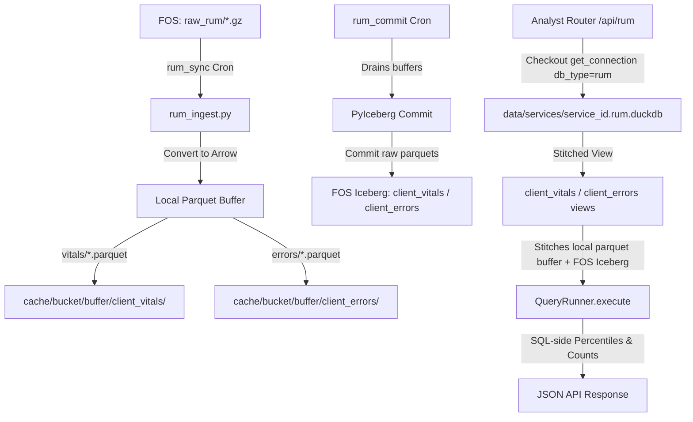

# Architectural Transition Plan: RUM-to-DuckDB & Apache Iceberg Migration

This document outlines the authoritative, step-by-step technical specification and implementation plan to modernize the **Real User Monitoring (RUM)** storage and query engine.

It transitions RUM from its prototype state (where raw JSON beacons were dumped into a local SQLite text column and manually aggregated in Python) to a high-performance **DuckDB + Local Parquet Buffer + Apache Iceberg on Fastly Object Storage (FOS)** pipeline identical to standard CDN request logs, while preserving total process, catalog, and database isolation.

---

## 1. Architectural Layout & Isolation Strategy

To prevent listing-performance degradation and avoid directory conflicts in Fastly Object Storage (FOS) and local disk buffers, standard request logs and client-side RUM logs are strictly segregated across all layers.



### A. Storage Layout Matrix

| Layer / Concern | Key / Path Pattern | Format & Retention | Isolation & Guardrails |
|---|---|---|---|
| **Raw Request Logs** | `s3://{bucket}/{prefix}raw/` | `.gz` JSON | CDN request logs |
| **Raw RUM Logs** | `s3://{bucket}/{prefix}raw_rum/` | `.gz` JSON | Client Faro Web Vitals & Error beacons; sibling prefix prevents `ListObjectsV2` pollution |
| **Request Iceberg Table** | `s3://{bucket}/{prefix}iceberg/default/logs/` | Parquet + JSON manifests | Long-term CDN request log catalog |
| **RUM Vitals Table** | `s3://{bucket}/{prefix}iceberg/default/client_vitals/` | Parquet + JSON manifests | Core Web Vitals long-term catalog |
| **RUM Errors Table** | `s3://{bucket}/{prefix}iceberg/default/client_errors/` | Parquet + JSON manifests | JS exceptions long-term catalog |
| **DuckDB Database** | `data/services/{service_id}.rum.duckdb` | DuckDB file | Dedicated RUM DuckDB database file; isolated connection pool lock from `{id}.duckdb` |
| **Operational Metadata** | `data/services/{service_id}.metadata.db` | SQLite (WAL) | Ingest tracking, cron runs, alerts. Uses `table_name` discriminator column |
| **Usage Billing** | `data/services/{service_id}.usage_log.db` | SQLite (WAL) | Disconnected from `metadata.db` to keep background writes non-blocking |

---

## 2. DuckDB Schemas & PyArrow Types

RUM data is organized into two distinct tables matching `backend/repositories/rum.py`. All metric values are strictly cast to `DOUBLE` (`pa.float64()`) during Arrow construction to prevent DuckDB schema evolution errors across mixed float/int Web Vitals (e.g. LCP ms vs CLS ratio).

### A. `client_vitals` Table (Web Vitals & Page Views)

| Column | DuckDB Type | PyIceberg / PyArrow Type | Purpose |
|---|---|---|---|
| `timestamp` | TIMESTAMP | TimestampType / `pa.timestamp("us")` | Event time |
| `metric_name` | VARCHAR | StringType / `pa.string()` | Vital name (`'LCP'`, `'FID'`, `'CLS'`, `'INP'`, `'TTFB'`, `'FCP'`) |
| `metric_value` | DOUBLE | DoubleType / `pa.float64()` | Metric value (standardized to double) |
| `metric_rating` | VARCHAR | StringType / `pa.string()` | Rating (`'good'`, `'needs_improvement'`, `'poor'`) |
| `pathname` | VARCHAR | StringType / `pa.string()` | URL Path |
| `browser` | VARCHAR | StringType / `pa.string()` | Client Browser |
| `os` | VARCHAR | StringType / `pa.string()` | Client Operating System |
| `device` | VARCHAR | StringType / `pa.string()` | Category (`'Desktop'`, `'Mobile'`, `'Tablet'`) |
| `cid` | VARCHAR | StringType / `pa.string()` | Connection / Session Token ID |
| `req_id` | VARCHAR | StringType / `pa.string()` | Fastly Request ID (CDN cross-correlation key) |

### B. `client_errors` Table (JS Runtime Exceptions)

| Column | DuckDB Type | PyIceberg / PyArrow Type | Purpose |
|---|---|---|---|
| `timestamp` | TIMESTAMP | TimestampType / `pa.timestamp("us")` | Exception time |
| `error_message` | VARCHAR | StringType / `pa.string()` | Raw JS error message |
| `error_file` | VARCHAR | StringType / `pa.string()` | Source JS file |
| `error_line` | INTEGER | IntegerType / `pa.int32()` | Line number |
| `error_col` | INTEGER | IntegerType / `pa.int32()` | Column number |
| `pathname` | VARCHAR | StringType / `pa.string()` | URL Path where error fired |
| `browser` | VARCHAR | StringType / `pa.string()` | Client Browser |
| `os` | VARCHAR | StringType / `pa.string()` | Client Operating System |
| `device` | VARCHAR | StringType / `pa.string()` | Category |
| `cid` | VARCHAR | StringType / `pa.string()` | Connection / Session Token ID |
| `req_id` | VARCHAR | StringType / `pa.string()` | Fastly Request ID |

---

## 3. Detailed Phase-by-Phase Implementation Plan

### Phase 1: Storage Infrastructure & Connection Isolation

#### Tasks
1. **SQLite Schema Migration (`backend/core/sqlite_migrations.py`):**
   - Implement Migration `009`:
     ```sql
     ALTER TABLE ingested_files ADD COLUMN table_name TEXT NOT NULL DEFAULT 'logs';
     ALTER TABLE ingest_in_flight ADD COLUMN table_name TEXT NOT NULL DEFAULT 'logs';
     CREATE INDEX IF NOT EXISTS idx_ingested_files_table_source ON ingested_files(table_name, source_name);
     DROP TABLE IF EXISTS rum_beacons;
     ```
2. **Metadata DB & Cache Isolation (`backend/core/metadata/`):**
   - Update `record_in_flight`, `clear_in_flight`, `insert_ingested_files`, and `get_ingested_filenames` to accept `table_name: str = "logs"`.
   - Update `_ingested_filenames_cache` keying to `(service_id, table_name)` tuple so standard log files and RUM Parquets never evict or collision-check each other.
3. **DuckDB Pool Isolation (`backend/core/duckdb.py` & `duckdb_pool.py`):**
   - Extend `get_connection` to take `db_type: str = "logs"` (`"logs"` | `"rum"`).
   - Key pool instances by `(service_id, db_type)` tuple.
   - When `db_type == "rum"`, target `data/services/{service_id}.rum.duckdb`.
4. **PyIceberg Multi-Table Core (`backend/core/iceberg/_core.py`):**
   - Parameterize `_table_identifier(source, table_name="logs")` -> `default.logs`, `default.client_vitals`, `default.client_errors`.
   - Parameterize `_buffer_dir(source, table_name="logs")` -> `cache/{bucket}/buffer/{table_name}/`.
   - Update `update_iceberg_view(con, source, table_name="logs")` and `execute_with_stale_view_retry(con, src, fn, table_name="logs")` to register views dynamically for `client_vitals` and `client_errors`.
   - Ensure an empty buffer returns a fallback CTE `SELECT ... WHERE 1=0` matching the exact table schema.
5. **Field Registry Metadata (`backend/core/field_registry.py`):**
   - Register definitions for `client_vitals` and `client_errors` fields for validation and query autocomplete.

#### Verification & Validation Checklist
- [ ] Run `pytest tests/core/test_sqlite_migrations.py` — verify Migration 009 applies cleanly on existing and new metadata databases.
- [ ] Run unit test verifying concurrent `get_connection("svc_1", "logs")` and `get_connection("svc_1", "rum")` checkout independent DuckDB files (`.duckdb` vs `.rum.duckdb`) without lock contention.
- [ ] Verify `_ingested_filenames_cache` caches `("svc_1", "logs")` and `("svc_1", "client_vitals")` independently.
- [ ] Verify `update_iceberg_view` creates a valid DuckDB view when zero local buffer Parquet files exist.

---

### Phase 2: Ingestion Pipeline & PyIceberg Buffering

#### Tasks
1. **Deterministic RUM Ingestion (`backend/core/rum_ingest.py`):**
   - Refactor `ingest_rum_logs(service_id)` to list raw FOS files under `s3://{bucket}/{prefix}raw_rum/`.
   - Implement `_recover_in_flight(src, table_name)` recovery loop prior to each ingest run.
   - Parse raw Faro JSON beacons and construct PyArrow tables for `client_vitals` and `client_errors`:
     - Cast all vital metric values to `pa.float64()`.
     - Cast line/col error fields to `pa.int32()`.
   - Write Parquets using deterministic chunk naming via `iceberg.write_to_buffer(src, arrow_table, buf_filename, table_name=...)` -> `batch_{sha256(sorted_chunk)[:16]}.parquet`.
   - Persist atomic ingest status via `metadata.record_in_flight` and `metadata.insert_ingested_files` with `table_name`.
2. **Scheduled PyIceberg Commits (`backend/cron/jobs/rum_commit.py`):**
   - Create `_run_rum_commit` calling `iceberg.commit_buffer(src, table_name="client_vitals")` and `client_errors`.
   - Decorate with `@cron_task` from `backend/cron/decorators.py` and set `_BOTO3_CALLER_HINT = "rum_commit"`.
3. **Cron Registration (`backend/cron/scheduler.py`):**
   - Register `rum_sync_{service_id}` (every `log_period` sec) and `rum_commit_{service_id}` (every `commit_interval_mins`).

#### Verification & Validation Checklist
- [ ] Run `pytest tests/core/test_rum_ingest.py` — verify raw `.gz` files in `raw_rum/` produce deterministic Parquets in `cache/{bucket}/buffer/client_vitals/` and `cache/{bucket}/buffer/client_errors/`.
- [ ] Test crash resilience: simulate crash after `write_to_buffer` before `insert_ingested_files`; verify `_recover_in_flight` promotes the buffer cleanly on next sync.
- [ ] Verify `rum_commit` drains local Parquets into FOS PyIceberg manifests without leaving orphan files.
- [ ] Verify `_BOTO3_CALLER_HINT` and `@cron_task` emit telemetry events to OTel and `usage_log.db`.

---

### Phase 3: SQL Repositories & Analytics Routers

#### Tasks
1. **DuckDB SQL Repositories (`backend/repositories/rum.py`):**
   - Refactor `get_web_vitals_summary`: execute `PERCENTILE_CONT(0.75)` directly in DuckDB over the `client_vitals` view.
   - Refactor `get_error_rate_trend` and `get_worst_pages`: execute aggregations directly over `client_errors` view.
   - Extract inline SQL into parameterized SQL templates under `backend/repositories/_sql/rum.py`.
2. **Analytics Router Integration (`backend/routers/rum.py`):**
   - Update router endpoints to checkout `get_connection(source, db_type="rum")` via `RequestContext`.
   - Wrap view queries in `execute_with_stale_view_retry(con, source, query_fn, table_name=...)`.

#### Verification & Validation Checklist
- [ ] Run `pytest tests/api/test_rum.py` — verify Web Vitals p75 percentiles match mathematical ground truth.
- [ ] Verify query performance on 1,000,000 synthetic RUM records responds in <50ms.
- [ ] Test stale-view handling: delete a local Parquet buffer file mid-query and verify `execute_with_stale_view_retry` self-heals without throwing 500 exceptions.

---

### Phase 4: Lifecycle, Compaction, Rollups & Administration

#### Tasks
1. **Multi-Directory Local Parquet Compaction (`backend/core/local_compaction.py`):**
   - Update `compact_local_buffer` to scan table-specific buffer directories (`cache/{bucket}/buffer/{table_name}/`).
   - Implement sequential size-capped bin-packing (`<=256MB`) for RUM hourly Parquets.
   - Maintain 7-day `daily/` tiering and 30-day `weekly/` tiering under `cache/{bucket}/buffer/{table_name}/daily/`.
2. **Hourly Pre-Aggregated Rollups (`backend/core/rollups/`):**
   - Add RUM rollup writers (`rum_vitals_hour`, `rum_errors_hour`) writing to `cache/{bucket}/rollups/`.
3. **Service Lifecycle & Teardown (`backend/services/service_manager.py`):**
   - Update service deletion routines to purge `data/services/{service_id}.rum.duckdb`, RUM buffer directories, and unregister RUM cron jobs.
4. **Admin Iceberg Management (`backend/routers/admin/iceberg.py`):**
   - Parameterize administrative Iceberg endpoints (`info`, `commit`, `optimize`, `expire`) with optional `table_name="logs"` | `"client_vitals"` | `"client_errors"`.

#### Verification & Validation Checklist
- [ ] Run `pytest tests/core/test_local_compaction.py` — verify RUM Parquets bin-pack into files <=256MB and migrate to `daily/` after 7 days.
- [ ] Verify `delete_service` completely removes `{service_id}.rum.duckdb` and all RUM cache/buffer files.
- [ ] Run `/api/admin/iceberg/info?table_name=client_vitals` — verify Iceberg snapshot metadata returns correctly.

---

### Phase 5: SQL Query Console & Frontend Dataset Integration

#### Tasks
1. **Backend Dataset Routing (`backend/models/dashboard.py` & `backend/routers/query.py`):**
   - Extend `QueryRequest` schema with `dataset: str = "logs"` (`"logs"`, `"client_vitals"`, `"client_errors"`).
   - In `backend/routers/query.py`, checkout `get_connection(source, db_type="rum" if dataset in ("client_vitals", "client_errors") else "logs")`.
2. **Frontend Console UI Toggle:**
   - Add a Dataset Selector bar to the SQL Query Console UI: `[ CDN Request Logs (logs) ] [ RUM Web Vitals (client_vitals) ] [ RUM JS Errors (client_errors) ]`.
   - Update schema autocomplete in the SQL editor to load fields from `field_registry` based on the active dataset.

#### Verification & Validation Checklist
- [ ] Execute `SELECT metric_name, AVG(metric_value) FROM client_vitals GROUP BY 1` in SQL Query Console with dataset=`client_vitals` — verify results return.
- [ ] Verify selecting `logs` dataset targets `{service_id}.duckdb` while `client_vitals` targets `{service_id}.rum.duckdb`.

---

## 4. Final End-to-End Verification Protocol

Before declaring the migration complete, the developer must run and verify:

1. **Full Test Suite:**
   ```bash
   uv run pytest tests/core/test_rum_ingest.py tests/core/test_rum_duckdb.py tests/api/test_rum.py
   ```
2. **Type & Lint Checking:**
   ```bash
   uv run ruff check backend/
   uv run mypy backend/
   ```
3. **Deep Health Check Verification:**
   - Call `GET /api/health?deep=1` and ensure no `degraded` status is reported for RUM sync or commit cron jobs.
