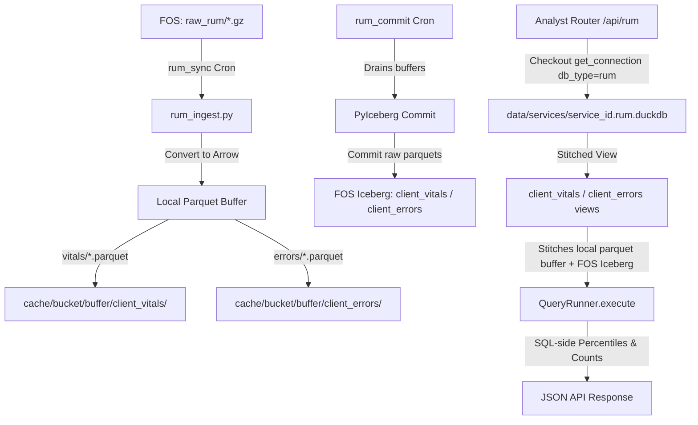

# Architectural Transition Plan: RUM-to-DuckDB & Apache Iceberg Migration

This document outlines the final, comprehensive technical specification and implementation plan to modernize the **Real User Monitoring (RUM)** storage and query engine.

It transitions RUM from its prototype state (where raw JSON beacons were dumped into a local SQLite text column and manually aggregated in Python) to a high-performance **DuckDB + Local Parquet Buffer + Apache Iceberg on Fastly Object Storage (FOS)** pipeline identical to standard CDN request logs, while preserving total process and database isolation.

---

## 1. Architectural Layout & Isolation Strategy

To prevent listing-performance degradation and avoid directory conflicts in Fastly Object Storage (FOS) and local disk buffers, standard request logs and client-side RUM logs are strictly segregated.



### A. Storage Layout Matrix

| Layer / Concern | Key / Path Pattern | Format & Retention | Isolation & Guardrails |
|---|---|---|---|
| **Raw Request Logs** | `s3://{bucket}/{prefix}raw/` | `.gz` JSON | CDN request logs |
| **Raw RUM Logs** | `s3://{bucket}/{prefix}raw_rum/` | `.gz` JSON | Client Faro Web Vitals & Error beacons; sibling prefix prevents `ListObjectsV2` pollution |
| **Request Iceberg Table** | `s3://{bucket}/{prefix}iceberg/default/logs/` | Parquet + JSON manifests | Long-term CDN request log catalog |
| **RUM Vitals Table** | `s3://{bucket}/{prefix}iceberg/default/client_vitals/` | Parquet + JSON manifests | Core Web Vitals long-term catalog |
| **RUM Errors Table** | `s3://{bucket}/{prefix}iceberg/default/client_errors/` | Parquet + JSON manifests | JS exceptions long-term catalog |
| **DuckDB Database** | `data/services/{service_id}.rum.duckdb` | DuckDB file | Dedicated RUM DuckDB database file; isolated connection pool lock from `{id}.duckdb` |
| **Operational Metadata** | `data/services/{service_id}.metadata.db` | SQLite (WAL) | Ingest tracking, cron runs, alerts. Uses `table_name` discriminator column |
| **Usage Billing** | `data/services/{service_id}.usage_log.db` | SQLite (WAL) | Disconnected from `metadata.db` to keep background writes non-blocking |

---

## 2. DuckDB Schemas & PyArrow Types

RUM data is organized into two distinct tables matching `backend/repositories/rum.py`. All metric values are strictly cast to `DOUBLE` (`pa.float64()`) during Arrow construction to prevent DuckDB schema evolution errors across mixed float/int Web Vitals (e.g. LCP ms vs CLS ratio).

### A. `client_vitals` Table (Web Vitals & Page Views)

| Column | DuckDB Type | PyIceberg / PyArrow Type | Purpose |
|---|---|---|---|
| `timestamp` | TIMESTAMP | TimestampType / `pa.timestamp("us")` | Event time |
| `metric_name` | VARCHAR | StringType / `pa.string()` | Vital name (`'LCP'`, `'FID'`, `'CLS'`, `'INP'`, `'TTFB'`, `'FCP'`) |
| `metric_value` | DOUBLE | DoubleType / `pa.float64()` | Metric value (standardized to double) |
| `metric_rating` | VARCHAR | StringType / `pa.string()` | Rating (`'good'`, `'needs_improvement'`, `'poor'`) |
| `pathname` | VARCHAR | StringType / `pa.string()` | URL Path |
| `browser` | VARCHAR | StringType / `pa.string()` | Client Browser |
| `os` | VARCHAR | StringType / `pa.string()` | Client Operating System |
| `device` | VARCHAR | StringType / `pa.string()` | Category (`'Desktop'`, `'Mobile'`, `'Tablet'`) |
| `cid` | VARCHAR | StringType / `pa.string()` | Connection / Session Token ID |
| `req_id` | VARCHAR | StringType / `pa.string()` | Fastly Request ID (CDN cross-correlation key) |

### B. `client_errors` Table (JS Runtime Exceptions)

| Column | DuckDB Type | PyIceberg / PyArrow Type | Purpose |
|---|---|---|---|
| `timestamp` | TIMESTAMP | TimestampType / `pa.timestamp("us")` | Exception time |
| `error_message` | VARCHAR | StringType / `pa.string()` | Raw JS error message |
| `error_file` | VARCHAR | StringType / `pa.string()` | Source JS file |
| `error_line` | INTEGER | IntegerType / `pa.int32()` | Line number |
| `error_col` | INTEGER | IntegerType / `pa.int32()` | Column number |
| `pathname` | VARCHAR | StringType / `pa.string()` | URL Path where error fired |
| `browser` | VARCHAR | StringType / `pa.string()` | Client Browser |
| `os` | VARCHAR | StringType / `pa.string()` | Client Operating System |
| `device` | VARCHAR | StringType / `pa.string()` | Category |
| `cid` | VARCHAR | StringType / `pa.string()` | Connection / Session Token ID |
| `req_id` | VARCHAR | StringType / `pa.string()` | Fastly Request ID |

---

## 3. Metadata DB & System Migration (Migration 009)

To track RUM files atomically alongside request logs without key collisions:

1. **SQLite Migration `009` (`backend/core/sqlite_migrations.py`):**
   ```sql
   ALTER TABLE ingested_files ADD COLUMN table_name TEXT NOT NULL DEFAULT 'logs';
   ALTER TABLE ingest_in_flight ADD COLUMN table_name TEXT NOT NULL DEFAULT 'logs';
   CREATE INDEX IF NOT EXISTS idx_ingested_files_table_source ON ingested_files(table_name, source_name);
   ```
2. **In-Memory Cache Keying (`backend/core/metadata/base.py`):**
   Key `_ingested_filenames_cache` by `(service_id, table_name)` tuple so standard logs and RUM files do not evict each other.
3. **Purge Legacy Prototype Schema:**
   Drop obsolete `rum_beacons` SQLite table during Migration 009.

---

## 4. Execution Components & Implementation Checklist

### Phase 1: Core Storage & Connection Isolation
- [ ] **`backend/core/duckdb.py` & `duckdb_pool.py`:** Extend `get_connection` to accept `db_type="logs"` | `"rum"`. Register pool holders under `(service_id, db_type)` keys. When `db_type == "rum"`, open `data/services/{service_id}.rum.duckdb`.
- [ ] **`backend/core/iceberg/_core.py`:** Parameterize `_table_identifier(source, table_name="logs")`, `_buffer_dir(source, table_name="logs")`, `update_iceberg_view(con, source, table_name=...)`, and `execute_with_stale_view_retry(con, src, fn, table_name=...)`. Add empty buffer fallback CTE generation (`WHERE 1=0`).
- [ ] **`backend/core/field_registry.py`:** Register `client_vitals` and `client_errors` field metadata for validation and autocomplete.

### Phase 2: Ingestion & PyIceberg Buffering
- [ ] **`backend/core/rum_ingest.py`:** Refactor `ingest_rum_logs` to build Arrow tables for `client_vitals` and `client_errors`, write to `cache/{bucket}/buffer/{table_name}/` via `iceberg.write_to_buffer`, and log to `metadata.db` with `table_name`.
- [ ] **`backend/cron/jobs/rum_commit.py`:** Implement `_run_rum_commit` calling `iceberg.commit_buffer(src, table_name="client_vitals")` and `client_errors`. Set `_BOTO3_CALLER_HINT = "rum_commit"`.

### Phase 3: Repositories & Analytics Routers
- [ ] **`backend/repositories/rum.py`:** Connect `get_web_vitals_summary`, `get_error_rate_trend`, and `get_worst_pages` to DuckDB views using native `PERCENTILE_CONT(0.75)` and `cid` column references.
- [ ] **`backend/routers/rum.py`:** Update analytics routes to check out `get_connection(source, db_type="rum")` and pass to `QueryRunner`.

### Phase 4: Lifecycle, Rollups & Administration
- [ ] **`backend/core/local_compaction.py`:** Bin-pack small hourly RUM Parquets into `<=256MB` files, tier to `daily/` after 7 days, and sweep files past `rum_retention_days`.
- [ ] **`backend/core/rollups/`:** Direct closed-hour RUM pre-aggregations to `cache/{bucket}/rollups/rum_vitals_hour/` and `rum_errors_hour/`.
- [ ] **`backend/services/service_manager.py`:** Ensure service deletion purges `.rum.duckdb`, RUM buffer paths, and unregisters RUM cron jobs from APScheduler.
- [ ] **`backend/routers/admin/iceberg.py`:** Scope administrative Iceberg endpoints (`info`, `commit`, `optimize`, `expire`) with `table_name`.

### Phase 5: Query Console & UI Overhaul
- [ ] **`backend/routers/query.py` & `models/dashboard.py`:** Extend `QueryRequest` with `dataset: str = "logs"` (`"logs"`, `"client_vitals"`, `"client_errors"`) and checkout appropriate `db_type`.
- [ ] **Frontend Dataset Selector:** Add dataset toggle bar (`[ CDN Request Logs ] [ RUM Web Vitals ] [ RUM JS Errors ]`) to the SQL Query Console.

---

## 5. Verification & Testing Protocol

1. **Pool Isolation Unit Test (`tests/core/test_rum_duckdb.py`):** Assert concurrent operations on `.duckdb` and `.rum.duckdb` do not block each other.
2. **Ingest Contract Test (`tests/core/test_rum_ingest_iceberg.py`):** Verify Arrow schema enforcement (`pa.float64()`), buffer creation, and PyIceberg commits for `client_vitals` and `client_errors`.
3. **Analytics Accuracy Test (`tests/api/test_rum_analytics_sql.py`):** Validate DuckDB percentile SQL metrics against mathematical expectations.
