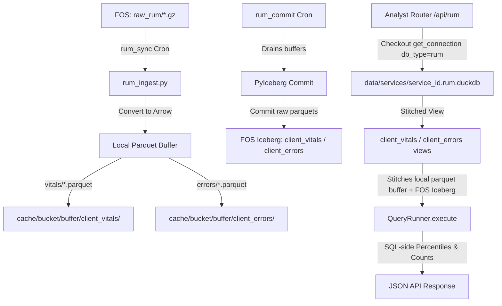

# Architectural Transition Plan: RUM-to-DuckDB & Iceberg Migration

This document outlines the design and step-by-step technical plan to modernize the **Real User Monitoring (RUM)** storage and query architecture.

It transitions RUM from its current rapid-prototype state—where raw JSON logs are dumped into a local SQLite text column and manually aggregated in Python memory—to the high-performance **DuckDB + Local Parquet Buffer + Apache Iceberg on Fastly Object Storage (FOS)** pipeline used by standard request logs, while preserving total isolation via a dedicated RUM DuckDB file.

---

## 1. Architectural Blueprint & FOS Path Isolation

To prevent listing-performance degradation and avoid raw directory conflicts in Fastly Object Storage (FOS), the raw and long-term paths for standard request logs and client-side RUM logs are strictly segregated.



### Dedicated Storage Layout on FOS (S3 Compatible)

We enforce separate sibling top-level prefixes to ensure that list operations (`ListObjectsV2` calls) for request logs do not accidentally read, iterate over, or suffer from prefix collisions due to RUM files.

| Data Type | FOS Key Prefix | Storage Stage | Purpose / Avoids Conflict |
|---|---|---|---|
| **Request Logs (Raw)** | `raw/` | Gzipped JSON | Standard CDN request logs streamed from Fastly edge |
| **RUM Logs (Raw)** | `raw_rum/` | Gzipped JSON | Client-side Faro Web Vitals and error beacons (completely isolated sibling directory) |
| **Request Iceberg Table** | `iceberg/default/logs/` | Parquet + JSON | Long-term catalog, data files, and manifests for standard request logs |
| **RUM Vitals Iceberg Table** | `iceberg/default/client_vitals/` | Parquet + JSON | Long-term catalog, data files, and manifests for Web Vitals data |
| **RUM Errors Iceberg Table** | `iceberg/default/client_errors/` | Parquet + JSON | Long-term catalog, data files, and manifests for client runtime JS errors |

### Operational State & Ingest Manifest Tracking

Operational database metadata is cleanly separated from analytical DuckDB databases.
*   **Operational DB Location:** Operational tracking (`ingest_in_flight`, `ingested_files`, `cron_runs`) stays strictly in `data/services/{service_id}.metadata.db` (WAL-mode SQLite).
*   **Dataset Disambiguation:** `ingested_files` and `ingest_in_flight` schema and queries are extended with a `table_name` discriminator column (e.g. `'logs'`, `'client_vitals'`, `'client_errors'`) so recovery and deduplication in `_recover_in_flight(src)` are strictly isolated per dataset.

---

## 2. DuckDB Schema Definitions & PyArrow Types

RUM data will be structured into two distinct tables/views matching the stubs defined in `backend/repositories/rum.py`. All numeric metric values are standardized to `DOUBLE` (`pa.float64()`) during Arrow construction to prevent schema mismatch when parsing mixed float/int Web Vitals (e.g., LCP ms vs CLS ratio).

### A. `client_vitals` Table
Tracks Core Web Vitals (LCP, FID, CLS, INP, TTFB, FCP) and page views.

| Column | DuckDB Type | PyIceberg / PyArrow Type | Purpose |
|---|---|---|---|
| `timestamp` | TIMESTAMP | TimestampType / `pa.timestamp("us")` | Date and time the metric was recorded |
| `metric_name` | VARCHAR | StringType / `pa.string()` | Name of the vital (e.g., `'LCP'`, `'CLS'`) |
| `metric_value` | DOUBLE | DoubleType / `pa.float64()` | Numerical value of the metric (always Double) |
| `metric_rating` | VARCHAR | StringType / `pa.string()` | Rating assigned (`'good'`, `'needs_improvement'`, `'poor'`) |
| `pathname` | VARCHAR | StringType / `pa.string()` | URL Path (e.g., `'/home'`) |
| `browser` | VARCHAR | StringType / `pa.string()` | Client Browser (e.g., `'Chrome'`) |
| `os` | VARCHAR | StringType / `pa.string()` | Client OS (e.g., `'macOS'`) |
| `device` | VARCHAR | StringType / `pa.string()` | Client Device Category (`'Desktop'`, `'Mobile'`) |
| `cid` | VARCHAR | StringType / `pa.string()` | Client Connection ID (anonymous session token) |
| `req_id` | VARCHAR | StringType / `pa.string()` | Fastly Edge Request ID (for matching CDN & RUM logs) |

### B. `client_errors` Table
Tracks JS Runtime Exceptions and errors.

| Column | DuckDB Type | PyIceberg / PyArrow Type | Purpose |
|---|---|---|---|
| `timestamp` | TIMESTAMP | TimestampType / `pa.timestamp("us")` | Date and time the error occurred |
| `error_message` | VARCHAR | StringType / `pa.string()` | Raw JavaScript error message |
| `error_file` | VARCHAR | StringType / `pa.string()` | JS file where the error occurred |
| `error_line` | INTEGER | IntegerType / `pa.int32()` | Line number of the exception |
| `error_col` | INTEGER | IntegerType / `pa.int32()` | Column number of the exception |
| `pathname` | VARCHAR | StringType / `pa.string()` | URL Path where the error fired |
| `browser` | VARCHAR | StringType / `pa.string()` | Client Browser |
| `os` | VARCHAR | StringType / `pa.string()` | Client OS |
| `device` | VARCHAR | StringType / `pa.string()` | Client Device Category |
| `cid` | VARCHAR | StringType / `pa.string()` | Client Connection ID |
| `req_id` | VARCHAR | StringType / `pa.string()` | Fastly Edge Request ID |

---

## 3. Step-by-Step Technical Transition Plan

### Phase 0: SQLite Table Deletion & Data Purge (No-Migration Policy)
Since there are no external installations running RUM on historical datasets, **no SQL data migration or transfer path is required.** To prevent database bloating and clean up unused database objects, the old SQLite tables and files will be dropped at the start of the migration:

1.  **Drop SQLite Tables and Indexes:**
    *   During system startup or when RUM is first provisioned/activated under the new pipeline, run a migration step inside `backend/core/metadata/schema.py` or the initialization lifecycle:
        ```sql
        DROP TABLE IF EXISTS rum_beacons;
        ```
    *   This drops the old `rum_beacons` schema and purges all stringified JSON rows instantly, reclaiming disk space via `VACUUM` on the service-specific `metadata.db` SQLite files.
2.  **Delete Obsolete Python Parsing Helpers:**
    *   Permanently delete any obsolete in-memory sorting, chunking, or limit-filtering helpers in the backend codebase that previously loaded SQLite string columns to build metrics manually in Python.

---

### Phase 1: DuckDB Connection & View Isolation
To enforce **Dedicated RUM DuckDB file Isolation**, we update the DuckDB connection manager and pool wrappers.

1.  **Modify `backend/core/duckdb.py` & `duckdb_pool.py`:**
    *   Extend `get_connection` to accept a `db_type: str = "logs"` parameter.
    *   If `db_type == "rum"`, set `db_path = os.path.abspath(f"data/services/{service_id}.rum.duckdb")` instead of the main `logs.duckdb` path.
    *   Ensure connection pool locks and holders (`_ConnectionHolder`) operate on distinct locks per `db_type` to guarantee zero lock contention between standard log syncs and RUM dashboard queries.
2.  **View Generation & Synthetic CTE Safeguard (`view.py`):**
    *   Parameterize `update_iceberg_view(con, source, table_name="client_vitals", view_name="client_vitals")`.
    *   **Empty Buffer Safeguard:** When buffer files or Iceberg catalogs are empty on a new service, generate a synthetic empty Typed CTE (`SELECT CAST(NULL AS TIMESTAMP) AS timestamp... WHERE 1=0`) to prevent DuckDB `read_parquet` missing-file IO exceptions on query execution.
    *   **Stale View Retry Parameterization:** Update `execute_with_stale_view_retry(con, src, fn, table_name="logs")` in `backend/core/iceberg/_core.py` to accept `table_name` so RUM queries self-heal view cache errors for `client_vitals` or `client_errors` specifically.

---

### Phase 2: PyIceberg Multi-Table Parameterization & Field Registry
Currently, PyIceberg utility functions in `backend/core/iceberg/` are hardcoded to the `"logs"` table and a single buffer path.

1.  **Update `backend/core/iceberg/_core.py`:**
    *   Refactor `_table_identifier(source, table_name="logs")` to dynamically return `("default", table_name)`.
    *   Refactor `_buffer_dir(source, table_name="logs")` to return `os.path.join(_cache_dir(source), "buffer", table_name)`. For backwards compatibility, `table_name="logs"` continues to map to `cache/{bucket}/buffer/`.
    *   Expose dynamic PyIceberg schemas: Create `get_rum_vitals_schema()` and `get_rum_errors_schema()` inside `_core.py`.
2.  **Update `backend/core/iceberg/buffer.py`:**
    *   Parameterize `write_to_buffer` and `commit_buffer` to accept a `table_name: str` argument.
3.  **Field Registry Registration (`backend/core/field_registry.py`):**
    *   Register typed declarations for `client_vitals` and `client_errors` fields into `field_registry.py` to enable structured SQL query validation, column auto-completion, and PII masking across RUM tables.

---

### Phase 3: RUM Ingestion & Parquet Buffering
Update the background RUM sync task to write PyArrow tables into the local parquet buffers instead of doing direct SQLite database writes.

1.  **Refactor `backend/core/rum_ingest.py`:**
    *   Initialize two PyArrow builders inside `ingest_rum_logs`: one for `vitals` and one for `errors`.
    *   Cast all metric values explicitly to `pa.float64()` to guarantee uniform Arrow schema typing.
    *   At the end of a file or chunk, convert batch arrays to `pyarrow.Table` objects matching `get_rum_vitals_schema()` and `get_rum_errors_schema()`.
    *   Call:
        ```python
        iceberg.write_to_buffer(src, vitals_table, filename, table_name="client_vitals")
        iceberg.write_to_buffer(src, errors_table, filename, table_name="client_errors")
        ```
    *   Record and clear `metadata_db` ingest tracking using `table_name="client_vitals"` / `table_name="client_errors"`.

---

### Phase 4: Enabling the RUM Commit Cron
Activate the empty skeleton job in `rum_commit.py` to drain the RUM parquet buffer and commit to Apache Iceberg.

1.  **Complete `backend/cron/jobs/rum_commit.py`:**
    *   Fill in `_run_rum_commit` to execute `iceberg.commit_buffer(src, table_name="client_vitals")` and `iceberg.commit_buffer(src, table_name="client_errors")`.
    *   Set ContextVar telemetry hint `_BOTO3_CALLER_HINT = "rum_commit"` prior to S3/Iceberg commits.

---

### Phase 5: Query and Dashboard Activation
Replace the manual Python-side filtering in the router with high-performance SQL executions in DuckDB.

1.  **Activate and Connect `backend/repositories/rum.py`:**
    *   Update stubs (`get_web_vitals_summary`, `get_error_rate_trend`, `get_worst_pages`) to target `client_vitals` and `client_errors` DuckDB views.
    *   Fix repository query field references: use `cid` consistently (replacing old stub `rum_cid`).
    *   Utilize DuckDB native percentiles (`PERCENTILE_CONT(0.75)`).
2.  **Modify `backend/routers/rum.py`:**
    *   In the `rum_analytics` endpoint, check out a connection with:
        ```python
        con = get_connection(source, db_type="rum")
        runner = QueryRunner(con, source)
        ```
    *   Call repository methods to fetch pre-aggregated results directly from DuckDB.
    *   Remove `LIMIT 1000` restriction entirely.

---

## 4. Provisioning, Settings, & Service Schema Changes

### A. API Request Schema Additions (`backend/models/provision.py`)
Expand `ProvisionExecuteRequest` model:

```python
class ProvisionExecuteRequest(BaseModel):
    token: str
    service_id: str
    rum_enabled: bool = False
    rum_retention_days: int = 90

    # NEW FIELDS:
    rum_sync_interval_sec: int = 60         # Frequency RUM logs are fetched from FOS
    rum_commit_interval_mins: int = 5      # Cadence RUM buffers commit to Iceberg/FOS
```

### B. Service Configuration Schema Update (`configs/{service_id}.json`)
Version-locked to **schema v2**:

```json
{
  "schema_version": 2,
  "logging_service_id": "service_id_here",
  "request_logging_enabled": true,
  "rum_enabled": true,
  "rum_retention_days": 90,
  "rum": {
    "enabled": true,
    "enabled_at": "2026-08-09T17:00:00Z",
    "sync_interval_sec": 60,
    "commit_interval_mins": 5,
    "delete_after": 90
  }
}
```

### C. Questions & UI Layout for RUM Provisioning Wizard
Provisioning form sections:
1.  **Enable RUM Tracking:** Boolean Toggle
2.  **RUM Sync Interval (Freshness):** Dropdown (`60s`, `2 min`, `5 min`, `10 min`)
3.  **RUM Commit Interval:** Slider / Dropdown (`2 min`, `5 min` [Default], `15 min`, `30 min`)
4.  **RUM Data Retention Period:** Number (`90 days` default)

---

## 5. Iceberg & Data Management Page Overhaul

### A. Admin Endpoint Table-Scoping (`backend/routers/admin/iceberg.py`)
Extend administrative endpoints (`iceberg-info`, `commit-iceberg`, `optimize-iceberg`, `expire-iceberg`, `delete-iceberg-data`) to take `table_name: str = "logs"`:

1.  **`GET /api/admin/iceberg-info?table_name=client_vitals`**
2.  **`POST /api/admin/optimize-iceberg`** with `{"table_name": "client_vitals"}`
3.  **`POST /api/admin/delete-iceberg-data`** with `{"table_name": "client_errors", ...}`

### B. Frontend UI Overhaul: Data Management Card Grid & File Browser
*   **Table Statistics Dashboard Cards:** Split Data Management into Request Logs, RUM Web Vitals, and RUM JS Errors cards.
*   **File Browser (`FileBrowser.tsx`):** Add Table Scope Selector (`[ All Tables ] [ Request Logs ] [ RUM Vitals ] [ JS Errors ]`) locking path prefixes to `default/client_vitals/`, etc.

---

## 6. RUM Performance: Rollups, Compaction, & Retention Sweeps

### A. Local-Only Parquet Compaction & Retention
Extend `backend/core/local_compaction.py`:
1.  **Sequential Bin-Packing:** Merge small hourly parquet buffers under `cache/{bucket}/buffer/client_vitals/` and `client_errors/` into size-capped parquets (`<=256MB`).
2.  **Daily & Weekly Archival Tiers:** Bin-pack entries older than 7 days into `daily/` and 30 days into `weekly/`.
3.  **Retention Sweep:** Automatically purge buffer files and local rollups exceeding `rum_retention_days`.

### B. Pre-Aggregated Rollups (`rum_vitals_hourly`, `rum_errors_hourly`)
Establish dedicated rollup writers in `backend/core/rollups/`:
1.  **`rum_vitals_hourly` & `rum_vitals_daily`:** Pre-calculate `p50`, `p75`, `p90` doubles and rating counts (`good_count`, `poor_count`) grouped by Hour, Path, Device, Browser.
2.  **`rum_errors_hourly` & `rum_errors_daily`:** Aggregate exception counts by Hour, Message, File, Path.
3.  **Query Rewrite:** Automatically redirect `QueryRunner` scans to RUM rollups for closed hours.

### C. Cloud Compaction & Snapshot Expiration
1.  **`optimize_table`:** Refactor in `backend/core/iceberg/_core.py` to accept `table_name`.
2.  **Daily Optimization Cron (`optimize_{id}`):** Invoke sequentially for `logs`, `client_vitals`, and `client_errors`.
3.  **Snapshot Expiration Cron (`expire_{id}`):** Update `_run_expire_snapshots` in `expire.py` to expire old Iceberg snapshots across all active tables.

---

## 7. RUM Cost, Usage Accounting, & Telemetry

### A. Usage Logging & S3 Operation Tracking (Backend)
1.  **ContextVar Telemetry Hints:** `rum_sync` and `rum_commit` set `_BOTO3_CALLER_HINT` to `"rum_sync"` and `"rum_commit"` so telemetry_proxy accurately attributes S3 GET/PUT requests.
2.  **Explicit Context Flushes:** Trigger `flush_usage_log(service_id)` at the end of every RUM sync/commit run.

### B. Cost Estimator Formulas (`calc.ts` & `backend/routers/usage.py`)
1.  **Prefill API:** Route `/api/usage/rum-breakdown` to execute queries against `{id}.rum.duckdb`.
2.  **Calculator State:** Include `rumEnabled`, `rumPageViewsDay`, `rumBeaconsPerPageView`, `rumSyncIntervalSec`, `rumCommitMins`.
3.  **Consolidated S3 Math:** Add RUM raw `.gz` files and Iceberg committed Parquet files into Class A, Class B, and GB-month storage totals.

---

## 8. Verification & Testing Strategy

1.  **Unit Tests (`tests/core/test_rum_duckdb.py`):** Connection checkout with `db_type="rum"`, pool isolation, and concurrent `.duckdb` / `.rum.duckdb` access.
2.  **Ingestion Contract Test (`tests/core/test_rum_ingest_iceberg.py`):** Arrow schema enforcement (`pa.float64()`), buffer creation, and PyIceberg commits for `client_vitals` and `client_errors`.
3.  **Analytics Assertions (`tests/api/test_rum_analytics_sql.py`):** DuckDB SQL percentile calculations vs mathematical ground truth.

---

## 9. Selective Feature Enablement & Health Probe Safeguards

### A. Dynamic Service Configurations & Schema Gate
Introduces `request_logging_enabled: bool` (default: `true`) alongside `rum_enabled: bool`.

### B. Conditional Scheduler Registrations & Kill Switch (`scheduler.py`)
1.  **Cron Scheduling Gates:** `_sync_jobs()` gates standard log crons on `request_logging_enabled` and RUM crons on `rum_enabled`.
2.  **Stale Job Removal:** Unregisters disabled jobs cleanly on config reload.
3.  **Dev Kill Switch (`FLA_DEV_NO_CRONS=1`):** In `dev_mode_no_crons()`, suppress `rum_sync` and `rum_commit`. Register `local_compact` for RUM in `_register_dev_local_safe_jobs()`.

### C. Zero-Latency Health Check Probe (`GET /api/health`)
1.  **Strict Constraint:** `GET /api/health` **MUST REMAIN 100% SQLITE-ONLY.** It will NEVER execute DuckDB queries on `.rum.duckdb` or `.duckdb` files.
2.  **Liveness Verification:**
    *   If `request_logging_enabled` is True, verify standard log sync freshness via `metadata.db` (`SELECT max(ingested_at) FROM ingested_files WHERE table_name = 'logs'`).
    *   If `rum_enabled` is True, verify RUM sync freshness via `metadata.db` (`SELECT max(ingested_at) FROM ingested_files WHERE table_name = 'client_vitals'`) and check `cron_runs` status for `task = 'rum_sync'`.

---

## 10. Multi-Dataset SQL Query Page (Backend & UI Overhaul)

### A. Expanded Request Schema (`backend/models/dashboard.py`)
`QueryRequest` accepts `dataset: str = "logs"` (`"logs"`, `"client_vitals"`, `"client_errors"`).

### B. Dual-Pool Query Endpoint Execution (`backend/routers/query.py`)
Routes checkouts to `_ConnectionHolder(ctx.source, read_only=True, db_type="rum")` for RUM dataset queries.

### C. SQL Validation & Field Registry Scoping (`backend/repositories/query.py`)
Validate query table references and column selections against `field_registry.py` declarations for `client_vitals` / `client_errors`.

### D. Frontend UI: Dynamic Dataset Selection Tab bar
Segmented toggle bar (`[ CDN Request Logs ] [ RUM Web Vitals ] [ RUM JS Errors ]`) dynamically shown based on service config flags.
