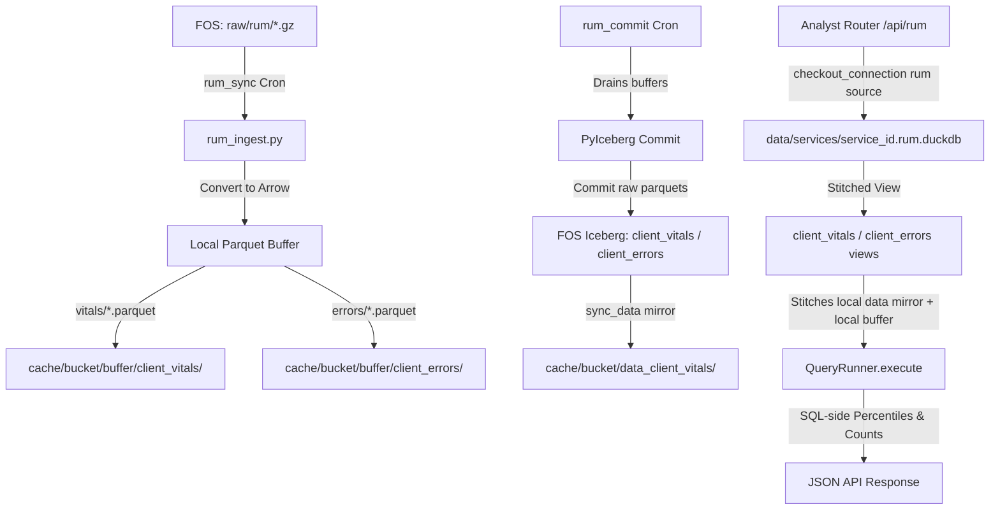

# Architectural Transition Plan: RUM-to-DuckDB & Apache Iceberg Migration

This document outlines the authoritative, step-by-step technical specification and implementation plan to modernize the **Real User Monitoring (RUM)** storage and query engine.

It transitions RUM from its prototype state (where raw JSON beacons were dumped into a local SQLite text column and manually aggregated in Python) to a high-performance **DuckDB + Local Parquet Buffer + Apache Iceberg on Fastly Object Storage (FOS)** pipeline identical to standard CDN request logs, while preserving total process, catalog, and database isolation.

> **Plan revision — 2026-08-09.** Every file path, function signature, and
> table/column name below was re-verified against `feature/rum` at commit
> `436e60ae`. Claims that did not survive verification are called out with
> **⚠️ CORRECTION** and replaced. Read §0 before starting: a meaningful
> fraction of Phases 1–2 is already implemented, and two items in the
> original draft (the `raw_rum/` prefix move and `DROP TABLE rum_beacons`)
> are breaking changes disguised as one-liners.

---

## 0. Current State (verified against `feature/rum` @ `436e60ae`)

Before planning new work, this is what is already on disk. The plan below is
written as a **delta against this state**, not against a greenfield repo.

| Component | State | Location |
|---|---|---|
| RUM cron registration | **Done.** `rum_sync_{id}` + `rum_commit_{id}` already registered, gated on `rum_enabled`/`rum.enabled` | `backend/cron/scheduler.py:780-838` |
| `rum_sync` job wrapper | **Done**, and does more than ingest — it also drives the Faro bundle reconcile (FOS HEAD integrity + throttled upstream drift) | `backend/cron/jobs/rum_sync.py` |
| `rum_commit` job | **Placeholder.** Logs, sleeps, writes a `cron_runs` row. No Iceberg work | `backend/cron/jobs/rum_commit.py` |
| RUM ingest | **SQLite prototype.** Parses `.gz` from FOS, `INSERT`s reconstructed JSON into `rum_beacons` | `backend/core/rum_ingest.py` |
| RUM repositories | **Written but dead.** SQL already targets `client_vitals` / `client_errors` views that do not exist yet; no caller | `backend/repositories/rum.py` |
| RUM router | **Live on SQLite.** Analytics, beacon-health, live-events, and a direct `POST /rum-beacon` write path all read/write `rum_beacons` | `backend/routers/rum.py` |
| Bootstrap RUM counters | **Live on SQLite.** Reads `rum_beacons` for the nav badge | `backend/routers/bootstrap.py:420-428` |
| FOS raw prefix | `raw/rum/` — **nested under `raw/`**, not a sibling | `backend/provision/declarative/generators.py:525` |

**Implication:** Phase 2 task 3 (cron registration) is already complete and
should be struck. Phase 2 task 2 is a *replacement* of an existing placeholder,
not a new file. And the migration is a **cutover with a live SQLite reader on
the other side** — that is the part the original draft under-scoped.

---

## 1. Architectural Layout & Isolation Strategy

To prevent listing-performance degradation and avoid directory conflicts in Fastly Object Storage (FOS) and local disk buffers, standard request logs and client-side RUM logs are strictly segregated across all layers.



### A. Storage Layout Matrix

| Layer / Concern | Key / Path Pattern | Format & Retention | Isolation & Guardrails |
|---|---|---|---|
| **Raw Request Logs** | `s3://{bucket}/{prefix}raw/` | `.gz` JSON | CDN request logs. Listing already excludes RUM via `exclude_prefix_subpath="raw/rum/"` (`backend/core/ingest.py:631`) |
| **Raw RUM Logs** | `s3://{bucket}/{prefix}raw/rum/` | `.gz` JSON | Client Faro Web Vitals & Error beacons. **See "Prefix decision" below** |
| **Request Iceberg Table** | `s3://{bucket}/{prefix}iceberg/default/logs/` | Parquet + JSON manifests | Long-term CDN request log catalog |
| **RUM Vitals Table** | `s3://{bucket}/{prefix}iceberg/default/client_vitals/` | Parquet + JSON manifests | Core Web Vitals long-term catalog |
| **RUM Errors Table** | `s3://{bucket}/{prefix}iceberg/default/client_errors/` | Parquet + JSON manifests | JS exceptions long-term catalog |
| **Local Iceberg mirror** | `cache/{bucket}/data_{table}/` | Hour-partitioned Parquet | Downloaded by `sync_data`; the *left* half of the stitched view |
| **Local write buffer** | `cache/{bucket}/buffer/{table}/` | Parquet (ZSTD-1) | Pre-commit hot data; the *right* half of the stitched view |
| **DuckDB Database** | `data/services/{service_id}.rum.duckdb` | DuckDB file | Dedicated RUM DuckDB database file; isolated connection pool lock from `{id}.duckdb` |
| **Operational Metadata** | `data/services/{service_id}.metadata.db` | SQLite (WAL) | Ingest tracking, cron runs, alerts. Uses `table_name` discriminator column |
| **Usage Billing** | `data/services/{service_id}.usage_log.db` | SQLite (WAL) | Disconnected from `metadata.db` to keep background writes non-blocking |

#### ⚠️ CORRECTION — Prefix decision (`raw/rum/` vs `raw_rum/`)

The original draft specified `raw_rum/` as a "sibling prefix [that] prevents
`ListObjectsV2` pollution." That is **not the current layout** and it is not a
free change. The producer — the generated Fastly logging endpoint — writes to
`{prefix}/raw/rum/%Y/%m/%d/%H/rum_log_%M.json.gz`
(`backend/provision/declarative/generators.py:525`). Moving it touches:

- `backend/provision/declarative/generators.py:525` (producer — **requires a VCL/logging-endpoint re-provision on every RUM-enabled service**)
- `backend/core/ingest.py:631` — `exclude_prefix_subpath="raw/rum/"` (log ingest would start eating RUM beacons)
- `backend/core/rum_ingest.py:54,139`
- `backend/core/metadata/ingest_log.py:244-251` — the `/raw/rum/` lexicographic self-heal
- `backend/provision/orchestrator.py:760`, `backend/provision/rum_orchestrator_v2.py:452` — teardown exclude
- `backend/routers/usage.py:496` — RUM byte accounting (billing surface)
- `tests/utils/test_fos_setup.py`, `tests/core/test_rum_ingest.py`, `tests/backend/provision/declarative/test_generators.py`

**Decision: keep `raw/rum/`.** The stated benefit does not exist — listing is
already isolated because every log-side listing passes
`exclude_prefix_subpath="raw/rum/"`, and RUM listing passes
`prefix_subpath="raw/rum/"`. Neither ever pages the other's keys. If the prefix
is moved anyway, it must be its own phase with a dual-read window (ingest both
prefixes until the last pre-cutover object ages out of retention), because
in-flight beacons will land on the old prefix until every service is
re-provisioned.

---

## 2. DuckDB Schemas & PyArrow Types

RUM data is organized into two distinct tables matching `backend/repositories/rum.py`. All metric values are strictly cast to `DOUBLE` (`pa.float64()`) during Arrow construction to prevent DuckDB schema evolution errors across mixed float/int Web Vitals (e.g. LCP ms vs CLS ratio).

> **⚠️ CORRECTION — column naming is inconsistent in the existing code.**
> `backend/repositories/rum.py` uses **`rum_cid`** in `get_worst_pages` and
> `get_worst_sessions` (lines 90, 117-123) but the raw beacon field is
> `rum_cid` and the reconstructed key is `cid`. Pick one before writing the
> Arrow schema — the schema below standardizes on **`cid`**, so
> `repositories/rum.py` must be updated in Phase 3 to match. Silent
> mismatch = a view that builds fine and returns zero rows.

> **⚠️ Timestamp type.** `_DUCKDB_TO_ICEBERG` maps `TIMESTAMP` →
> `TimestamptzType()` ("always store as tz-aware", `_core.py:125`). The RUM
> tables must use the same mapping or the stitched `UNION ALL` between the
> Iceberg mirror and the local buffer will fail on a tz-aware/naive mismatch.
> Arrow type is therefore `pa.timestamp("us", tz="UTC")`, not `pa.timestamp("us")`.

### A. `client_vitals` Table (Web Vitals & Page Views)

| Column | DuckDB Type | PyIceberg / PyArrow Type | Purpose |
|---|---|---|---|
| `timestamp` | TIMESTAMP | TimestamptzType / `pa.timestamp("us", tz="UTC")` | Event time |
| `metric_name` | VARCHAR | StringType / `pa.string()` | Vital name (`'LCP'`, `'FID'`, `'CLS'`, `'INP'`, `'TTFB'`, `'FCP'`) |
| `metric_value` | DOUBLE | DoubleType / `pa.float64()` | Metric value (standardized to double) |
| `metric_rating` | VARCHAR | StringType / `pa.string()` | Rating (`'good'`, `'needs_improvement'`, `'poor'`) |
| `pathname` | VARCHAR | StringType / `pa.string()` | URL Path |
| `browser` | VARCHAR | StringType / `pa.string()` | Client Browser |
| `os` | VARCHAR | StringType / `pa.string()` | Client Operating System |
| `device` | VARCHAR | StringType / `pa.string()` | Category (`'Desktop'`, `'Mobile'`, `'Tablet'`) |
| `cid` | VARCHAR | StringType / `pa.string()` | Connection / Session Token ID — **PII, see §6** |
| `req_id` | VARCHAR | StringType / `pa.string()` | Fastly Request ID (CDN cross-correlation key) |

### B. `client_errors` Table (JS Runtime Exceptions)

| Column | DuckDB Type | PyIceberg / PyArrow Type | Purpose |
|---|---|---|---|
| `timestamp` | TIMESTAMP | TimestamptzType / `pa.timestamp("us", tz="UTC")` | Exception time |
| `error_message` | VARCHAR | StringType / `pa.string()` | Raw JS error message |
| `error_file` | VARCHAR | StringType / `pa.string()` | Source JS file |
| `error_line` | INTEGER | IntegerType / `pa.int32()` | Line number |
| `error_col` | INTEGER | IntegerType / `pa.int32()` | Column number |
| `pathname` | VARCHAR | StringType / `pa.string()` | URL Path where error fired |
| `browser` | VARCHAR | StringType / `pa.string()` | Client Browser |
| `os` | VARCHAR | StringType / `pa.string()` | Client Operating System |
| `device` | VARCHAR | StringType / `pa.string()` | Category |
| `cid` | VARCHAR | StringType / `pa.string()` | Connection / Session Token ID — **PII, see §6** |
| `req_id` | VARCHAR | StringType / `pa.string()` | Fastly Request ID |

### C. Where these schemas live

> **⚠️ CORRECTION — not `field_registry`.** The original draft assigned RUM
> field definitions to `backend/core/field_registry.py`. That module is the
> **VCL log-field catalog**: its `LogField` records carry
> `vcl_log_expression`, security hooks, `Group` membership, and drive VCL
> generation plus the `/logs` field picker. Registering non-VCL RUM columns
> there pollutes those surfaces.
>
> Instead: the log Iceberg schema is generated by
> `get_iceberg_schema(log_fields_config)` / `get_arrow_schema()` in
> `_core.py:264-313`, driven by the hand-maintained `_FIELD_ORDER` list
> (see the comment block at `_core.py:111-122` — a field absent from
> `_FIELD_ORDER` "silently never materializes as a column"). RUM tables are
> **static** (no per-service VCL config), so they get plain module-level
> constants — e.g. `RUM_TABLE_SCHEMAS: dict[str, pa.Schema]` in a new
> `backend/core/iceberg/rum_schema.py` — and `get_arrow_schema` gains a
> `table_name` dispatch that returns those constants for the RUM tables and
> the existing dynamic schema for `logs`.

---

## 3. Detailed Phase-by-Phase Implementation Plan

### Phase 1: Storage Infrastructure & Connection Isolation

#### Tasks

1. **SQLite Schema Migration (`backend/core/sqlite_migrations.py`):**

   > **⚠️ CORRECTION — the migration number is 010, not 009.** Slot 9 is
   > taken by `_migration_009_quarantined_error_size`
   > (`sqlite_migrations.py:296`); `LATEST_VERSION = max(MIGRATIONS)`.

   > **⚠️ CORRECTION — `DROP TABLE IF EXISTS rum_beacons` is both unsafe and
   > a no-op.** `backend/core/metadata/base.py:442-449` issues
   > `CREATE TABLE IF NOT EXISTS rum_beacons (...)` on every metadata-DB open,
   > so the table reappears on the next connection. And five live callers
   > still read/write it: `routers/rum.py` (beacon-health :219, direct beacon
   > write :303, timestamp normalizer :315-343, analytics :389/:494/:500,
   > live-events :911) and `routers/bootstrap.py:420-428`. Dropping it here
   > breaks the RUM page and the nav badge. The drop moves to **Phase 6**,
   > after the readers are cut over.

   Implement Migration `010`:
   ```sql
   ALTER TABLE ingested_files ADD COLUMN table_name TEXT NOT NULL DEFAULT 'logs';
   ALTER TABLE ingest_in_flight ADD COLUMN table_name TEXT NOT NULL DEFAULT 'logs';
   CREATE INDEX IF NOT EXISTS idx_ingested_files_table_source ON ingested_files(table_name, source_name);
   CREATE INDEX IF NOT EXISTS idx_ingest_in_flight_table_source ON ingest_in_flight(table_name, source_name);
   ```
   Backfill existing RUM rows so they are not misclassified as logs:
   ```sql
   UPDATE ingested_files SET table_name = 'client_vitals' WHERE file_name LIKE '%/raw/rum/%';
   ```
   (Pre-cutover RUM rows carry no vitals/errors split; classifying them all as
   `client_vitals` is only a de-dup key, and re-ingest is idempotent either way.)

2. **Metadata DB & Cache Isolation (`backend/core/metadata/`):**
   - Update `record_in_flight`, `clear_in_flight`, `insert_ingested_files`, and `get_ingested_filenames` to accept `table_name: str = "logs"` (`ingest_log.py:711,737` and the insert/select helpers).
   - **Missing from the original draft:** `list_in_flight(service_id)` (`ingest_log.py:748`) returns *every* in-flight row for the service. Without a `table_name` filter, the logs-side `_recover_in_flight` will try to promote RUM buffer manifests into the logs table and vice versa. Add the filter.
   - **Missing from the original draft:** `ingest_log.py` maintains an `ingested_files_summary` rollup with `latest_file_name`. That rollup must become per-`table_name`, or the "Latest Log" badge will report a RUM beacon file as the newest CDN log (the exact class of bug the `/raw/rum/` self-heal at `ingest_log.py:244-251` was bolted on to paper over). Once the discriminator column lands, **retire that self-heal hack** — leaving it in means it fights the new column.
   - Update `_ingested_filenames_cache` keying to a `(service_id, table_name)` tuple so standard log files and RUM Parquets never evict or collision-check each other.

3. **DuckDB Pool Isolation (`backend/core/duckdb.py` & `duckdb_pool.py`):**

   > **⚠️ CORRECTION — `get_connection` has no `service_id` and no `db_type`.**
   > Its real signature is
   > `get_connection(source: dict | None = None, max_wait: float = 300.0, skip_view_update: bool = False, read_only: bool = False)`
   > (`duckdb.py:904`), and it resolves the file from `src["duckdb_path"]`
   > (`duckdb.py:926`). Routers do **not** call it — they receive `ctx.con`,
   > built by `backend/deps.py:_ConnectionHolder` → `duckdb_pool.checkout_connection(source)`
   > (`deps.py:128`). Pools are keyed by
   > `service_key = src.get("name") or src.get("service_id") or "default"`
   > (`duckdb_pool.py:891`).

   The correct seam is **a RUM-variant source dict**, not a new positional arg:
   - Add `rum_source_for(src) -> dict` (or `db_type` on `db_path_for_source`) that returns a shallow copy of the source with `duckdb_path` → `data/services/{service_id}.rum.duckdb` and `name` → `{name}::rum`. The `::rum` suffix gives pool-key isolation for free, without touching `checkout_connection`'s signature or the `_get_pool` cache.
   - Verify the derived key flows into `warm_pool_for_service`, `reset_pool_for_service`, and `get_all_stats` (the admin pool-stats panel will otherwise show RUM connections as a mystery service).
   - **Missing from the original draft:** `duckdb_pool._safe_buffer_mtime(src)` (`duckdb_pool.py:221`) drives view-staleness checkout decisions off the *logs* buffer dir. It must resolve the buffer dir for the source's table, or RUM checkouts will either never refresh or refresh on every request.
   - **Missing from the original draft:** `backend/core/duckdb_recycle.py` groups sources by `db_path_for_source(src)` (`:105`). The `.rum.duckdb` files must appear in that grouping or they are never recycled and grow without bound.

4. **PyIceberg Multi-Table Core:**

   > **⚠️ CORRECTION — wrong module for two of these.** `update_iceberg_view`
   > and `execute_with_stale_view_retry` live in
   > `backend/core/iceberg/view.py` (`:627` and `:149`), not `_core.py`.
   > `_buffer_dir` / `_table_identifier` are correctly in `_core.py:322,328`.
   > `write_to_buffer` / `commit_buffer` are in `buffer.py:429,462`.

   - Parameterize `_table_identifier(source, table_name="logs")` → `("default", table_name)`. Today it is a hard-coded `return ("default", "logs")`.
   - Parameterize `_buffer_dir(source, table_name="logs")` → `os.path.join(_cache_dir(source), "buffer")` for logs (unchanged) and `.../buffer/{table_name}` for RUM. **Do not change the logs path** — existing buffers on disk would be orphaned.
   - Parameterize `get_iceberg_schema` / `get_arrow_schema` / `get_schema_field_names` on `table_name` (see §2.C).
   - **Missing from the original draft:** `_align_to_schema(table, target_schema=None, source=None)` (`manifest.py:421`) falls back to the *log* schema whenever `target_schema` is None, and `write_to_buffer` calls it that way (`buffer.py:438`). Every RUM write must pass the RUM schema explicitly or all RUM columns are silently nulled out.
   - **Missing from the original draft:** `write_to_buffer` sorts by `("timestamp", "ip")` when `ip` is present (`buffer.py:442-446`). RUM has no `ip`; the guard already handles it, but confirm in test.
   - **Missing from the original draft:** the rest of `buffer.py` is table-blind — `buffer_files(source)` (`:304`), `tombstone_buffer_files` (`:163`), `sweep_tombstoned_buffer_files` (`:240`), `_quarantine_dir` (`:326`), `buffer_backlog_stats` (`:395`), `optimize_table` (`:798`), `run_cloud_maintenance` (`:1039`). All take `source` only and must take `table_name`.
   - Update `update_iceberg_view(con, source, ..., table_name="logs")`. Note the hard-coded catalog lookup inside `_update_iceberg_view_locked`:
     `SELECT metadata_location FROM iceberg_tables WHERE table_namespace = 'default' AND table_name = 'logs'` (`view.py:754`) — parameterize it.
   - **Missing from the original draft — the view name.** The logs view is named `_safe_table_name(source["name"])`, i.e. **the service name**, not `logs` (`view.py:742`, used at `:967` and `:1204`). `repositories/rum.py` currently writes `FROM client_vitals`. Decide and enforce one convention: simplest is to name RUM views literally `client_vitals` / `client_errors` inside the `.rum.duckdb` database, since that DB holds nothing else. Whatever is chosen, `_safe_table_name` must not be applied to it silently.
   - **Missing from the original draft:** `_view_cache`, `_snapshot_files_cache`, `_load_persistent_cache` / `_save_persistent_cache`, and `clear_source_caches(source_key)` are all keyed on `source_key` alone (`view.py:182,203-232`). With the `::rum` source-name suffix from task 3 these separate for free — but only if the suffix is applied consistently. Verify, don't assume.
   - `execute_with_stale_view_retry(con, source, fn, *args, **kwargs)` forwards `**kwargs` **to `fn`** (`view.py:181`). A `table_name=` kwarg would be passed through to the caller's function and raise `TypeError`. Use a keyword-only `*, table_name="logs"` parameter, or bind it into `fn` with `functools.partial`.
   - Ensure an empty buffer + empty mirror returns the existing `WHERE false` fallback (`view.py:967`) built from the **RUM** column list.

5. **Iceberg table creation:** `_init_iceberg_table_locked` (`_core.py:1062`) builds a `PartitionSpec` of `hour(timestamp)` and a `SortOrder` on `timestamp` (`:1139-1161`). Parameterize on `table_name` so both RUM tables get the same hidden hourly partitioning — RUM queries are almost entirely time-ranged, so this is load-bearing, not cosmetic.

6. **Local mirror sync (`backend/core/iceberg/sync.py`) — entirely absent from the original draft.** `sync_data(source, ...)` (`:89`) is what downloads committed Iceberg data files into `cache/{bucket}/data/`, which is the *left* half of every stitched view. It calls `_table_identifier(source)` (`:103`) with no table argument. Without parameterizing it and its destination directory, committed RUM data is written to FOS and then never appears in any query — the view would only ever show un-committed buffer files. This is the single most likely way to ship a pipeline that looks green and returns 90%-missing data.

#### Verification & Validation Checklist
- [ ] `uv run pytest tests/core/test_metadata_db_migrations.py` — verify Migration 010 applies cleanly on existing and new metadata databases, and that the `LIKE '%/raw/rum/%'` backfill classifies pre-cutover rows.
- [ ] Unit test: concurrent checkout of the logs source and the RUM-variant source resolve to distinct files (`.duckdb` vs `.rum.duckdb`) and distinct pool keys, with no lock contention.
- [ ] Verify `_ingested_filenames_cache` caches `("svc_1", "logs")` and `("svc_1", "client_vitals")` independently.
- [ ] Verify `list_in_flight(svc, table_name="logs")` does not return RUM buffer manifests.
- [ ] Verify `update_iceberg_view` creates a valid DuckDB view when zero local buffer Parquet files AND zero mirror files exist, with the correct RUM column list.
- [ ] Verify `_align_to_schema` with the RUM schema round-trips all 10/11 columns non-null (regression against the silent-null failure mode).
- [ ] Verify `sync_data(src, table_name="client_vitals")` writes to a RUM-specific mirror dir and leaves `cache/{bucket}/data/` untouched.

---

### Phase 2: Ingestion Pipeline & PyIceberg Buffering

#### Tasks
1. **Deterministic RUM Ingestion (`backend/core/rum_ingest.py`):**
   - Refactor `ingest_rum_logs(service_id)` to list raw FOS files under `s3://{bucket}/{prefix}raw/rum/` (unchanged prefix — see §1).
   - **Preserve the generator event contract.** `ingest_rum_logs` is a generator consumed by `_run_rum_sync` (`rum_sync.py:186-224`), which switches on `"started"` (captures `run_id`, starts progress, **and triggers the Faro bundle reconcile**), `"file_done"`, `"error"`, `"cleanup_done"`, `"done"`. Changing or dropping any of these silently disables Faro bundle self-healing and the cron progress stream. Any new events must be additive.
   - **Reuse, don't reimplement, crash recovery.** `_recover_in_flight(source: dict)` already exists at `backend/core/ingest.py:355` and is called at `:592`. Parameterize it to `_recover_in_flight(source, table_name="logs")` and call it from the RUM path rather than writing a second copy — a divergent second implementation is how the orphaned-sync-row class of bug recurs.
   - Parse raw Faro JSON beacons and construct PyArrow tables for `client_vitals` and `client_errors`:
     - Cast all vital metric values to `pa.float64()`.
     - Cast line/col error fields to `pa.int32()`.
     - Preserve the existing pathname fallback (`rum_pathname` → `urlparse(referer).path` → `/`) and the `service_id`/`rum_service_id` cross-service filter from the current implementation — both are load-bearing and easy to drop in a rewrite.
     - **Decide the fan-out rule explicitly:** today a single beacon line can carry both a vital and an error. Writing it to both tables double-counts it in `get_error_rate_trend`, whose denominator is `client_errors ∪ client_vitals` (`repositories/rum.py:52-66`). Route each line to exactly one table, or change the denominator.
   - Write Parquets using deterministic chunk naming. The existing helper is `_deterministic_buffer_name(good_files)` → `batch_{sha256(...)[:16]}.parquet` (`ingest.py:343-352`); reuse it. Note it hashes the **source file list**, so a chunk producing both a vitals and an errors Parquet yields the same basename in two different buffer dirs — that is fine given per-table dirs, but `ingest_in_flight.buffer_filename` is the conflict target of the `ON CONFLICT` upsert (`ingest_log.py:722`) and is therefore effectively unique across tables. **The in-flight primary key must become `(buffer_filename, table_name)`, or the vitals manifest will overwrite the errors manifest.** This requires a table rebuild in Migration 010, not just an `ADD COLUMN`.
   - Persist atomic ingest status via `metadata.record_in_flight` and `metadata.insert_ingested_files` with `table_name`.
   - Keep `cleanup_old_rum_logs` wired in (it is gated on `rum.delete_after` and yields `cleanup_done`).

2. **Scheduled PyIceberg Commits (`backend/cron/jobs/rum_commit.py`):**
   - **Replace the existing placeholder** (`_run_rum_commit` currently logs and writes a `cron_runs` row with no work). Mirror `backend/cron/jobs/commit.py`.
   - Call `iceberg.commit_buffer(src, table_name="client_vitals")` and `client_errors`, then `sync_data` for each so the local mirror stays current.
   - It already carries `@cron_task("cron_rum_commit")`; add `_BOTO3_CALLER_HINT = "rum_commit"`.
   - Note the current placeholder logs status `"done"`; the rest of the codebase uses `"success"` (`rum_ingest.py:116`). Fix while replacing — a non-standard status string will make the job look permanently un-succeeded on the health snapshot.

3. ~~**Cron Registration (`backend/cron/scheduler.py`)**~~ — **already done** (`scheduler.py:780-838`). Both jobs are registered, gated on `rum_enabled`/`rum.enabled`, with reschedule-on-config-change handling. Note the intervals are `rum.sync_interval_seconds` (default = the service's `interval_seconds`, floored at 5) and `rum.commit_interval_mins` — **not `log_period`** as the original draft stated. No work required; verify only.

#### Verification & Validation Checklist
- [ ] `uv run pytest tests/core/test_rum_ingest.py` — verify raw `.gz` files in `raw/rum/` produce deterministic Parquets in `cache/{bucket}/buffer/client_vitals/` and `cache/{bucket}/buffer/client_errors/`. (This file currently asserts SQLite `rum_beacons` rows — it must be rewritten, not extended.)
- [ ] Test crash resilience: simulate crash after `write_to_buffer` before `insert_ingested_files`; verify `_recover_in_flight(src, table_name=...)` promotes the buffer cleanly on next sync, and does **not** promote the other table's manifest.
- [ ] Test the `(buffer_filename, table_name)` uniqueness fix: ingest a chunk yielding both a vitals and an errors Parquet, assert two in-flight rows survive.
- [ ] Verify `rum_commit` drains local Parquets into FOS PyIceberg manifests, tombstones the buffer files, and that a subsequent `sync_data` makes the committed rows visible in the view.
- [ ] Verify the Faro reconcile still fires: assert `_reconcile_faro_bundle` is called on the `"started"` event after the refactor.
- [ ] Verify `_BOTO3_CALLER_HINT` and `@cron_task` emit telemetry events to OTel and `usage_log.db`.

---

### Phase 3: SQL Repositories & Analytics Routers

#### Tasks
1. **DuckDB SQL Repositories (`backend/repositories/rum.py`):**
   - Reconcile the `cid` / `rum_cid` split (§2) — `get_worst_pages` and `get_worst_sessions` currently reference `rum_cid`, which is not in the schema.
   - `get_web_vitals_summary` already runs `PERCENTILE_CONT` in DuckDB; the docstring calling it a "stub for Phase 2" is stale — update it.
   - `get_error_rate_trend`'s `UNION ALL` denominator is a full scan of both tables. On a 30d window this is the most expensive query in the module; either bound it or back it with a rollup (Phase 4).
   - Extract inline SQL into parameterized SQL templates under `backend/repositories/_sql/` following the existing convention in that directory.
2. **Analytics Router Integration (`backend/routers/rum.py`):**
   - **This is the cutover, and it is the largest single piece of work in the plan.** `GET /{service_id}/rum/analytics` (`:349`) is ~150 lines of Python-side beacon aggregation with a hand-rolled `match_filters` and a `LIMIT 1000` sample extrapolated to an estimated count (`:513`). It must be replaced by repository calls, not adapted.
   - `GET /{service_id}/rum/beacon-health` (`:197`) and `GET /{service_id}/rum/live-events` (`:905`) also read `rum_beacons` and need DuckDB equivalents.
   - `normalize_rum_beacons_timestamps` (`:315`) becomes dead once the SQLite table is gone — delete it, don't port it.
   - `backend/routers/bootstrap.py:420-428` reads `rum_beacons` for the nav badge. It must be cut over in the same change or the badge goes to zero.
   - **Unresolved in the original draft: `POST /rum-beacon` (`:254`).** This is a direct, unauthenticated backend write path that bypasses Fastly and FOS entirely — it `INSERT`s straight into `rum_beacons`. In the new architecture it has no destination. Three options: (a) drop the endpoint and rely solely on the edge→FOS path, (b) keep it as a small SQLite side-channel used only by `beacon-health` for "is the beacon firing at all" liveness, (c) buffer it to Parquet directly. **(b) is recommended** — it is what `beacon-health` actually needs, it keeps the fail-open `204` behavior, and it avoids a second writer racing the ingest pipeline for buffer filenames.
   - Route endpoints through the RUM-variant source so `ctx.con` binds `.rum.duckdb`. Because `deps.get_con` resolves the source from `get_service_id`, this needs either a dedicated dependency (`get_rum_con`) or an explicit holder in the handler — it is not a one-line `db_type=` argument.
   - Wrap view queries in `execute_with_stale_view_retry(con, source, query_fn, table_name=...)` using the keyword-only form from Phase 1.

#### Verification & Validation Checklist
- [ ] `uv run pytest tests/backend/routers/test_rum_analytics.py` — this file seeds `rum_beacons` directly (`:161`, `:223`, `:293`); it must be rewritten against Parquet fixtures. Derive fixture keys from the **producer** (`rum_ingest`), not the reader.
- [ ] Verify Web Vitals p75 percentiles match mathematical ground truth against a hand-computed fixture.
- [ ] ~~Verify query performance on 1,000,000 synthetic RUM records responds in <50ms.~~ **Replace with a measured baseline.** 50 ms is arbitrary and not achievable for a cold `PERCENTILE_CONT` over a 30d multi-file scan on the 4-core prod VM. Capture `section_timings` for each RUM endpoint at 1d/7d/30d on dev, record the numbers here, and gate on regression against those, not a guessed constant.
- [ ] Test stale-view handling: delete a local Parquet buffer file mid-query and verify `execute_with_stale_view_retry` self-heals without a 500.
- [ ] Verify the nav badge and `beacon-health` still report non-zero after cutover.

---

### Phase 4: Lifecycle, Compaction, Rollups & Administration

#### Tasks
1. **Local Parquet Compaction (`backend/core/local_compaction.py`):**

   > **⚠️ CORRECTION — wrong function and wrong directory.** There is no
   > `compact_local_buffer`. The function is
   > `compact_local_partitions(source, min_files_per_partition=1, dry_run=False)`
   > (`:158`), and it operates on **`cache/{bucket}/data/`** — the
   > hour-partitioned Iceberg *mirror* (`timestamp_hour=YYYY-MM-DD-HH` dirs,
   > `:182`, `:230`) — **not** on `cache/{bucket}/buffer/`. The buffer is
   > short-lived and drained by `commit_buffer`; it is never tier-compacted.
   > The original draft's `cache/{bucket}/buffer/{table_name}/daily/` path
   > does not and should not exist.

   - Parameterize `compact_local_partitions` on `table_name` so it resolves `cache/{bucket}/data_{table_name}/` for RUM (matching the Phase 1.6 mirror layout).
   - `_DAILY_TIER_AGE_DAYS` (7) / `_WEEKLY_TIER_AGE_DAYS` (30) tiering and the `daily/` `weekly/` dirs come along for free once the root dir is parameterized. RUM volume is 2–4 orders of magnitude below CDN logs, so consider whether the weekly tier is worth running at all.
   - Preserve the **active-hour guard** (`:230`) and the `_get_service_lock(source["name"])` publish lock (`:212`) — with a `::rum` source name these give per-table locking automatically, but the lock key must not accidentally collapse back to the base service name.
   - `_build_merge_select_sql` takes `has_rid` and strips columns; confirm it degrades correctly for a table with no `rid`.
   - Bin-packing already exists (`_bin_pack_files`, `:122`). The `<=256MB` cap in the original draft conflicts with `optimize_table`'s `target_file_size_mb: int = 128` default (`buffer.py:798`) — pick one and state why.

2. **Pre-Aggregated Rollups (`backend/core/rollups/`):**
   - Add RUM rollup writers (`rum_vitals_hour`, `rum_errors_hour`).
   - **Scope check:** the `add-topn-rollup` skill documents 10 writer→reader→cron→test seams per rollup, plus the stale-bundle backfill trap. Two rollups is a phase of its own, not a bullet. Given RUM's expected row volume, **defer this until the Phase 3 measured baselines show a scan-bound panel.** Do not build rollups speculatively — `perf-dead-ends` already records percentile rollups as an empirically verified dead end for the logs pipeline.

3. **Service Lifecycle & Teardown:**
   - Purge `data/services/{service_id}.rum.duckdb`, the RUM buffer and mirror directories, and unregister RUM cron jobs on service deletion.
   - **Missing from the original draft — "Delete Data" (`backend/core/reset.py`).** `reset_service_logs` purges the entire `iceberg/` prefix except `iceberg/meta/` (`:4`, `:37-67`), deletes the local DuckDB file, and clears `ingested_files` / `ingest_in_flight` / `committed_buffers` wholesale (`:7`). As written it will silently destroy the RUM Iceberg tables while leaving `.rum.duckdb` and the RUM metadata rows behind — a half-deleted state, and exactly the shape of the 2026-08-04 Delete-Data race. Decide explicitly whether Delete Data is all-tables or logs-only, then make the purge, the DuckDB file deletion, and the metadata `DELETE`s consistent with that decision and `table_name`-scoped.

4. **Admin Iceberg Management (`backend/routers/admin/iceberg.py`):**
   - Parameterize `info`, `commit`, `optimize`, `expire` with `table_name: str = "logs"`, validated against an allowlist (`logs` | `client_vitals` | `client_errors`) — this is an admin surface that reaches storage, so an unvalidated table name is a path-traversal-shaped risk into `_table_identifier`.
   - Regenerate the OpenAPI contract afterwards (`make gen-types`).

#### Verification & Validation Checklist
- [ ] `uv run pytest tests/core/test_local_compaction.py tests/core/test_local_compaction_branches.py` — verify RUM mirror Parquets bin-pack and migrate to `daily/` after 7 days, and that logs-side behavior is byte-identical to before (this function is load-bearing for the main pipeline).
- [ ] Verify `delete_service` removes `{service_id}.rum.duckdb` and all RUM cache/buffer/mirror files.
- [ ] Verify `reset_service_logs` leaves the system in a consistent state under the chosen all-tables/logs-only policy — assert on both FOS keys and metadata rows.
- [ ] `GET /api/admin/iceberg/info?table_name=client_vitals` returns snapshot metadata; `?table_name=../logs` is rejected.

---

### Phase 5: SQL Query Console & Frontend Dataset Integration

#### Tasks
1. **Backend Dataset Routing (`backend/models/dashboard.py` & `backend/routers/query.py`):**
   - Extend `QueryRequest` (`dashboard.py:365`) with `dataset: Literal["logs", "client_vitals", "client_errors"] = "logs"`. Use `Literal`, not bare `str` — this value selects a database file and a view name, so validation belongs in the model.
   - In `backend/routers/query.py`, bind the RUM-variant source when `dataset != "logs"`. Note the handler uses `ctx.con` / `ctx.source` (`query.py:103-115`), so this is a context-construction change, not a `get_connection` call.
   - Run `make gen-types` and `make openapi-drift` — `QueryRequest` is on the wire.

2. **⚠️ MISSING — Analyst PII and query-bound enforcement.** The original draft
   added a dataset switch to the query console with no security review. This is
   the highest-risk item in the plan:
   - `repositories/query.py` redacts per-client PII **at the source view** via `_pii_redact_cols(con, table_name)` (`:151`), which matches column names against `IP_FAMILY_KEYS` and `SESSION_ID_KEYS`. `SESSION_ID_KEYS` is `frozenset({"cookie_session"})` (`share_db/validation.py:35`). **`cid` is not in it.** `cid` is a per-client session token — the same category as `cookie_session`, which the code comments explicitly call "a stable pseudonymous session identifier … masked on the raw `/logs` and `/query` surfaces exactly like `ip`." Shipping the dataset switch without adding `cid` (and deciding on `req_id`) hands `mask_ips` analysts raw session identifiers on a free-form SQL surface where value-shape masking is trivially defeated (`'x' || cid`).
   - `_rebind_table_to_window_view(con, table_name, time_filter, redact_cols)` (`:184`) is what applies the analyst time-window clamp (`MAX_ANALYST_QUERY_SPAN`, `remote_access.py:1385`). It is bound to the logs view name. The RUM datasets must go through the same rebind, or an analyst gets unbounded full-table RUM scans.
   - Add the RUM datasets to the security regression suite (floor 206, never lower) with a live analyst probe asserting `SELECT cid FROM client_vitals` returns `[redacted]`.
   - Route this change past `security-rbac-expert` before merge.

3. **Frontend Console UI Toggle:**
   - Add a Dataset Selector to the SQL Query Console: `[ CDN Request Logs ] [ RUM Web Vitals ] [ RUM JS Errors ]`.
   - Update schema autocomplete to load fields for the active dataset from the RUM schema constants (§2.C), not `field_registry`.
   - `frontend/app/query/` bypasses `ReportShell` — check the primitive callers before assuming shared layout changes apply.
   - New lint findings must fit under the ESLint ceiling (**824**, drive down, never raise).

#### Verification & Validation Checklist
- [ ] `SELECT metric_name, AVG(metric_value) FROM client_vitals GROUP BY 1` with `dataset=client_vitals` returns rows.
- [ ] `dataset=logs` targets `{service_id}.duckdb`; `dataset=client_vitals` targets `{service_id}.rum.duckdb` — assert on the resolved path, not on results.
- [ ] Analyst probe: `SELECT cid, 'x' || cid, split_part(cid,'-',1) FROM client_vitals` — all three redacted.
- [ ] Analyst probe: a query spanning > `MAX_ANALYST_QUERY_SPAN` on a RUM dataset is clamped, not served.
- [ ] `make openapi-drift` clean after the `QueryRequest` change.

---

### Phase 6: Decommission the SQLite Prototype

Only after Phase 3's readers are live and verified on real data:

1. Remove the `rum_beacons` DDL from `backend/core/metadata/base.py:442-449` (both the `CREATE TABLE` and the index).
2. Migration `011`: `DROP TABLE IF EXISTS rum_beacons;` — this now sticks, because nothing recreates it.
3. Delete `normalize_rum_beacons_timestamps` and the remaining `rum_beacons` references in `routers/rum.py` and `routers/bootstrap.py`.
4. Keep or drop `POST /rum-beacon` per the Phase 3 decision.
5. Update `backend/core/rum_ingest.py`'s module docstring — it still says "streams them into the sqlite rum_beacons table."

**Rollback note:** Phases 1–5 are additive; the SQLite path keeps working
throughout, so the branch is revertible at any point up to Phase 6. Phase 6 is
the point of no return — do not run it in the same deploy as Phase 3.

---

## 4. Cross-Cutting Gates (missing from the original draft)

These are repo-wide CI gates the plan touches and must not break:

| Gate | Command | Note |
|---|---|---|
| Import contracts | `make import-contracts` | `core ↛ routers` — the RUM cron/ingest changes must not import from `backend/routers/` (see the scheduler-injection fix documented for Delete Data) |
| OpenAPI drift | `make gen-types` then `make openapi-drift` | Triggered by `QueryRequest.dataset` and the admin iceberg `table_name` param |
| Backend coverage | `make test-ci` | Floor is **95** in the live ratchet (`CLAUDE.md` says 86 — stale, fix it) |
| Security regression | `make security-regression` | Floor **206**, never lower. Add the RUM analyst probes from Phase 5 |
| ESLint ceiling | `check_eslint_count.sh` | **824**, drive down |
| Typecheck / lint | `make typecheck`, `make lint` | mypy over the new `table_name` signatures will surface every missed call site — run it early, it is the cheapest way to find the parameterization gaps |
| Infra leak sweep | `infra-leak-sweep` skill | Public repo. No bucket names, service IDs, or GCE hostnames in fixtures or docs |

---

## 5. Final End-to-End Verification Protocol

Before declaring the migration complete:

1. **Targeted suites:**
   ```bash
   uv run pytest tests/core/test_rum_ingest.py \
                 tests/backend/routers/test_rum_analytics.py \
                 tests/core/test_metadata_db_migrations.py \
                 tests/core/test_local_compaction.py \
                 tests/core/test_iceberg.py \
                 tests/core/test_iceberg_view_branches.py
   ```
   > **⚠️ CORRECTION.** The original draft referenced `tests/api/test_rum.py`,
   > `tests/core/test_rum_duckdb.py`, and `tests/core/test_sqlite_migrations.py`.
   > None exist. There is no `tests/api/` directory — router tests live under
   > `tests/routers/` and `tests/backend/routers/`, and the migration suite is
   > `tests/core/test_metadata_db_migrations.py`. The Iceberg suites are added
   > above because parameterizing `_core.py`/`view.py`/`buffer.py` is a change
   > to the **logs** pipeline, and those tests are the regression net for it.

2. **Full CI:**
   ```bash
   make ci
   ```

3. **Type & Lint:**
   ```bash
   uv run ruff check backend/ && uv run ruff format --check backend/
   uv run mypy backend/
   ```

4. **Dev-stack verification before any GCE deploy** (ports 13002/18002), per the
   `deploy-to-gce-and-verify` runbook — dual-role: admin via tunnel, analyst via
   `/share-login`.

5. **Deep Health Check:**
   - `GET /api/health?deep=1` — no `degraded` status for `rum_sync` or `rum_commit`.
   - Confirm no leaked `cron_runs` rows with `status='running'` for either job (the orphaned-sync-row trap: a leaked row freezes ingestion permanently and the symptom is silence, not an error).

6. **Real-data soak:** run one full `sync → commit → sync_data → query` cycle on
   dev against live beacons and confirm the row count in the view equals
   `SUM(row_count)` from `ingested_files WHERE table_name='client_vitals'`.
   A mismatch here is the signature of the missing-`sync_data` failure mode from
   Phase 1.6.

---

## 6. Open Decisions

Resolve these before Phase 1, not during:

1. **`cid` / `req_id` PII classification.** Is `cid` analyst-visible, redacted, or hashed? This determines the schema, the `SESSION_ID_KEYS` change, and whether RUM has any analyst-facing surface at all. (`req_id` is the CDN join key — masking it kills cross-correlation, so it likely stays, but that needs to be a stated decision.)
2. **`POST /rum-beacon`'s fate** (Phase 3).
3. **Delete Data scope** — all tables or logs-only (Phase 4.3).
4. **`cid` vs `rum_cid`** as the canonical column name (§2).
5. **Vitals/errors fan-out rule** for beacons carrying both (Phase 2.1).
6. **Whether rollups are built at all** — gate on Phase 3's measured baselines (Phase 4.2).
