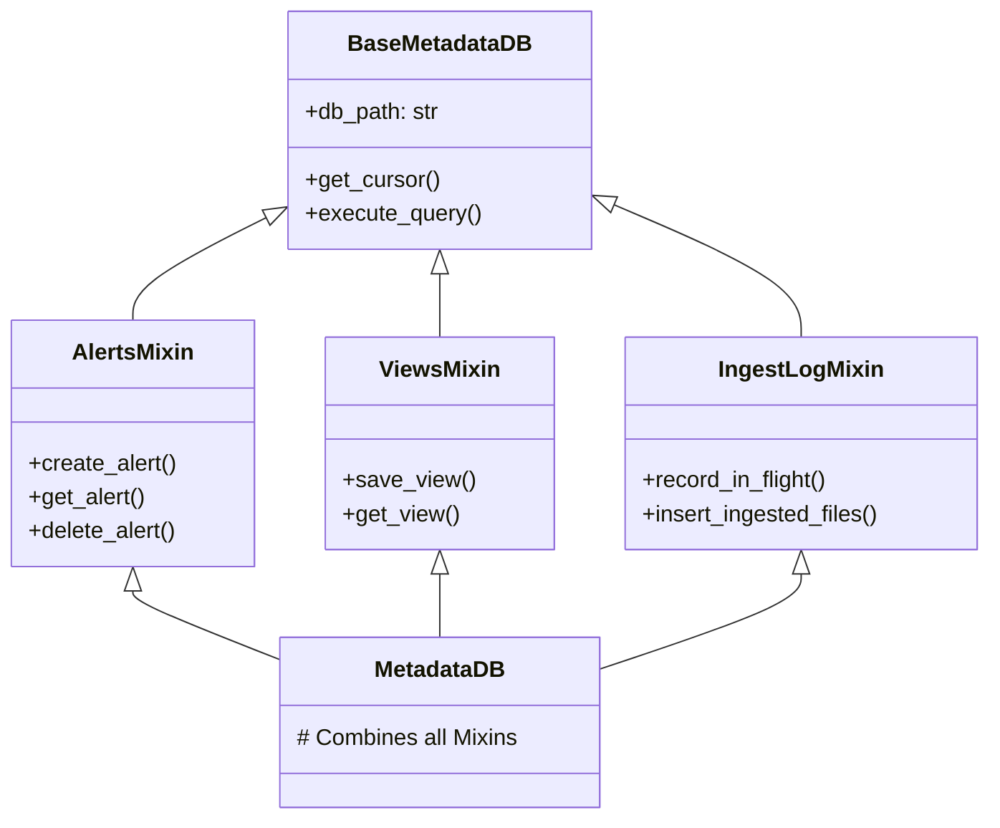

# Architectural Design Specification: Metadata DB Refactoring (`metadata_db.py` Carve-up)

## 1. Context & Motivation

The `backend/core/metadata_db.py` file is a 3,168-line monolithic Python module that manages all read/write operations against the SQLite operational database (`metadata.db`).

### Problems with the Monolithic Approach
1. **Single Point of Change/Contention:** Any feature relating to alert conditions, ingestion tracking, pricing calculations, saved dashboards, or geolocation ASN mapping requires editing the same massive file.
2. **Violates Single Responsibility Principle:** The `MetadataDB` class is simultaneously a database initialization script, an audit logger, a cost estimator, a discrepancy investigator, and an state exporter.
3. **Mypy and Test Clutter:** Writing clean unit tests and maintaining strict type checking is extremely difficult when single class instances carry 50+ unrelated methods.

---

## 2. Refactored Package Directory Architecture

We will decompose `metadata_db.py` into a structured, highly cohesive Python package directory: `backend/core/metadata/`.

```
backend/core/metadata/
├── __init__.py           # Package exports
├── base.py               # Db connection pooling, WAL, and initialization
├── alerts.py             # Alerts CRUD and conditions tracking
├── views.py              # Saved dashboard queries and view CRUD
├── ingest_log.py         # Ingestion manifest, in-flight transaction registry
├── cron_log.py           # APScheduler execution logging and progress tracking
├── asn_cache.py          # Geolocation ASN translates cache
├── usage_log.py          # Cost operations logger (Class A/B)
├── reconciliation.py     # Fastly stats vs ingestion reconciliation
└── state.py              # System configuration backups and export/import
```

---

## 3. Mixin Inheritance Strategy (100% Backward Compatibility)

To achieve 100% backward compatibility with all existing calling code, we will implement the specialized sub-managers as **Mixins**. The main `MetadataDB` class in `backend/core/metadata_db.py` (which other routers and services import) will then simply inherit from all of these mixins.



### Module Interface Blueprints

#### `backend/core/metadata/base.py`
```python
import sqlite3
import os
import tenacity
from contextlib import contextmanager

# Standardized retry policy for SQLite "database is locked" / OperationalError
# under WAL contention (concurrent cron writers + API writers).
# Per Phase 3.5a of cleanup_plan.md (tenacity adoption).
sync_db_retry = tenacity.retry(
    retry=tenacity.retry_if_exception_type(sqlite3.OperationalError),
    stop=tenacity.stop_after_attempt(5),
    wait=tenacity.wait_exponential(multiplier=0.1, min=0.1, max=1.0),
    reraise=True,
)


class BaseMetadataDB:
    def __init__(self, db_path: str):
        self.db_path = db_path
        self._init_db()

    @contextmanager
    def connection(self):
        """Synchronous connection context manager.

        All metadata mixin methods are sync. FastAPI's threadpool dispatches
        sync route handlers off the event loop already, so there is no
        measurable win from rewriting these as `async def + await aiosqlite`
        (which itself just wraps sync sqlite3 in a thread). Any future async
        caller uses `await asyncio.to_thread(self.<method>, ...)`.

        Decided in planning round: aiosqlite is scoped to `rdns_cache.py`
        only (its flow is already async via aiodns + asyncio.gather).
        """
        con = sqlite3.connect(self.db_path, timeout=5.0)
        con.execute("PRAGMA journal_mode=WAL;")
        con.execute("PRAGMA foreign_keys=ON;")
        try:
            yield con
        finally:
            con.close()

    def _init_db(self):
        # Database schema bootstrap tables
        pass
```

#### `backend/core/metadata/alerts.py`
```python
from backend.core.metadata.base import BaseMetadataDB, sync_db_retry
from typing import List, Dict, Any

class AlertsMixin(BaseMetadataDB):
    @sync_db_retry
    def create_alert(self, service_id: str, alert_config: dict) -> str:
        """Synchronous insert with tenacity retry on SQLite busy/locked.

        FastAPI sync routes dispatch to the threadpool; this does not block
        the event loop. Async routes (if any in v2.0) call via
        `await asyncio.to_thread(metadata.create_alert, service_id, cfg)`.
        """
        with self.connection() as con:
            cur = con.execute(
                "INSERT INTO alerts (service_id, config) VALUES (?, ?);",
                (service_id, alert_config),
            )
            con.commit()
            return str(cur.lastrowid)

    def list_alerts(self, service_id: str) -> List[Dict[str, Any]]:
        """Read path — no retry decorator (reads don't take the write lock)."""
        with self.connection() as con:
            cur = con.execute(
                "SELECT id, config FROM alerts WHERE service_id = ?;",
                (service_id,),
            )
            return [{"id": r[0], "config": r[1]} for r in cur.fetchall()]
```

#### `backend/core/metadata/ingest_log.py`
```python
from backend.core.metadata.base import BaseMetadataDB, sync_db_retry
from typing import List, Tuple

class IngestLogMixin(BaseMetadataDB):
    @sync_db_retry
    def record_in_flight(self, source_name: str, buf_filename: str, file_rows: int):
        """
        Synchronous transactional logging for cron jobs.
        Retries automatically on sqlite3.OperationalError locks via tenacity.
        """
        with self.connection() as con:
            con.execute(
                "INSERT INTO ingest_in_flight (source_name, filename, rows) VALUES (?, ?, ?);",
                (source_name, buf_filename, file_rows)
            )
            con.commit()

    @sync_db_retry
    def insert_ingested_files(self, files: List[Tuple[str, int, int]]):
        """
        Bulk insert of ingested files under transactional retry protection.
        """
        with self.connection() as con:
            con.executemany(
                "INSERT OR REPLACE INTO ingested_files (filename, rows, bytes) VALUES (?, ?, ?);",
                files
            )
            con.commit()
```


---

## 4. Refactoring `backend/core/metadata_db.py` (The Shim)

The original file `backend/core/metadata_db.py` will be reduced to under 50 lines. It will load and re-export the multi-inherited class so that **zero caller imports or signatures need to be changed** across the entire 150+ files codebase:

```python
# backend/core/metadata_db.py
from backend.core.metadata.base import BaseMetadataDB
from backend.core.metadata.alerts import AlertsMixin
from backend.core.metadata.views import ViewsMixin
from backend.core.metadata.ingest_log import IngestLogMixin
from backend.core.metadata.cron_log import CronLogMixin
from backend.core.metadata.asn_cache import AsnCacheMixin
from backend.core.metadata.usage_log import UsageLogMixin
from backend.core.metadata.reconciliation import ReconciliationMixin
from backend.core.metadata.state import StateMixin

class MetadataDB(
    AlertsMixin,
    ViewsMixin,
    IngestLogMixin,
    CronLogMixin,
    AsnCacheMixin,
    UsageLogMixin,
    ReconciliationMixin,
    StateMixin
):
    """
    Backward-compatible monolithic wrapper representing the combined SQLite metadata layer.
    All implementation code has been carved out to backend/core/metadata/.
    """
    def __init__(self, db_path: str):
        # Multi-inheritance initializer calls are handled by Python's MRO
        super().__init__(db_path)
```

---

## 5. Test and Validation Strategy

Each mixin can be tested in isolation, and the combined class will undergo comprehensive integration testing:
- **Isolated Unit Testing:** Create mock databases and test mixins (e.g., `AlertsMixin`) directly by instantiating a dummy class subclassing only `BaseMetadataDB` and `AlertsMixin`.
- **Backward-Compatibility Verification:** Run the existing complete integration and unit test suite against the composite `MetadataDB` to verify that all existing queries, data migrations, and reconciliation routines continue to pass with 100% exact matching behavior.
