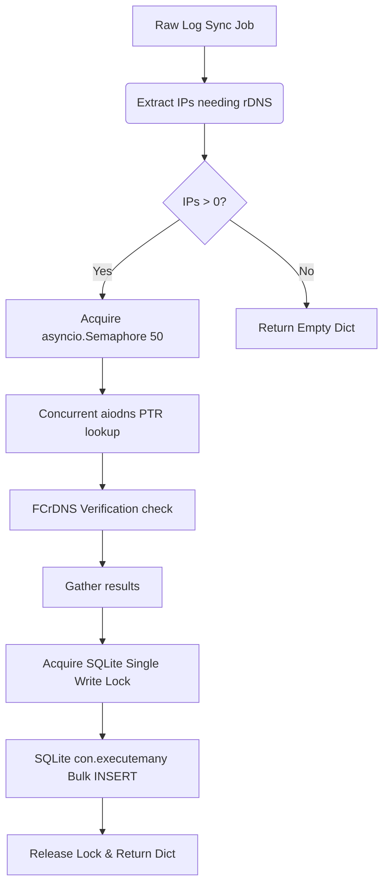

# Architectural Design Specification: Concurrent Async Reverse DNS Cache (`rdns_cache.py`)

## 1. Context & Motivation

The `rdns_cache.py` utility is responsible for mapping IP addresses in log entries to their reverse DNS hostnames (PTR records), which is vital for bot detection, provider identification, and security analytics.

### The Bottleneck in v1.x
The legacy implementation of `rdns_cache.py` operates under several architectural constraints that block sync execution pipelines:
1. **Sequential Blocking Resolution:** It uses standard blocking socket resolution (`socket.gethostbyaddr(ip)`), resolving up to 200 IPs sequentially. If a DNS server is slow or an IP has no PTR record, individual lookups can take up to 2–5 seconds, causing a single sync-worker run to block for several minutes.
2. **Transactional Lock Contention:** The caching worker opens a SQLite connection, acquires an exclusive thread-lock, performs a lookup, writes the result, commits the transaction, closes the connection, and repeats this loop *for every single IP address*. This causes massive $O(N)$ transaction/IO cycles and write-lock contention.

---

## 2. Proposed Async Architecture

We will re-architect the rDNS caching module to perform **high-concurrency, asynchronous, non-blocking DNS resolution** using `aiodns` and `asyncio.gather()`, paired with a single bulk SQLite transaction commit.



### Key Components

1. **`aiodns` Integration:**
   `aiodns` is a lightweight Python wrapper around the C library `c-ares`, providing non-blocking asynchronous DNS queries.
2. **Semaphore-Bounded Concurrency:**
   We will bound parallel queries using `asyncio.Semaphore(50)` (configurable) to avoid socket/file descriptor exhaustion and prevent overwhelming local/upstream resolvers.
3. **FCrDNS (Forward-Confirmed Reverse DNS) Verification:**
   To prevent DNS spoofing (where an attacker crafts a malicious PTR record to mimic a reputable bot like `googlebot.com`), the resolver must verify the hostname:
   - Perform PTR lookup on IP $\to$ Hostname.
   - Perform A/AAAA lookup on Hostname $\to$ IPs list.
   - Verify that the original IP is in the resolved IPs list.
   - If spoofed, flag the cache status accordingly (e.g., mark as `unverified` or append `[UNVERIFIED]`).
4. **Single-Transaction Bulk Write ($O(1)$ IO):**
   Instead of writing and committing one IP at a time, we will perform bulk writes using a single transaction block with `con.executemany()`.

---

## 3. Class & API Interface Design

```python
import asyncio
import sqlite3
import aiodns
from typing import Dict, List, Tuple, Optional

class AsyncRdnsResolver:
    def __init__(
        self,
        db_path: str,
        concurrency_limit: int = 50,
        cache_ttl_seconds: int = 86400, # 24 hours
        timeout: float = 2.0
    ):
        self.db_path = db_path
        self.semaphore = asyncio.Semaphore(concurrency_limit)
        self.cache_ttl = cache_ttl_seconds
        self.timeout = timeout
        self._loop: Optional[asyncio.AbstractEventLoop] = None
        self._resolver: Optional[aiodns.DNSResolver] = None

    @property
    def resolver(self) -> aiodns.DNSResolver:
        if self._resolver is None:
            self._resolver = aiodns.DNSResolver(timeout=self.timeout)
        return self._resolver

    async def resolve_batch(self, ips: List[str]) -> Dict[str, str]:
        """
        Public entrypoint to resolve a batch of IP addresses asynchronously.
        Checks cache first, resolves missing IPs concurrently, bulk commits, and returns.
        """
        if not ips:
            return {}

        # 1. Fetch from SQLite Cache
        cached_results, missing_ips = self._get_cached_ips(ips)
        if not missing_ips:
            return cached_results

        # 2. Resolve missing IPs concurrently
        tasks = [self._bounded_resolve(ip) for ip in missing_ips]
        resolved_records = await asyncio.gather(*tasks, return_exceptions=True)

        # 3. Filter valid records
        valid_writes: List[Tuple[str, str, int]] = []
        now = int(asyncio.get_event_loop().time())
        
        for ip, result in zip(missing_ips, resolved_records):
            if isinstance(result, Exception) or result is None:
                # Cache negative result with shorter TTL to prevent repeatedly lookup failure IPs
                valid_writes.append((ip, "NXDOMAIN", now - self.cache_ttl + 3600)) # Retry in 1 hour
                cached_results[ip] = "NXDOMAIN"
            else:
                hostname, verified = result
                cached_results[ip] = hostname
                valid_writes.append((ip, hostname, now))

        # 4. SQLite single bulk write transaction
        if valid_writes:
            self._bulk_save_to_cache(valid_writes)

        return cached_results

    async def _bounded_resolve(self, ip: str) -> Optional[Tuple[str, bool]]:
        async with self.semaphore:
            try:
                # 1. Reverse PTR lookup
                ptr_response = await self.resolver.query(f"{aiodns.helpers.reverse_address(ip)}", 'PTR')
                hostname = ptr_response.name
                
                # 2. Forward IP lookup for FCrDNS confirmation
                try:
                    a_response = await self.resolver.query(hostname, 'A')
                    resolved_ips = [r.host for r in a_response]
                except Exception:
                    try:
                        aaaa_response = await self.resolver.query(hostname, 'AAAA')
                        resolved_ips = [r.host for r in aaaa_response]
                    except Exception:
                        resolved_ips = []

                is_verified = ip in resolved_ips
                return hostname, is_verified
                
            except Exception as e:
                # Catch resolver/host errors
                return None

    def _get_cached_ips(self, ips: List[str]) -> Tuple[Dict[str, str], List[str]]:
        cached: Dict[str, str] = {}
        missing: List[str] = []
        now = int(asyncio.get_event_loop().time())

        # Select with IN clause
        placeholders = ",".join("?" for _ in ips)
        query = f"SELECT ip, hostname, resolved_at FROM rdns_cache WHERE ip IN ({placeholders})"
        
        with sqlite3.connect(self.db_path) as con:
            cur = con.cursor()
            cur.execute(query, ips)
            for ip, hostname, resolved_at in cur.fetchall():
                if now - resolved_at < self.cache_ttl:
                    cached[ip] = hostname
                else:
                    missing.append(ip)

        # Mark truly missing
        for ip in ips:
            if ip not in cached and ip not in missing:
                missing.append(ip)

        return cached, missing

    def _bulk_save_to_cache(self, records: List[Tuple[str, str, int]]):
        """
        Executes a single-transaction bulk write lock to prevent WAL write lock starvation.
        """
        with sqlite3.connect(self.db_path) as con:
            con.execute("PRAGMA journal_mode=WAL;")
            con.execute("BEGIN TRANSACTION;")
            try:
                con.executemany(
                    "INSERT OR REPLACE INTO rdns_cache (ip, hostname, resolved_at) VALUES (?, ?, ?);",
                    records
                )
                con.commit()
            except Exception:
                con.rollback()
                raise
