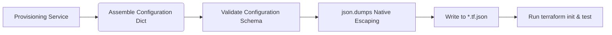

# Architectural Design Specification: Programmatic Terraform JSON Generation (`terraform_gen.py`)

## 1. Context & Motivation

The `terraform_gen.py` module programmatically generates Terraform configurations to automatically provision infrastructure resources (Fastly Real-Time VCL Logging, Fastly Object Storage bucket integrations, and CDN proxies).

### The Inherent Vulnerabilities in v1.x
The legacy implementation of `terraform_gen.py` constructs standard HCL (`.tf`) configuration files using multi-line python f-strings, custom string interpolation, and a manual, regex-based escaping helper named `_hcl_escape`.
This pattern has several critical engineering flaws:
1. **Injection Risks:** Complex, dynamic values containing control characters, newlines, quotes, or backslashes can easily bypass regex-based sanitizers, exposing the system to HCL injection and misconfiguration.
2. **Schema Fragility:** Small, manual adjustments to HCL indentation, syntax punctuation, or parentheses nesting can produce unparseable HCL, failing the provisioning process at compile-time.
3. **Complex Escaping Logic:** To safely inject block structures, conditions, and lists, the f-string generator is cluttered with complex boilerplate logic.

---

## 2. Proposed JSON Configuration Architecture

We will eliminate the hand-rolled HCL templates entirely by generating native **Terraform JSON Configuration Files (`.tf.json`)** instead of `.tf` files.



### Terraform JSON Syntax Support
Terraform natively supports JSON configuration files with complete feature-parity. Any file ending in `.tf.json` is parsed as a JSON-encoded configuration block.
- String interpolation works identically (e.g. `"${aws_s3_bucket.fos_bucket.bucket}"` is evaluated as a resource reference).
- standard JSON serializers (`json.dumps()`) guarantee 100% robust string escaping out of the box, rendering `_hcl_escape` completely obsolete.

### HCL to JSON Structural Translation Rules

| HCL Construct | Native JSON Equivalent |
|---|---|
| **Resource Block**<br>`resource "aws_s3_bucket" "fos" { bucket = "name" }` | `{"resource": {"aws_s3_bucket": {"fos": {"bucket": "name"}}}}` |
| **Provider Block**<br>`provider "aws" { region = "us-east-1" }` | `{"provider": [{"aws": {"region": "us-east-1"}}]}` |
| **Variable Block**<br>`variable "id" { type = string }` | `{"variable": {"id": {"type": "string"}}}` |
| **Terraform Block**<br>`terraform { required_version = ">= 1.5.0" }` | `{"terraform": {"required_version": ">= 1.5.0"}}` |

---

## 3. Configuration Layout & Code Structure

We will refactor the output of `terraform_gen.py` to write these specialized JSON structures:

- `versions.tf.json` — Declares required providers, Terraform version constraints, and backend settings.
- `fos.tf.json` — Fastly Object Storage (S3-compatible) buckets, access keys, and IAM policy bindings.
- `cdn_proxy.tf.json` — CDN VCL configuration blocks, rewrite routing rules, and proxy caching directives.
- `logging_service.tf.json` — Fastly Real-Time logging endpoints, custom headers, and VCL templates.

### Python Code Interface Design

The new `terraform_gen.py` will expose a clean, dictionary-based interface:

```python
import json
import os
from typing import Dict, Any, List

class TerraformJsonGenerator:
    def __init__(self, output_dir: str):
        self.output_dir = output_dir

    def generate_all(
        self,
        service_id: str,
        bucket_name: str,
        aws_region: str,
        cdn_domain: str,
        custom_vcl_snippet: str
    ) -> Dict[str, str]:
        """
        Main runner that generates and writes all .tf.json files.
        Returns a dict mapping written filenames to their JSON string contents.
        """
        files = {
            "versions.tf.json": self.build_versions(),
            "fos.tf.json": self.build_fos(bucket_name, aws_region),
            "cdn_proxy.tf.json": self.build_cdn_proxy(cdn_domain),
            "logging_service.tf.json": self.build_logging_service(service_id, bucket_name, custom_vcl_snippet)
        }

        # Write files with safe indent serialization
        os.makedirs(self.output_dir, exist_ok=True)
        for filename, data in files.items():
            filepath = os.path.join(self.output_dir, filename)
            with open(filepath, "w", encoding="utf-8") as f:
                json.dump(data, f, indent=2, sort_keys=True)

        return {k: json.dumps(v, indent=2) for k, v in files.items()}

    def build_versions(self) -> Dict[str, Any]:
        return {
            "terraform": {
                "required_version": ">= 1.5.0",
                "required_providers": {
                    "aws": {
                        "source": "hashicorp/aws",
                        "version": "~> 5.0"
                    },
                    "fastly": {
                        "source": "fastly/fastly",
                        "version": "~> 5.0"
                    }
                }
            }
        }

    def build_fos(self, bucket_name: str, region: str) -> Dict[str, Any]:
        return {
            "provider": [
                {"aws": {"region": region}}
            ],
            "resource": {
                "aws_s3_bucket": {
                    "fos_bucket": {
                        "bucket": bucket_name,
                        "force_destroy": True
                    }
                },
                "aws_s3_bucket_public_access_block": {
                    "fos_bucket_privacy": {
                        "bucket": "${aws_s3_bucket.fos_bucket.id}",
                        "block_public_acls": True,
                        "block_public_policy": True,
                        "ignore_public_acls": True,
                        "restrict_public_buckets": True
                    }
                }
            }
        }

    def build_cdn_proxy(self, cdn_domain: str) -> Dict[str, Any]:
        return {
            "resource": {
                "fastly_service_vcl": {
                    "cdn_proxy": {
                        "name": f"CDN Proxy - {cdn_domain}",
                        "domain": [
                            {"name": cdn_domain, "comment": "Managed proxy domain"}
                        ],
                        # Native JSON nesting for list blocks
                        "backend": [
                            {
                                "name": "FOS Origin",
                                "address": "${aws_s3_bucket.fos_bucket.bucket_regional_domain_name}",
                                "port": 443,
                                "ssl_cert_hostname": "${aws_s3_bucket.fos_bucket.bucket_regional_domain_name}",
                                "use_ssl": True
                            }
                        ]
                    }
                }
            }
        }

    def build_logging_service(self, service_id: str, bucket_name: str, vcl_snippet: str) -> Dict[str, Any]:
        # JSON structure naturally escapes complex vcl_snippet multi-line strings
        return {
            "resource": {
                "fastly_service_vcl": {
                    "logging_service": {
                        "name": f"Fastly Log Analytics Service - {service_id}",
                        "domain": [
                            {"name": f"{service_id}.analytics.example.com"}
                        ],
                        "vcl": [
                            {
                                "name": "Custom Logs Injection",
                                "content": vcl_snippet,
                                "main": True
                            }
                        ],
                        "logging_s3": [
                            {
                                "name": "Stream raw logs to FOS S3",
                                "bucket_name": bucket_name,
                                "domain": "${aws_s3_bucket.fos_bucket.bucket_regional_domain_name}",
                                "period": 30,
                                "format": "{\"timestamp\":\"%{begin:%Y-%m-%dT%H:%M:%S%Z}t\",\"client_ip\":\"%h\",\"request_method\":\"%m\"}",
                                "format_version": 2,
                                "gzip_level": 9,
                                "message_type": "blank"
                            }
                        ]
                    }
                }
            }
        }
