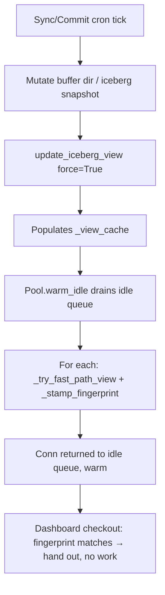

# Architectural Design Specification: Writer-Driven View Warming

## 1. Context & Motivation

The dashboard's panel queries periodically stall during sync/commit cron activity. Investigation shows the cause is **not** the classic "writer holds a lock while readers wait" pattern — instead, it is a **fingerprint-invalidation cascade** that pushes view-rebuild work onto the request path.

### The Current Read Path

Each dashboard request acquires a pooled DuckDB connection (`backend/core/duckdb_pool.py`). On checkout, `_Pool._prepare_checkout` validates the connection's stamped fingerprint against two facts:

1. The identity of the cached iceberg `_view_cache[source_key]` tuple
2. The mtime of the per-service buffer directory

If either changed since the connection was last stamped, the pool calls `iceberg.update_iceberg_view(con, src)`. That call has two branches:

- **Fast path (`_try_fast_path_view`)** — if `_view_cache` is populated and matches current `(metadata_loc, buf_set, schema)`, just re-execute the cached `CREATE OR REPLACE TEMP VIEW` SQL on this connection. Sub-millisecond.
- **Slow path (`_rebuild_locked`)** — acquire the per-service Iceberg `RLock` (shared with ingest), read the catalog, list manifests, regenerate view SQL, repopulate cache. Can take hundreds of milliseconds, and can stall on the lock for up to `lock_timeout` (currently 5s) when ingest is mid-write.

### Why Crons Trigger the Slow Path

Every sync cron tick lands new parquet files in the buffer dir. That changes `buf_set`, which is part of the cache fingerprint. Every commit cron tick drains the buffer (different `buf_set`) and advances `metadata_loc`. Both invalidate the cache from the perspective of any pool connection bound before the cron tick.

The first dashboard reader to check out each pool slot after a cron tick gets a fingerprint mismatch → calls `update_iceberg_view` → fast path returns False (cache is also stale) → slow path under contended lock.

A dashboard with 6–12 panel queries fires N concurrent checkouts. Each lands on its own pool slot. Each first-after-cron checkout pays the slow-path cost independently. The result is a visible page-load stall correlated with cron activity.

### Constraint: Per-Tick Freshness

Every page load must reflect data through the most recently *completed* cron run. This rules out the obvious deferral strategies:

- Throttling commit interval (delays freshness)
- Skipping `update_iceberg_view` for dashboard reads (serves stale)
- Stretching tombstone grace alone (helps with file-delete races but not the rebuild cost)

The only place left to move the work is **the cron worker itself**. APScheduler `max_instances=1` ensures sync/commit ticks don't overlap, so cron wall-clock can grow without coordination concerns. Trading cron-side CPU for request-path responsiveness is explicitly accepted: the cron worker is invisible to users; dashboard latency is not.

---

## 2. Proposed Design

After each writer-side cron tick mutates state that invalidates the view fingerprint, the cron worker itself:

1. Populates `_view_cache` via `update_iceberg_view(con, src, force=True)` on a dedicated connection
2. Rebinds every currently-idle pool connection to the new view via a new `Pool.warm_idle(src)` method

By the time the next dashboard checkout occurs, both `_view_cache` and the per-connection fingerprint are already current. `_prepare_checkout` finds a fingerprint match and hands the connection out with zero rebuild work.

In-use pool connections at warm-time are left alone. When they return to the pool and are next checked out, `_prepare_checkout` calls `update_iceberg_view`, which now hits the **fast path** because the cron worker has already populated `_view_cache`. That's a sub-ms DDL execute, not a slow-path lock acquisition.



---

## 3. Component Design

### 3.1 `Pool.warm_idle(src: dict) -> None`

Added to `_Pool` in `backend/core/duckdb_pool.py`. Sequential pop-bind-return loop bounded by `max_size`:

```python
def warm_idle(self, src: dict) -> None:
    """Rebind every idle connection to the latest cached view.

    Pops each idle conn, executes the cached view DDL via _try_fast_path_view
    (handles the CREATE OR REPLACE TEMP VIEW translation), re-stamps the
    fingerprint, returns the conn to the idle queue. Bounded by max_size so
    a hot return loop can't keep us spinning.

    Sequential, not parallel: TEMP VIEWs are per-connection in DuckDB, and
    DuckDB connection handles are single-threaded. The cost is N * fast-path
    bind ≈ N * sub-ms; for N=8 that is ~tens of ms total, on the cron thread.
    """
    from backend.core import iceberg
    for _ in range(self.max_size):
        with self._cond:
            try:
                con = self._idle.get_nowait()
            except queue.Empty:
                return
        try:
            iceberg._try_fast_path_view(con, src)
            self._stamp_fingerprint(con, src)
        except Exception as e:
            logger.warning("[pool] %s: warm_idle bind failed: %s", self.service_key, e)
            # Best-effort: put it back unwarmed; _prepare_checkout will
            # rebind on next checkout via the normal path.
        with self._cond:
            try:
                self._idle.put_nowait(con)
                self._cond.notify()
            except queue.Full:
                try: con.close()
                except Exception: pass
                self._in_use -= 1
                self._cond.notify()
```

**Bookkeeping invariant** (`_in_use == checked_out + idle_count`) is preserved through the loop:

- `get_nowait()` drops `idle_count` by 1; `_in_use` unchanged
- During the bind, the connection is held by warm_idle, not by a checkout — it is "in our hands" but not counted as checked out
- `put_nowait()` restores `idle_count`; `_in_use` unchanged
- On `Full` (defensive, shouldn't happen since we just popped from the same queue under the same lock), close and decrement `_in_use` to maintain the invariant

**Concurrency:** a reader that arrives while warm_idle holds a connection sees `_idle` minus one slot. If `_in_use < max_size`, it builds a new connection (which gets its own fresh fingerprint via `_stamp_fingerprint` at the existing site `duckdb_pool.py:247`); if saturated, it waits on `_cond` — identical to today's behavior. The connection warm_idle is binding is exclusively ours.

### 3.2 `warm_pool_for_service(service_key: str, src: dict) -> None`

Module-level public accessor in `backend/core/duckdb_pool.py`:

```python
def warm_pool_for_service(service_key: str, src: dict) -> None:
    """Warm idle pool connections for a service. No-op if no pool exists yet.

    Called by writer-side cron jobs after they mutate state that invalidates
    the view fingerprint (sync ingest, commit). Sync/commit are protected by
    APScheduler max_instances=1, so warm wall-clock can grow without overlap
    risk.
    """
    with _pools_lock:
        pool = _pools.get(service_key)
    if pool is None:
        return
    pool.warm_idle(src)
```

Does **not** create a pool on miss — if no reader has triggered pool creation yet, there is nothing to warm.

### 3.3 Sync Cron Hook (`backend/cron/jobs/sync.py`)

The existing post-sync view refresh at `sync.py:249–274` already calls `update_iceberg_view` after a successful ingest tick. Two adjustments:

1. Pass `force=True` — sync knows the buffer changed; skip the redundant fast-path attempt
2. Append `warm_pool_for_service(service_id, src)` after the rebuild succeeds

`_run_full_sweep` and `_run_gap_heal` both funnel through the same `ingest()` generator and exit through this code path — one hook covers all three sync paths.

### 3.4 Commit Cron Hook (`backend/cron/jobs/commit.py`)

Commit currently does **not** refresh the view at all post-drain. This is the single biggest contributor to dashboard stalls (every commit tick → 100% cache miss for every pool connection → N concurrent slow paths under contended lock).

Add the refresh + warm pair inside the existing `if result.get("files_committed", 0) > 0:` branch (around `commit.py:119`), before the `_run_metadata_sync` call. Limiting to the success branch avoids unnecessary work when nothing was committed.

### 3.5 Tombstone Grace Bump

`_TOMBSTONE_GRACE_SECONDS` in `backend/core/iceberg/_core.py:1052` increases from `60` → `300`. The docstring already documents the rationale: tombstone marking (which hides files from new view binds) happens immediately on commit; only physical sweep is delayed. This is purely a knob to widen the safety margin for in-flight readers whose connections were bound before the tombstone was placed.

No freshness impact. Trade-off: ~5 minutes of disk retention for tombstoned buffer files, which is negligible relative to the buffer dir's working set.

---

## 4. Out of Scope

- **Local compaction warming.** `backend/core/local_compaction.py` rewrites files under `cache/data/`, not the buffer dir. Per the explicit comment in `backend/routers/query.py:44–48`, the "Cannot open file" race local_compaction can trigger is a glob-enumeration race resolved at query execution time, not a view-binding race. The existing one-shot retry handles it correctly; rebinding the view does not reach inside the race window. If observed to matter post-deploy, the right fix is extending compaction's own pre-delete grace, not pool warming.
- **Schema-change warming.** Same writer-side hook pattern would apply, but schema changes are rare enough to leave to the existing reader-side self-heal path (`execute_with_stale_view_retry` in `backend/core/iceberg/_core.py`).
- **Per-page-load coalescing.** Once writer-driven warming is in place, the request-path cost is sub-ms per checkout. Coalescing across panels would be premature.

---

## 5. Failure Modes & Recovery

| Scenario | Behavior |
|---|---|
| `update_iceberg_view(force=True)` raises | Caught and logged; warm step skipped. Pool conns remain stamped with old fingerprint → next checkout takes the existing reader-side rebuild path (i.e., we degrade to today's behavior, no worse). |
| `_try_fast_path_view` raises inside warm_idle | Connection returned to idle queue unwarmed. `_prepare_checkout` will rebind on next checkout via the normal path. |
| Pool not yet created (no readers have queried this service) | `warm_pool_for_service` is a no-op. First reader will trigger pool creation and pay the normal first-checkout cost — same as today. |
| All connections in-use at warm-time | warm_idle loop exits immediately (queue empty). Returned connections self-heal at next checkout via the now-warm `_view_cache` (fast path, sub-ms). |
| Concurrent reader arrives mid-warm | Either finds a different idle slot, or sees empty queue and builds new (which stamps a fresh fingerprint), or waits on `_cond`. None of these is slower than today. |
| `Pool.warm_idle` hits the `max_size` iteration cap | Defensive guard; in practice the cap is reached only if a hot reader loop keeps returning connections. Acceptable — duplicated fast-path binds are cheap, and the next cron tick re-warms. |

---

## 6. Verification

**Unit (`tests/test_pool_warm_idle.py`, new):**

- `warm_idle` invokes `_try_fast_path_view` on every idle connection and stamps the fingerprint
- `warm_idle` on an empty pool is a no-op
- A binding exception leaves the connection in the idle queue unwarmed (best-effort)
- `_in_use` and `_idle.qsize()` are unchanged across a successful warm cycle

**Integration:**

- Sync tick that lands files calls `warm_pool_for_service` exactly once with the right service id
- Commit tick that commits files calls `warm_pool_for_service` exactly once

**Local dev validation** (per `memory/verify-dev-first.md`):

1. Run dev stack (13002 / 18002) with a service that has an active sync cron
2. Open dashboard with browser devtools network tab visible
3. Capture pre-change p95 panel latency across a sync tick boundary on `main`
4. Apply changes, repeat capture, compare
5. Inspect scheduler progress events for "View refresh + warm" timing — confirm warm is running and reasonable (~tens of ms)
6. Inspect `get_lock_retry_count()` (`backend/core/duckdb.py:576`) before/after a load run — should drop significantly

---

## 7. Rollback

Each piece is independently revertable:

- Revert the commit.py / sync.py hooks: behavior reverts to today (slow path on first reader)
- Revert `warm_idle` / `warm_pool_for_service`: hooks become no-ops (after revert of step 1) or get an AttributeError (handle in revert order)
- Revert tombstone grace bump: independent line change

No schema migrations, no on-disk format changes, no API contract changes.
