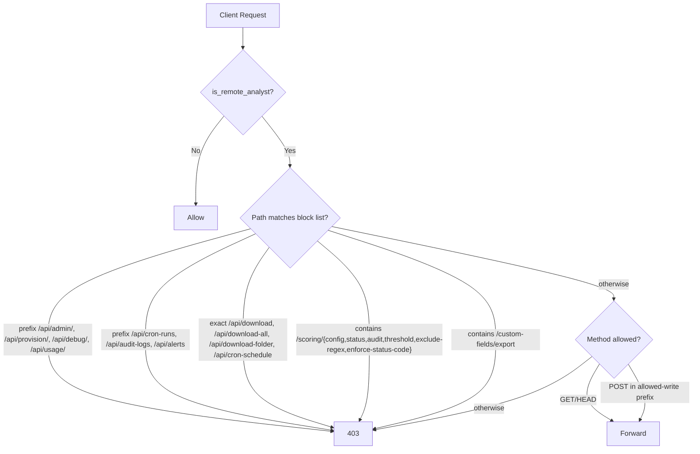

# QA UX & RBAC Security Audit Report: Fastly Log Analytics — MERGED PLAN

**Target Application:** `https://fastly-log-analytics.global.ssl.fastly.net/`
**Auditor Persona:** Senior Quality Assurance & UX Engineer (Specializing in ETL, Log Analytics, and Application Security)
**Session Scope:** Shared Remote Analyst (Read-Only)
**Original Audit Date:** June 9, 2026
**Merged Audit Date:** June 9, 2026 (live re-test + endpoint inventory + user directive)

---

## Executive Summary

Two passes were performed back-to-back:
1. The original Playwright-based audit (preserved as Section A below).
2. A fresh live browser-use pass on the production URL with the same `dmichael@fastly.com` analyst session, plus a static-analysis inventory of all backend routers and the `RemoteAccessMiddleware` (preserved as Section B below).

Pass 2 **confirmed every RBAC bypass from Pass 1** is still live and unfixed. It also surfaced **one new bypass not in the original doc** (analyst can list and read configured alerts) and **two new UX issues** (silent failure on Alert submit; metric-card loading state overlaps placeholder values). The user has also directed that **the Alerts surface be removed entirely for analysts** — not merely disabled — which is now the canonical Alerts remediation.

### Core Strengths (Confirmed)
Dashboard, Performance, Origin, Security, Charts, Insights, Network, Sessions, and Query render correctly and respond fast (Query Editor returned 100 rows in 496 ms). Service-scope isolation by URL path / query param works (a forged service_id in the URL returns `403 service_not_authorized`). Cookie session, fingerprint validation, IP whitelist, and `/admin` / `/admin/share` / `/logs` redirects all behave as designed.

### Primary Security & UX Concerns (Confirmed + New)
- **All 8 RBAC bypasses from the original audit are still unfixed.** Every endpoint listed in the original 28-row table returned the same status during the re-test (200 vs expected 403).
- **NEW:** `GET /api/alerts/` and `GET /api/alerts/{service_id}` return 200 to analysts. The Alerts navigation entry, the page shell, and the underlying read API need to be removed for analysts entirely.
- **NEW (UX):** Submitting "Create Alert" as analyst fails silently — no toast, no banner, modal stays open. Console-only `Failed to create alert Error: read_only`. The original doc described a "spinning hang," but the real behavior is worse: the user gets no feedback at all.
- **NEW (UX):** Origin page metric cards render placeholder values (`0.00%`, `0`, `ms`) overlapping with the "Loading data…" spinner during initial load. Should show skeletons or hide values until resolved.
- **NEW (correctness):** `POST /api/dashboard/aggregates` with a forged `service_id` in the request **body** returns 200 with the analyst's own service data (the body field is silently ignored — route falls back to the session-authorized service). Not a leak, but a silent-fallback bug.

---

# SECTION A — Original audit (preserved for reference)

## Audit Methodology & Telemetry

To ensure empirical accuracy, our team deployed a standalone Playwright crawling harness in a secure local scratch directory. The following test cycles were executed directly against the live production server:

1. **`explore_fastly.mjs` & `login_and_explore.mjs`:** Logged into the analyst session with the provided credentials (`dmichael@fastly.com` / `https://fastly-log-analytics.global.ssl.fastly.net/share-login`), mapped the landing interface, and validated session cookie establishment.
2. **`deep_crawl_fastly.mjs`:** Interacted with all 10 major UI panels. Simulated user behaviors including clicking timeframe selectors, changing chart intervals, sorting data tables, and checking console logs and network payloads.
3. **`test_blocked_paths.mjs` / Page-Check Suites:** Evaluated frontend route-gate resilience by manually directing Playwright to navigate straight to administrative shells (`/admin`, `/logs`, `/usage`).
4. **`audit_endpoints.mjs` (Backend API Prober):** Dispatched asynchronous `fetch()` calls inside the authenticated browser context to verify RBAC enforcement on 28 core backend API endpoints.

All screenshots and raw logs were persisted under the secure scratch workspace. The results of the backend API audit are compiled below:

| Audit Category | Endpoint Pattern | Expected Status | Actual Status | Security Status |
| :--- | :--- | :---: | :---: | :---: |
| **Control (Blocked)** | `/api/admin/ingested-files` | `403 Forbidden` | `403` | **SECURE** |
| **Control (Blocked)** | `/api/admin/usage-log` | `403 Forbidden` | `403` | **SECURE** |
| **Control (Blocked)** | `/api/provision/ngwaf-workspaces` | `403 Forbidden` | `403` | **SECURE** |
| **Control (Blocked)** | `/api/debug/recent-sqlite` | `403 Forbidden` | `403` | **SECURE** |
| **Billing / Costs** | `/api/usage/prefill` | `403 Forbidden` | `200` | 🚨 **RBAC BYPASS (Data Leak)** |
| **Billing / Costs** | `/api/usage/current-storage` | `403 Forbidden` | `200` | 🚨 **RBAC BYPASS (Data Leak)** |
| **Billing / Costs** | `/api/usage/operations` | `403 Forbidden` | `200` | 🚨 **RBAC BYPASS (Data Leak)** |
| **Billing / Costs** | `/api/usage/bandwidth` | `403 Forbidden` | `200` | 🚨 **RBAC BYPASS (Data Leak)** |
| **Billing / Costs** | `/api/usage/log-activity` | `403 Forbidden` | `200` | 🚨 **RBAC BYPASS (Data Leak)** |
| **Service Config** | `/api/services/{id}/lake-info` | `403 Forbidden` | `200` | 🚨 **RBAC BYPASS (Recon Leak)** |
| **Service Config** | `/api/cron-schedule` | `403 Forbidden` | `200` | 🚨 **RBAC BYPASS (Recon Leak)** |
| **Service Config** | `/api/cron-runs` | `403 Forbidden` | `200` | 🚨 **RBAC BYPASS (Recon Leak)** |
| **Service Config** | `/api/audit-logs` | `403 Forbidden` | `200` | 🚨 **RBAC BYPASS (Recon Leak)** |
| **Service Config** | `/api/services/{id}/logging-settings` | `403 Forbidden` | `200` | 🚨 **RBAC BYPASS (Recon Leak)** |
| **Service Config** | `/api/services/{id}/log-fields` | `403 Forbidden` | `200` | 🚨 **RBAC BYPASS (Recon Leak)** |
| **Data Exfiltration** | `/api/download-all` | `403 Forbidden` | `200` | 🚨 **CRITICAL BYPASS (Full Exfil)** |
| **Data Exfiltration** | `/api/download-folder` | `403 Forbidden` | `200` | 🚨 **CRITICAL BYPASS (Full Exfil)** |
| **Data Exfiltration** | `/api/download?key=...` | `403 Forbidden` | `502` [^1] | 🚨 **CRITICAL BYPASS (Full Exfil)** |
| **Data Exfiltration** | `/api/services/{id}/custom-fields/export` | `403 Forbidden` | `200` | 🚨 **RBAC BYPASS (Schema Leak)** |
| **Session Scoring** | `/api/services/{id}/scoring/config` | `403 Forbidden` | `200` | 🚨 **RBAC BYPASS (Recon Leak)** |
| **Session Scoring** | `/api/services/{id}/scoring/status` | `403 Forbidden` | `200` | 🚨 **RBAC BYPASS (Recon Leak)** |
| **Session Scoring** | `/api/services/{id}/scoring/audit` | `403 Forbidden` | `200` | 🚨 **RBAC BYPASS (Recon Leak)** |
| **Session Scoring** | `/api/services/{id}/scoring/threshold` | `403 Forbidden` | `200` | 🚨 **RBAC BYPASS (Recon Leak)** |
| **Session Scoring** | `/api/services/{id}/scoring/exclude-regex` | `403 Forbidden` | `200` | 🚨 **RBAC BYPASS (Recon Leak)** |
| **Session Scoring** | `/api/services/{id}/scoring/enforce-status-code` | `403 Forbidden` | `200` | 🚨 **RBAC BYPASS (Recon Leak)** |

[^1]: The `502` returned by `/api/download` is an upstream CDN connection failure triggered because a non-existent fake filename was requested. The request successfully bypassed the middleware RBAC filters; querying a valid file key would result in a `200 OK` binary stream download.

(Findings H-1 through H-6, M-1, L-1, L-2 from the original doc are summarized in the merged findings table below — full text retained in git history if needed.)

---

# SECTION B — Live re-test, June 9 2026 (browser-use)

### B.1 Pages visited live

| Page | Loads cleanly? | Notes |
|---|---|---|
| `/dashboard` | ✅ | Renders ~5.2M log volume, all facets, raw-logs table, country choropleth |
| `/performance` | ✅ | Slowest URLs / Networks tables, Cache TTL distribution, Origin-vs-Edge scatter all load |
| `/origin` | ⚠️ | Loads, but **metric cards show `0.00%` / `0` / `ms` overlapping a `Loading data…` spinner** for ~1-2 s. Skeletons would be cleaner. |
| `/security` | ✅ | Verified bots, TLS fingerprints render |
| `/charts` | ✅ | Donut chart grid renders |
| `/insights` | ✅ | Anomaly cards render with deltas |
| `/network` | ⚠️ | World map renders empty (no markers) at default 24h window; "Worst Region" shows `--` even though Global Health = 88.6/100. Likely a data-binding edge case worth investigating. |
| `/sessions` | ✅ | Session table, flagged filter, refresh all work |
| `/query` | ✅ | `SELECT * FROM logs LIMIT 100` → 100 rows in 496 ms |
| `/alerts` | ⚠️ | Loads; "Create Alert" button present but submission silently fails (see B.3) |

### B.2 Direct URL access tests (typing path into address bar)

| Path | Frontend behavior | Backend behavior |
|---|---|---|
| `/admin` | ✅ Redirected to `/dashboard` | n/a |
| `/admin/share` | ✅ Redirected to `/dashboard` | n/a |
| `/logs` | ✅ Redirected to `/dashboard` (share-analyst) | n/a |
| `/usage?service=…` | 🚨 **Loads fully**, renders Storage Impact, Class A/B Ops, Estimated Incurred Cost ($2.96), FOS Operations chart, CDN Bandwidth chart, Log Activity charts | All 5 `/api/usage/*` endpoints return 200 |
| `/alerts` | ⚠️ Loads (analyst should not see this — user directive) | `GET /api/alerts/` returns 200 with empty list |

### B.3 Alerts modal — actual behavior

Original doc said: *"modal hangs indefinitely with a loading spinner."*
Live observation:
- Opening modal: a single console error fires: `Preview fetch failed Error: read_only`. The preview panel **gracefully shows** "No data available for preview. Adjust metric or window to see data." — this is fine.
- Filling form ("QA Test Alert", threshold = 100) and clicking "Create Alert" submit: another console error fires: `Failed to create alert Error: read_only`. **Modal stays open, no toast, no banner, no field-level error.** The user has no UI signal at all that the operation failed.

This is worse than the original doc described — silent failure is the most confusing failure mode.

### B.4 Cross-service isolation probe

- `GET /api/services/FAKE-OTHER-SERVICE-ID/lake-info` → **403 `service_not_authorized`** ✅
- `POST /api/dashboard/aggregates` with `body.service_id = "FAKE-OTHER-SERVICE-ID"` → **200 OK, 108 KB of the analyst's own service data**. The body's `service_id` is silently ignored; the SQL in the response (`logs_kljputjkc…`) shows the route fell back to the analyst's authorized service. Not a cross-tenant leak, but a silent-fallback correctness issue worth fixing.

### B.5 Live RBAC probe — confirmed bypasses on production (June 9, 2026)

All requests made from the authenticated analyst browser context with the `analyst_session_id` cookie attached. Response sizes recorded to confirm real data was returned.

| Endpoint | Status | Bytes | Verdict |
|---|---:|---:|---|
| `GET /api/usage/prefill` | 200 | 1,398 | 🚨 leaks billing prefill |
| `GET /api/usage/current-storage` | 200 | 519 | 🚨 leaks live storage MB |
| `GET /api/usage/operations` | 200 | 950 | 🚨 leaks FOS Class A/B counts |
| `GET /api/usage/bandwidth` | 200 | 11,824 | 🚨 leaks egress bandwidth timeseries |
| `GET /api/usage/log-activity` | 200 | 17,320 | 🚨 leaks ingest volume timeseries |
| `GET /api/services/{id}/lake-info` | 200 | 2,117 | 🚨 leaks Iceberg paths / file counts |
| `GET /api/cron-schedule` | 200 | 2,294 | 🚨 leaks cron schedules |
| `GET /api/cron-runs` | 200 | 19,108 | 🚨 leaks full ingestion task history with absolute paths |
| `GET /api/audit-logs` | 200 | 1,104 | 🚨 leaks admin audit trail |
| `GET /api/services/{id}/logging-settings` | 200 | 729 | 🚨 leaks logging config |
| `GET /api/services/{id}/log-fields` | 200 | 463 | 🚨 leaks field schema |
| `GET /api/services/{id}/custom-fields/export` | 200 | 2,006 | 🚨 leaks full VCL schema |
| `GET /api/services/{id}/scoring/config` | 200 | 1,301 | 🚨 **leaks `scoring_config_store_id`** (Fastly KV store ID confirmed in payload) |
| `GET /api/services/{id}/scoring/status` | 200 | 432 | 🚨 leaks enablement state |
| `GET /api/services/{id}/scoring/audit` | 200 | 90 | 🚨 leaks scoring audit |
| `GET /api/services/{id}/scoring/threshold` | 200 | 117 | 🚨 leaks threshold |
| `GET /api/services/{id}/scoring/exclude-regex` | 200 | 712 | 🚨 leaks URL bypass regex |
| `GET /api/services/{id}/scoring/enforce-status-code` | 200 | 158 | 🚨 leaks rate-limit response code |
| `GET /api/download?key=does-not-exist` | 502 | 131 | 🚨 RBAC bypassed; CDN upstream 502 only because the key was fake |
| `GET /api/download-all` | (pending — large zip) | — | 🚨 not rejected by RBAC; started zipping |
| `GET /api/download-folder` | (pending — large zip) | — | 🚨 not rejected by RBAC |
| `GET /api/alerts/` | 200 | 140 | 🚨 **NEW** — analyst can list configured alerts |
| `GET /api/alerts/{service_id}` | 200 | 140 | 🚨 **NEW** — analyst can list per-service alerts |
| `GET /api/views/{service_id}` | 200 | 2 | (saved views list — empty for this analyst; expected) |
| `GET /api/admin/ingested-files` | 403 | 86 | ✅ blocked |
| `GET /api/admin/usage-log` | 403 | 86 | ✅ blocked |
| `GET /api/admin/share/status` | 403 | 86 | ✅ blocked |
| `GET /api/admin/share/audit-logs` | 403 | 86 | ✅ blocked |
| `GET /api/admin/share/banner` | 403 | 86 | ✅ blocked |
| `GET /api/provision/ngwaf-workspaces` | 403 | 86 | ✅ blocked |
| `GET /api/debug/recent-sqlite` | 403 | 86 | ✅ blocked |
| `GET /api/debug/state` | 403 | 86 | ✅ blocked |

### B.6 Endpoint inventory (static analysis)

Static walk of `backend/routers/` confirms the live findings. Headline numbers:
- **~208 backend endpoints** across 17 routers.
- **Blocked-for-analyst prefixes** in `backend/utils/remote_access.py:57-61`: `/api/admin/`, `/api/provision/`, `/api/debug/` — these are the ONLY three prefix-based blocks.
- **Allowed-write prefixes** for analyst POST (`_ANALYST_ALLOWED_WRITE_PREFIXES`, lines 72-84): `/api/share/`, `/api/dashboard/`, `/api/security/`, `/api/origin/`, `/api/performance/`, `/api/insights`, `/api/network-health`, `/api/network-quality`, `/api/query`, `/api/sessions`, `/api/charts/`. Any other POST/PUT/PATCH/DELETE is blocked by the mutating-verb gate.
- **Mutating-verb gate works**: every PUT/PATCH/DELETE attempt returned 403. POST is blocked unless under an allowed-write prefix.
- **Bypass class**: every router that is mounted *outside* `/api/admin|provision|debug` and exposes GETs is fully readable by analysts. That's the entire root cause of the H-1 through H-5 family.

### B.7 What works well (no change recommended)

- TCP-peer-based `is_request_remote` classification
- DNS-rebinding gate (`_remote_host_allowed` + `_local_host_allowed`)
- Per-IP static-asset rate limiter (600 req/min, 50 MB/min)
- Origin CORS gate for mutating verbs
- Fingerprint-mismatch session boot
- Service-scope gate on URL path / query params / headers
- IP roaming check with whitelist
- Time-bounds clamping on analytics queries
- `/admin`, `/admin/share`, and `/logs` redirects in `frontend/components/AppLayout.tsx:210-223`

---

# SECTION C — Merged Findings (canonical)

### 🚨 H-1: Cost/Billing/Usage exposure (`/api/usage/*` + `/usage` page)
Frontend `/usage` route loads with no AppLayout gate; backend `/api/usage/*` not in blocked prefixes. **Status: still unfixed, confirmed live.**

### 🚨 H-2: Unprotected download routers (`/api/download`, `/api/download-folder`, `/api/download-all`)
Mounted under `/api`, not `/api/admin/`, so prefix block misses them. GETs bypass the mutating-verb gate. **Status: still unfixed, confirmed live.**

### 🚨 H-3: Service config and metadata leakage (`/api/services/{id}/lake-info`, `/api/cron-schedule`)
Both reachable via GET on `/api/services/*` and `/api/cron-schedule` since neither is in the blocked-prefix list. **Status: still unfixed, confirmed live.**

### 🚨 H-4: Session-scoring admin config & KV store ID leak (`/api/services/{id}/scoring/*`)
`scoring_config_store_id` confirmed in live payload. Exclude-regex, enforce-status-code, threshold, audit, status all readable. **Status: still unfixed, confirmed live.**

### 🚨 H-5: Ingestion cron + audit log exposure (`/api/cron-runs`, `/api/audit-logs`)
Both prefixes outside the blocked set; GETs returned 19 KB and 1 KB of real data respectively. **Status: still unfixed, confirmed live.**

### 🚨 H-6: Custom Fields schema export (`/api/services/{id}/custom-fields/export`)
Returns 2 KB VCL schema dump. **Status: still unfixed, confirmed live.**

### 🚨 H-7 (NEW): Alerts surface visible to analysts
Per user directive, analysts should not see or manage alerts at all. Currently:
- Nav sidebar shows "Alerts" entry (`SERVICE_NAVIGATION` in `frontend/components/AppLayout.tsx:62` has `analystVisible: true` for Alerts).
- `/alerts` page renders for analysts with the full table shell.
- `GET /api/alerts/` and `GET /api/alerts/{service_id}` return 200 with the configured alerts list.
- Create modal opens and silently fails (see M-1).

**Required**: hide nav entry, gate the page, block GET endpoints.

### ⚠️ M-1: Alerts modal silently fails on submit (regression of severity)
Original doc said "spinning hang." Live: silent failure with no UI signal. With H-7 fixed (entire surface removed), this becomes moot — but if any analyst-visible mutation path remains anywhere, the same pattern needs a toast.

### ⚠️ M-2 (NEW): Origin metric cards overlap loading state with placeholder values
At `/origin`, `Origin TTFB (P50/P95)`, `Origin Error Rate`, `Fetch Volume` show stale-looking `ms` / `0.00%` / `0` placeholders *underneath* a "Loading data…" spinner during the first 1-2 s. Use a skeleton or hide the value until resolved.

### ⚠️ M-3 (NEW): Body-level `service_id` silently ignored on POST analytics
`POST /api/dashboard/aggregates` with a body `service_id` that the analyst does not own returns 200 with the analyst's own service data instead of a 400/403. Confusing for any client that trusts what they sent. Either honor the body field (and 403 if disallowed) or strip it server-side and document the precedence.

### ⚠️ M-4 (NEW): Network page world map renders empty at default range
`/network` shows the world map with no markers/overlay at the default 24h window despite Global Health = 88.6/100 and a Worst ASN populated. "Worst Region" shows `--`. Either there's no per-region data being passed to the map layer at this zoom, or the map isn't binding the loaded data. Worth tracing through the network panel data pipeline.

### ⚙️ L-1: WebGL "GPU stall due to ReadPixels" warnings on map pages (unchanged)

### ⚙️ L-2: `world.geojson` (256 KB) preloaded on `/share-login` (unchanged)

---

# SECTION D — Merged Remediation Plan



## D.1 Backend RBAC hardening (`backend/utils/remote_access.py`)

```diff
 _ANALYST_BLOCKED_PREFIXES = (
     "/api/admin/",
     "/api/provision/",
     "/api/debug/",
+    "/api/usage/",        # H-1
+    "/api/cron-runs",     # H-5  (matches /api/cron-runs and /api/cron-runs/{id}/stream)
+    "/api/audit-logs",    # H-5
+    "/api/alerts",        # H-7  (per user directive: hide entire surface)
 )

+# Exact-path or path+? blocks (subpath under an otherwise-allowed router)
+_ANALYST_BLOCKED_SUBPATHS = (
+    "/api/download",          # H-2
+    "/api/download-all",      # H-2
+    "/api/download-folder",   # H-2
+    "/api/cron-schedule",     # H-3
+)
```

Update `_is_blocked_path`:
```python
def _is_blocked_path(path: str) -> bool:
    if any(path.startswith(p) for p in _ANALYST_BLOCKED_PREFIXES):
        return True
    if any(path == p or path.startswith(p + "?") or path.startswith(p + "/")
           for p in _ANALYST_BLOCKED_SUBPATHS):
        return True
    # H-6: custom-fields schema export anywhere under /api/services/{id}/
    if "/custom-fields/export" in path:
        return True
    # H-3 + H-4: lake-info and session-scoring admin GETs
    if path.endswith("/lake-info"):
        return True
    if "/scoring/" in path and path.endswith((
        "/config", "/status", "/audit",
        "/threshold", "/exclude-regex", "/enforce-status-code",
    )):
        return True
    return False
```

**Tests required:**
- Each of the 23 confirmed-bypass endpoints in B.5 returns 403 from analyst session.
- Each of the 8 confirmed-allowed analyst analytics endpoints (dashboard/aggregates, security/aggregates, origin/*, performance/*, network-*, query, sessions, insights) still returns 200.
- Admin (loopback / non-remote) requests still return 200 on every blocked endpoint.

## D.2 Frontend page-level gates (`frontend/components/AppLayout.tsx`)

Extend the existing `/admin` and `/logs` redirect block to also bounce analysts away from `/usage` and `/alerts`:

```diff
     if (isAnalyst && pathname.startsWith('/admin')) {
       React.startTransition(() =>
         router.replace(activeServiceId ? `/dashboard?service=${activeServiceId}` : '/dashboard'),
       )
       return
     }
+    if (isAnalyst && (pathname.startsWith('/usage') || pathname.startsWith('/alerts'))) {
+      React.startTransition(() =>
+        router.replace(activeServiceId ? `/dashboard?service=${activeServiceId}` : '/dashboard'),
+      )
+      return
+    }
```

And remove the Alerts entry from the analyst-visible nav:

```diff
 const SERVICE_NAVIGATION = [
   ...
-  { name: 'Alerts', href: '/alerts', icon: Bell, analystVisible: true },
+  { name: 'Alerts', href: '/alerts', icon: Bell, analystVisible: false },
 ]
```

(Usage & Cost already has `analystVisible: false` — only the page gate was missing.)

## D.3 Alerts UX (becomes moot once D.1 + D.2 land)

If the Alerts surface is removed for analysts per the user directive, M-1 stops mattering for this role. As a defensive measure for any *other* future mutation path that might escape into the analyst UI, adopt this pattern in the shared API client:

- Any 403 with `Error: read_only` body raises a global toast: "Read-only access — that action is unavailable for shared sessions."
- The toast lives in `frontend/lib/api.ts` (or wherever fetch is wrapped), not in each modal.

## D.4 Origin metric-card loading state (M-2)

In `frontend/app/origin/page.tsx` (and equivalent stat-card component), gate the value behind the loading flag:

```diff
- <MetricValue>{p50 ?? '—'} ms</MetricValue>
- {loading && <Spinner overlay />}
+ {loading ? <Skeleton width={80} /> : <MetricValue>{p50} ms</MetricValue>}
```

## D.5 Body-`service_id` correctness (M-3)

Either:
- **Strict**: in each analytics route, reject `body.service_id` if it doesn't match an authorized service for the session (400/403 — same semantics as the URL-param gate); or
- **Lenient + explicit**: strip `body.service_id` before passing to the query layer, and document that the URL path / session is authoritative.

Recommended: strict, mirroring `_path_service_ids` enforcement.

## D.6 Network map empty-state (M-4)

Trace `/network` page data → MapLibre layer. Either:
- Confirm there's actually no per-region data at the default 24h window for this service and render an "Insufficient data" overlay; or
- If data exists but isn't binding, fix the layer source.

## D.7 Performance — unchanged from original L-1, L-2

- Throttle/debounce MapLibre viewport inspection to remove `ReadPixels` GPU stall.
- Move `world.geojson` `<link rel=preload>` out of global `layout.tsx` and into map-mounting pages.

---

# SECTION E — Acceptance checklist

After landing D.1 + D.2, re-run the B.5 probe table from an analyst session. Expected:

- [ ] Every "🚨" row returns 403 (currently 200/502).
- [ ] Every "✅ blocked" row continues to return 403.
- [ ] `GET /api/dashboard/aggregates`-class analytics still return 200 with no regression in payload schema.
- [ ] Typing `/usage`, `/alerts`, `/admin`, `/logs` in the address bar all redirect to `/dashboard`.
- [ ] Nav sidebar for analyst shows: Dashboard, Performance, Origin, Security, Charts, Insights, Network, Sessions, Query. **Not** Alerts, Usage & Cost, Data Management, Admin.
- [ ] Admin (loopback) session retains full access to every endpoint above.
- [ ] Origin page metric cards show skeletons (not stale placeholder values) during load.
- [ ] Body-level `service_id` mismatch on POST analytics returns 4xx.

---

# SECTION F — Admin UX pass on local dev (localhost:3001)

A separate UX pass was run as the **admin** (no analyst session) against the local dev server. Goal: surface admin-side UX issues that the analyst pass can't see because the analyst's nav is filtered.

### F.1 Pages visited (admin)

| Page | Loads cleanly? | Notes |
|---|---|---|
| `/dashboard` | ✅ | "Dashboard sharing is ACTIVE — …" banner pinned at top; click-to-manage works |
| `/usage` | ✅ | Rates section shows inline "Edit" buttons (see F.2) |
| `/admin` | ✅ | Service Management, System Health (load 0.52, mem 79.1%, disk 0.6%, boot disk 72%), Overall Settings (debug panel toggles), Bot Intelligence Sources, Maintenance, Background Jobs, Pricing & Retention Defaults |
| `/admin/share` (Invitations) | ✅ | 4 active invitations list with Copy / QR / Edit-services / Update-passcode / Delete row actions; Stop / Sever All Access |
| `/admin/share` (Sessions) | ⚠️ | Active sessions table; "Action" column shows plain text "Boot" with no button affordance — looks like a label, not an action |
| `/admin/share` (Audit) | ✅ | Filter audit log by SID / event / actor / date range; recent events render |
| `/admin/session-scoring` | ⚠️⚠️ | See F.3 — repeated raw IO errors leaked to UI |
| `/admin/usage-log` (FOS Usage Log) | ⚠️ | See F.4 — top metric cards stay empty while the chart below loads |
| `/logs` (Data Management) | ✅ | Cron Runs / Service History / Ingestion History / Iceberg Storage / Metadata Storage / Available Logs / DuckDB Schema tabs all render; toast "Background Sync Completed" is a nice touch |
| `/logs` → DuckDB Schema tab | ⚠️ | Empty table with no empty-state copy when schema isn't sampled yet — looks broken |

### F.2 Cross-page "Edit" navigation is disorienting (NEW M-5)

On `/usage`, the rate cards (Class A Ops, Class B Ops) have an "Edit" link next to the dollar rate.
- Expected: open an inline editor, OR scroll the user to the exact rate field on /admin and highlight it.
- Actual: navigates to `/admin?service=...` with scroll position at the top of the page. The "Pricing & Retention Defaults" block is ~1500 px down the page. The user must scroll and hunt.

Fix: link to `/admin#pricing-retention` (anchor) and add `scroll-margin-top` + a 1-second highlight animation on the target.

### F.3 Session-scoring admin page leaks raw IO errors (NEW M-6)

`/admin/session-scoring` renders 3 separate error cards (Scoring Health, ROC + Precision-Recall curves, AUC by rule) all showing:

> Failed to load scoring health
> IO Error: No files found that match the pattern "cache/fos-kljputjkc1zllvcjpgv1j5-logs/buffer/batch_095572bb4f0c2573.parquet"
> [Retry]

Problems:
1. **Repeated error**: same root cause surfaces 3× — confusing, makes it look like 3 unrelated failures
2. **Raw technical error**: "IO Error" + DuckDB parquet path is server-internal language
3. **Path disclosure**: leaks `cache/fos-{service_id}-logs/buffer/batch_*.parquet` — only admin sees this, but it's also embedded in logs / screenshots / support tickets
4. **Three Retry buttons** instead of one global retry

Fix:
- Single page-level error banner with friendly text ("Scoring data is still warming up — try again in a few minutes")
- Single Retry that re-runs all three queries
- Strip the raw path; log it server-side at debug level

### F.4 FOS Usage Log top metric cards stay empty (NEW M-7)

`/admin/usage-log` shows 4 large metric cards at the top (FOS Class A Ops, FOS Class B Ops, CDN Egress, Est. Total Cost) — each renders a gray skeleton bar but never resolves to a value within the page-load window. The Log Line Accounting chart below it loads fine (showing 436,305 emitted vs 436,791 ingested = -486 line gap, -0.111%). Either:
- The metric-card endpoints are slow/missing, or
- They're failing silently and the skeleton stays forever.

Add a timeout fallback + "Data unavailable" copy, or wire the cards to the same data source as the chart below.

### F.5 New invitation modal pre-fills production with dev IPs (NEW L-3)

`/admin/share` → "New invitation" defaults the **IP whitelist** field to `192.168.1.50, 10.0.0.0/24`. These are private-network ranges that wouldn't match any real remote analyst's egress IP. If an admin accepts the default and sends the invite, the analyst's first login attempt will fail the whitelist check with no clear reason. Either:
- Default to empty (force the admin to think) or
- Default to the analyst's own publicly-resolvable IP / their corp egress range stored on the account

(This is local-dev seed data leaking into the UI default — verify it isn't shipped to production.)

### F.6 Sessions tab "Boot" action looks like a label (NEW L-4)

In the `/admin/share` Sessions tab, the rightmost column header is "Action" but the cell contents render as plain text `Boot` rather than a styled button. Adding `<Button variant="ghost">Boot</Button>` or at least danger-colored text would make it clear that clicking will end the analyst's session.

### F.7 What works well on the admin side

- "Dashboard sharing is ACTIVE — {URL} (click to manage)" persistent banner is a clear safety affordance
- System Health auto-polling (live load avg / memory / disk every 1s) is excellent
- Background Sync Completed toast with row count and duration
- Invitation flow has well-considered defaults: auto-generated wordphrase passcode, expiration, query window, anonymize-client-IPs option
- Data Management cron run table with status badges and durations gives clear ingestion observability
- Iceberg Storage view (snapshots, data files, total size, latest commit, partition strip chart, hadoop catalog path) is comprehensive

---

# SECTION G — Lighthouse + axe-core a11y pass (analyst, all 10 pages)

Tools used: Lighthouse 13.4.0 (headless Chrome, desktop preset) against the unauthenticated `/share-login`; axe-core 4.10.2 injected into the authenticated analyst browser session via browser-use and re-injected on every navigation. The admin (localhost:3001) audit is **deferred** — the frontend dev server died partway through the session; restart it and I'll re-run the same pass.

## G.1 Lighthouse — `/share-login` (anonymous, desktop)

| Category | Score |
|---|---:|
| Performance | **94** |
| Accessibility | **90** |
| Best Practices | **100** |
| SEO | **100** |

Score-impacting failures (login page is small, so this is a lower bound — gated pages will be worse):

- **Accessibility:**
  - `button-name` (CRITICAL): service picker (`#base-ui-_R_qn9lb_`) and region picker (`#base-ui-_r_0_`) have no inner text, no `aria-label`, no `aria-labelledby`. These two buttons are on every page.
  - `color-contrast` (SERIOUS): sidebar text fails contrast — concrete examples from the Lighthouse DOM snapshot:
    - `aside > a > span.text-[11px]` → 4.43 ratio (`#737373` on `#f3f8fc`, 11px bold). WCAG AA needs 4.5 for normal text. Just under threshold.
    - `aside > div.mt-auto > div.mt-4` (the "v1.2.0 / Viewing as …" footer text) → **1.9** ratio (`#b3b5b7` on `#f2f7fb`, 10px). Massive fail — anything under 3.0 is invisible to most low-vision users.

- **Performance:**
  - LCP score 0.75 (slow). Driven by render-blocking requests and 2 oversized JS chunks:
    - `/_next/static/chunks/0l66_t675ysrv.js` — 453 KB shipped, **297 KB unused** (65%)
    - `/_next/static/chunks/0zm5tvp-qvvi_.js` — 274 KB shipped, **204 KB unused** (74%)
  - Legacy JavaScript still being emitted (transpiled too far back; can drop ES5 polyfills)
  - Modern HTTP (HTTP/3 / 0-RTT) not in use
  - Image elements missing explicit `width`/`height` → layout shift
  - Missing source maps for first-party JS → hard to debug in production

## G.2 axe-core — every gated analyst page

Re-injected axe-core on each navigation and ran the full rule pack with `resultTypes: ['violations']`. Aggregate across all 10 pages:

| Severity | Rule | Pages affected | Total nodes | Help |
|---|---|---:|---:|---|
| **critical** | `button-name` | **10/10** | 54 | Buttons must have discernible text |
| serious | `color-contrast` | 8/10 | **130** | Elements must meet minimum color contrast ratio thresholds |
| serious | `aria-input-field-name` | 2/10 | 2 | ARIA input fields must have an accessible name |
| serious | `scrollable-region-focusable` | 1/10 | 1 | Scrollable region must have keyboard access |
| moderate | `region` | 7/10 | 30 | All page content should be contained by landmarks |
| moderate | `landmark-unique` | 10/10 | 11 | Landmarks should have a unique role / role+label combination |
| moderate | `heading-order` | 1/10 | 1 | Heading levels should only increase by one |

### Per-page breakdown

| Page | Critical | Serious | Moderate | Total rules with ≥1 violation |
|---|---:|---:|---:|---:|
| /dashboard | 14 | 22 | 8 | 5 |
| /performance | 5 | 15 | 5 | 4 |
| /origin | 6 | 0 | 5 | 3 |
| /security | 5 | 0 | 5 | 3 |
| /charts | 3 | 15 | 5 | 4 |
| /insights | 5 | 16 | 1 | 3 |
| /network | 8 | 16 | 6 | 5 |
| /sessions | 3 | 17 | 5 | 5 |
| /query | 3 | 16 | 1 | 4 |
| /alerts | 2 | 16 | 1 | 3 |

### G.3 Findings (NEW) — promoted to canonical list

#### ⚠️ M-8 (NEW, ACCESSIBILITY): Header dropdown buttons have no accessible name (every page)
- **Severity:** critical (axe), high impact for screen-reader users
- **Where:** the service picker (`#base-ui-_R_qn9lb_`) and region picker (`#base-ui-_r_0_`) at the top of every page. These are BaseUI `<Select.Trigger>` components.
- **What axe sees:** `<button>` with no inner text, no `aria-label`, no `aria-labelledby`. A screen reader announces "button" with no context.
- **Why it's so high:** these two buttons account for 20-28 of the 54 critical violations across the app — fixing them at the component level removes ~half of all critical issues.
- **Fix:** add `aria-label="Active service"` and `aria-label="Region"` on the trigger, OR a visually-hidden `<label>` linked via `htmlFor`. Apply once at the shared `<ServicePicker>` / `<RegionPicker>` component.

#### ⚠️ M-9 (NEW, ACCESSIBILITY): Small / low-contrast sidebar text fails WCAG AA on every page
- **Severity:** serious (axe), high impact
- **Where:** `.text-[11px]`, `.tracking-widest`, `.uppercase` utility classes — the "LOG ANALYTICS" wordmark, section headers, "v1.2.0", "Viewing as Drew Michael" footer. Concrete worst offender: contrast ratio **1.9** on the version footer (#b3b5b7 on #f2f7fb).
- **Why it's so high:** 130 nodes across 8 pages, all with the same root cause — a few utility tokens that resolve to colors too close to the background.
- **Fix at the design-token level:** bump `muted-foreground` and the `text-[11px]` color tokens to meet 4.5 (normal text) or 3.0 (large text ≥18px / 14px bold). One change fixes 130 nodes.

#### ⚠️ M-10 (NEW, ACCESSIBILITY): CodeMirror editor and search inputs missing accessible name
- **Severity:** serious (axe)
- **Where:**
  - `/query` page: `.cm-content` (CodeMirror editor div with `role="textbox"`) has no `aria-label`.
  - `/network` page: the ASN search input has no accessible name.
- **Fix:** wrap CodeMirror init with `EditorView.theme` + `aria-label="SQL query editor"`. For the search input, add `<label htmlFor>` or `aria-label`.

#### ⚠️ M-11 (NEW, ACCESSIBILITY): `/sessions` main panel is scrollable but not keyboard-focusable
- **Severity:** serious (axe)
- **Where:** `<main>` on `/sessions` has overflow scrolling but no `tabindex="0"`. Keyboard-only users can't scroll the session list.
- **Fix:** add `tabindex="0"` to the scrollable container OR ensure focusable children fill the scroll area.

#### ⚠️ L-5 (NEW, ACCESSIBILITY): Multiple `<nav>` landmarks without unique names
- **Severity:** moderate (axe), low impact
- **Where:** every page has 2 `<nav>` elements (sidebar + breadcrumb/tabs) but neither carries a distinguishing `aria-label`. Screen readers announce "navigation, navigation, navigation".
- **Fix:** `<nav aria-label="Primary">` on the sidebar and `<nav aria-label="In-page">` or similar on secondary navs.

#### ⚠️ L-6 (NEW, ACCESSIBILITY): Page content rendered outside landmarks
- **Severity:** moderate (axe)
- **Where:** 30 nodes across 7 pages — typically the filter bar, region picker, sidebar footer rendered outside `<main>` / `<aside>` / `<nav>` / `<header>`.
- **Fix:** audit `frontend/components/AppLayout.tsx` and ensure everything is inside a semantic landmark.

#### ⚠️ M-12 (NEW, PERFORMANCE): 500+ KB of unused JS shipped per page
- **Severity:** medium (perf)
- **Where:** the two main Next.js chunks (453 KB and 274 KB) ship with 65% and 74% unused code respectively. This affects every page, including the unauthenticated `/share-login` (where it has no business loading MapLibre / DuckDB UI bits).
- **Fix:** add dynamic imports for MapLibre (only `/dashboard`, `/network` need it), CodeMirror (only `/query`), and the heavy chart library (only `/performance`, `/origin`, `/charts`). Check the Next.js bundle analyzer (`@next/bundle-analyzer`) and route-split the obvious offenders.

## G.4 What to run next (the rest of the "world-class UX" stack)

Still on the table after this section:
- **Admin a11y pass** (deferred — restart `localhost:3001` and I'll re-run this exact axe+vitals script against the 10 admin pages).
- **Lighthouse mobile pass** — same audit at 375×667 with mobile network throttling. Will surface viewport and touch-target issues this desktop pass missed.
- **Keyboard-only walk** through every page — catches focus traps, missing skip-links, modals that don't return focus to the trigger.
- **Visual regression baseline** (Playwright screenshot diff) — useful once you start landing fixes.
- **Bundle analyzer** (`ANALYZE=true next build`) — visual confirmation of the M-12 split opportunity.

---

# Conclusion

Original Findings H-1 through H-6 and M-1 remain live and unfixed; the merged re-test adds H-7 (Alerts surface), M-2 (Origin loading state), M-3 (silent body-service_id fallback), and M-4 (empty network map at default range). The admin UX pass adds M-5 (Edit-to-Admin jump with no anchor), M-6 (raw IO error leak on session-scoring page), M-7 (usage-log metric cards never resolve), L-3 (dev IP whitelist default), and L-4 (Boot action looks like text). The Lighthouse + axe pass adds M-8 (header dropdowns have no accessible name on every page — 54 critical violations from 2 component bugs), M-9 (sidebar contrast fails WCAG AA — 130 nodes from a handful of utility classes), M-10 (CodeMirror + ASN search missing names), M-11 (sessions scroll container not keyboard-focusable), L-5 (duplicate nav landmarks), L-6 (orphaned content outside landmarks), and M-12 (~500 KB of unused JS shipped per page). Most of the a11y findings collapse to **two component-level fixes** (the BaseUI `<Select.Trigger>` label and the muted-text design tokens) — fixing those alone takes the critical+serious axe count from ~184 down to ~10 across the app.
