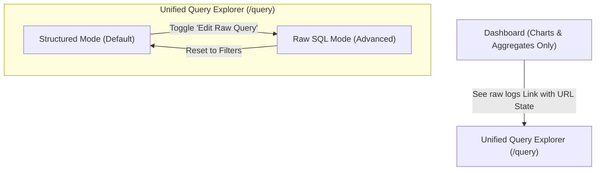

# Blueprint: Session Flagging & Unified Query Explorer Refactor

This design specification outlines the architectural blueprint for refactoring session-level flagging and log exploration. It documents the target state, core trade-offs, and file-by-file changes required to implement this refactor cleanly.

---

## 1. Architectural Strategy & Design



### Key Enhancements

1. **True Session Scope for Flagging:** Flagging represents an analytical evaluation of a client session, not an individual HTTP request. This blueprint moves the flagging interaction off the main Dashboard (raw request rows) and into the **User Sessions page**—both as a column in the master table and inside the detailed Request Timeline modal.
2. **Session Un-flagging (Label Deletion):** Exposes a direct "Clear Flag" (or "Un-flag") option inside the popover to delete existing label rows.
3. **Dashboard Performance & Cost Optimizations:** Prevents reading wide request logs from Parquet/Iceberg on default dashboard loads. Replaces the bottom raw logs card with a beautiful link to open the unified explorer.
4. **The Unified Logs & Query Explorer (Dual Mode):**
   * **Structured Mode (Default):** Synchronizes with global header `FilterBar` (dates/custom filters) and URL parameters. Auto-generates the matching query with live **server-side column sorting**.
   * **Raw SQL Mode:** Hides global filters, opens a rich `CodeEditor`, and handles table header sorting strictly client-side to protect custom hand-written SQL queries.

---

## 2. File-by-File Changes

### Backend Changes

#### File A: `backend/models/dashboard.py`
Add `edge_sid` as an optional string field on the session list response model so the frontend can associate each aggregated session with its corresponding Fastly cookie session ID.

```diff
class Session(BaseModel):
    ip: str
    ua: str | None = None
    ja4: str | None = None
    country: str | None = None
    asn: int | None = None
    session_start: str
    session_end: str
    req_count: int
    edge_count: int | None = None
    shield_count: int | None = None
    unique_urls: int | None = None
    reqs_4xx: int | None = None
    reqs_5xx: int | None = None
    total_bytes: int | None = None
    median_rtt_ms: float | None = None
+   edge_sid: str | None = None
    flagged: bool
```

#### File B: `backend/repositories/sessions.py`
Expose the representative cookie session identifier by appending a `MAX("edge_sid")` aggregation if the column is present in the table.

```diff
    group_cols = ["ip"]
    if has_ja4:
        group_cols.append("ja4")

+   has_edge_sid = "edge_sid" in actual_cols

    extra_aggs = ""
+   if has_edge_sid:
+       extra_aggs += ', MAX("edge_sid") AS edge_sid'
    if has_edge:
        extra_aggs += ', SUM(CASE WHEN "edge" = 1 THEN 1 ELSE 0 END) AS edge_count'
```

---

### Frontend Changes

#### File C: `frontend/components/SessionScoring/FlagSessionPopover.tsx`
Support un-flagging by enabling row deletions when a session is already labeled.

```typescript
// Target signature addition:
interface FlagSessionPopoverProps {
  serviceId: string
  sid: string
  sampleIp?: string
  sampleUa?: string
  sampleUrl?: string
  currentLabel?: LabelValue | null
  currentLabelId?: string | null  // <-- Add this prop
  trigger?: React.ReactNode
  onFlagged?: () => void
}

// In the component:
const handleClearLabel = async () => {
  if (!currentLabelId) return
  try {
    await client.DELETE('/api/services/{service_id}/scoring/labels/{label_id}' as any, {
      params: { path: { service_id: serviceId, label_id: currentLabelId } },
    } as any)
    onFlagged?.()
  } catch (e) {
    setError('Failed to clear label')
  }
}

// Render "Clear Label" button if currentLabel is active:
{currentLabel && (
  <Button 
    variant="ghost" 
    size="sm" 
    className="text-xs text-rose-600 hover:text-rose-700 hover:bg-rose-50"
    onClick={handleClearLabel}
  >
    Clear Label (Un-flag)
  </Button>
)}
```

#### File D: `frontend/app/sessions/page.tsx`
Inject the session-level flagging actions.

1. **Import Requirements:**
   ```typescript
   import { FlagSessionPopover } from '@/components/SessionScoring/FlagSessionPopover'
   import { useScoringLabels } from '@/hooks/useScoringLabels'
   import { useQueryClient } from '@tanstack/react-query'
   ```
2. **Retrieve Labels Cache Map:**
   ```typescript
   const qc = useQueryClient()
   const { labelBySid, labels } = useScoringLabels(activeServiceId || '', {
     enabled: !!activeServiceId,
   })
   const onFlagged = () => {
     qc.invalidateQueries({ queryKey: ['scoring-labels', activeServiceId] })
   }
   ```
3. **Table Column Definition:**
   Append the flag action column if the dataset returns an `edge_sid`:
   ```typescript
   if (data?.has_edge_sid) {
     cols.push({
       id: '__flag',
       header: 'Flag',
       cell: ({ row }) => {
         const sid = row.original.edge_sid
         if (!sid) return null
         // Find matching label row to pass its id
         const labelRow = labels.find(l => l.sid === sid)
         return (
           <FlagSessionPopover
             serviceId={activeServiceId}
             sid={sid}
             sampleIp={row.original.ip}
             sampleUa={row.original.ua}
             currentLabel={labelBySid.get(sid) ?? null}
             currentLabelId={labelRow?.id ?? null}
             onFlagged={onFlagged}
           />
         )
       }
     })
   }
   ```
4. **Modal Header Integration:**
   Add `FlagSessionPopover` nicely inside the Dialog title or Metadata block:
   ```typescript
   <DialogTitle className="flex items-center gap-2 text-base">
     <Users className="h-4 w-4" />
     Session: {selectedSession?.ip}
     {selectedSession?.edge_sid && (
       <FlagSessionPopover
         serviceId={activeServiceId}
         sid={selectedSession.edge_sid}
         sampleIp={selectedSession.ip}
         sampleUa={selectedSession.ua}
         currentLabel={labelBySid.get(selectedSession.edge_sid) ?? null}
         onFlagged={onFlagged}
       />
     )}
   </DialogTitle>
   ```

#### File E: `frontend/app/dashboard/page.tsx`
Remove all raw log queries and table components, replacing them with a premium CTA block linking to the `/query` explorer.

```typescript
// 1. Remove raw-logs useServiceQuery and sorting states entirely.
// 2. Replace the bottom AnalyticsCard with this link banner:

<div className="border rounded-lg bg-card p-6 flex flex-col md:flex-row items-center justify-between gap-4 shadow-sm">
  <div className="space-y-1">
    <h3 className="font-semibold text-sm">Raw Request Log Inspector</h3>
    <p className="text-xs text-muted-foreground">
      Inspect detailed parameters, search specific fields, and write advanced analytical queries.
    </p>
  </div>
  <Button
    variant="outline"
    onClick={() => {
      const params = new URLSearchParams()
      if (startTime) params.set('start_time', startTime)
      if (endTime) params.set('end_time', endTime)
      if (filterPayload) params.set('filters', JSON.stringify(filterPayload))
      router.push(`/query?${params.toString()}`)
    }}
  >
    See Raw Logs <ArrowRight className="ml-1.5 h-3.5 w-3.5" />
  </Button>
</div>
```

#### File F: `frontend/components/AppLayout.tsx`
Support dynamically showing/hiding the filter bar when visiting `/query` based on the query parameter.

```diff
- const hideFilterBar = pathname.startsWith('/admin') || pathname.startsWith('/logs') || pathname.startsWith('/query') || pathname.startsWith('/insights') || pathname.startsWith('/alerts') || !hasServices
+ const isRawQueryMode = pathname.startsWith('/query') && searchParams.get('mode') === 'raw'
+ const hideFilterBar = pathname.startsWith('/admin') || pathname.startsWith('/logs') || isRawQueryMode || pathname.startsWith('/insights') || pathname.startsWith('/alerts') || !hasServices
```

#### File G: `frontend/app/query/page.tsx`
Refactor into the **Dual-Mode workspace**.

*   Check if `mode === 'raw'` via search parameters. If structured mode is active, fetch from `/api/query` by automatically formatting the standard filters and date payload:
    ```sql
    SELECT * FROM logs 
    WHERE {filters_from_url} 
      AND timestamp >= '{start_time}' 
      AND timestamp <= '{end_time}'
    ORDER BY {sort_col} {sort_dir}
    LIMIT 500
    ```
*   Display a toggle switch `[ Structured View | Edit SQL Query ]` in the layout.
*   In Structured view, column sorting triggers a live refresh of the SQL generator, keeping database sorting accurate. In Raw SQL view, header sorting falls back to local client-side sorting.

---

## 3. Best Practices & Verification Plan

1. **Verify No Code Bottlenecks:** Confirming the elimination of `SELECT *` from raw dashboard load prevents wide parquet column reads.
2. **Validation Suite:** Run `pytest` to verify backend routers and check that no existing session tests break.
3. **Frontend Compilation:** Execute `npm run build` and `npm run typecheck-frontend` to verify all imports, openapi-fetch types, and prop declarations compile successfully.
